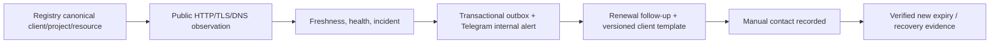
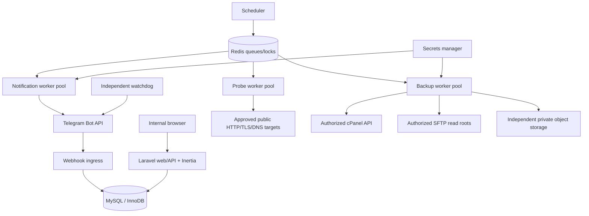
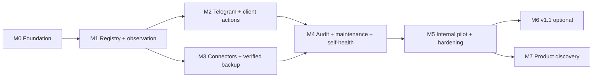

# Solveit OpsHub — Implementation Plan

**Diperbarui:** 4 Oktober 2026

**Fungsi:** roadmap, dependency dan acceptance criteria Internal v1 (M0–M5)

**Otoritas produk:** [PRD](PRD.md) v1.0.1

**Evidence/progres aktual:** [CHECKPOINT.md](CHECKPOINT.md)

**Posisi saat ini:** M0/M1 `MILESTONE_READY`; M2 aktif, task 01, 02, 03, 04, 05, 06 implemented/tested dan IP-M2-07 berikutnya; M3–M5 belum dimulai. Full TC lintas milestone/Internal v1 belum terpenuhi.

Dokumen ini menjelaskan apa yang harus dibangun dan syarat penerimaannya. CHECKPOINT menjelaskan apa yang sudah dibangun, bukti pengujian, commit/push, blocker dan panduan operasi. Membaca roadmap tidak mengotorisasi credential creation, integrasi live atau tindakan production. Instruksi user menentukan scope pekerjaan yang sedang diotorisasi.

## Panduan membaca dan progres

| Kebutuhan | Baca |
|---|---|
| Menentukan task aktif atau pekerjaan tersisa | Ringkasan di bawah dan [checkpoint](CHECKPOINT.md#1-ringkasan-progres-dan-keputusan-berikutnya). |
| Memahami keputusan produk dan scope | Bagian 1; PRD tetap sumber keputusan produk. |
| Memahami baseline aktual versus target | Bagian 2; production architecture adalah target yang belum otomatis tersedia. |
| Menentukan dependency dan pengujian | Bagian 3. |
| Melihat task, deliverable, acceptance dan exit gate | Bagian 4, pilih milestone. |
| Memeriksa traceability requirement | Bagian 5. |
| Menyiapkan konfigurasi/live validation secara aman | Bagian 6–8. |
| Melanjutkan pekerjaan dan memperbarui evidence | Bagian 9–10. |

| Milestone | Task | Progres | Exit gate |
|---|---|---|---|
| [M0 — Foundation](#m0--foundation) | IP-M0-01–09 | Implemented/tested dalam scope fondasi. | `MILESTONE_READY` lokal; batas deployment tetap dicatat. |
| [M1 — Registry/observation](#m1--registry-and-external-observation) | IP-M1-01–10 | Implemented/tested; gate sesuai scope disetujui Owner. | `MILESTONE_READY` lokal; full TC lintas milestone tetap menjadi kewajiban M2–M5. |
| [M2 — Telegram/client loop](#m2--telegram-and-client-action-loop) | IP-M2-01–09 | 01, 02, 03, 04, 05, 06 implemented/tested; task lain belum selesai. | `PARTIAL_WITH_BLOCKERS`: gate belum lengkap. |
| [M3 — Connector/backup](#m3--capability-aware-connectors-and-verified-backup) | IP-M3-01–10 | `not_started` | Belum dievaluasi. |
| [M4 — Audit/resilience](#m4--audit-maintenance-operational-resilience) | IP-M4-01–07 | `not_started` | Belum dievaluasi. |
| [M5 — Internal pilot](#m5--internal-pilot-and-hardening) | IP-M5-01–07 | `not_started` | Belum dievaluasi. |

Status task di bagian 4 adalah snapshot implementasi, bukan izin mengaktifkan fitur live. `implemented/tested` berarti behavior lokal dalam scope task terbukti; `partial` berarti ada pekerjaan/gate tersisa; `not_started` berarti task belum dijalankan. ID task menentukan urutan kerja dalam milestone; dependency dan gate tetap mengikat. Untuk detail test/live gunakan CHECKPOINT.

### Keputusan sequencing gate M1

Owner pada 4 Oktober 2026 menyetujui gate engineering M1 sesuai scope registry/observation/incident/freshness/security/demo; assertion full TC yang bergantung pada M2–M5 tetap wajib pada gate milestone pemilik dan release Internal v1. Definisi TC dan acceptance produk tidak diubah, tidak ada waiver, dan fake/pending event bukan bukti delivery atau live readiness. [ADR-0006](adr/0006-milestone-acceptance-sequencing.md) mencatat keputusan dan batas otorisasi; [matriks TC](CHECKPOINT.md#53-matriks-tc-0110) memisahkan evidence M1 dari full scenario yang masih unfinished.

Source tidak berubah sejak suite lokal **71 tests / 392 assertions**. Evidence lokal dan historis browser/CI serta validasi keputusan di [checkpoint penutupan M1](CHECKPOINT.md#14-keputusan-owner-dan-penutupan-m1--4-oktober-2026) memenuhi gate M1 yang disetujui. M1 `MILESTONE_READY`; pekerjaan ini berhenti sebelum M2. Next task setelah instruksi milestone berikutnya adalah `IP-M2-01`, bukan mengulang review gate M1.

## Daftar isi

1. [Executive summary](#1-executive-summary)
2. [Technical baseline dan target architecture](#2-recommended-technical-baseline)
3. [Sequence, dependencies, and release rules](#3-sequence-dependencies-and-release-rules)
4. [Detailed delivery phases](#4-detailed-delivery-phases)
5. [Requirement coverage matrix](#5-requirement-coverage-matrix)
6. [Configuration, credential, and environment plan](#6-configuration-credential-and-environment-plan)
7. [Work safe to complete before live integration](#7-work-safe-to-complete-before-live-integration)
8. [Risk register and controls](#8-risk-register-and-controls)
9. [Melanjutkan pekerjaan dari progres aktual](#9-melanjutkan-pekerjaan-dari-progres-aktual)
10. [Plan maintenance rules](#10-plan-maintenance-rules)

## 1. Executive summary

Solveit OpsHub Internal v1 is an internal control plane for portfolio maintenance, not a client portal, hosting panel replacement, or general remote-management product. The first proof must be a real operational loop, not a green dashboard:



The slice starts after M0 with one fictitious Laravel/shared-hosting project and a public sandbox URL. It must demonstrate: three failed samples create one incident and a durable Telegram outbox event; a H-14 renewal creates exactly one follow-up and a ready client draft; copying does **not** mean the client was contacted; payment/client confirmation does **not** resolve renewal; two successful samples create recovery. M3 then adds only backup paths whose capability was tested and whose artifact is independently stored and verified.

### 1.1 Binding product decisions

| Decision | Execution consequence |
|---|---|
| Internal-first, one organization in v1 | Keep `organization_id` and server-side scope on all business records; no public sign-up, billing, marketplace, or client portal. |
| Telegram-only | Implement Telegram alerts, digest, binding, callbacks, and ready-to-copy client text. Do not add email, WhatsApp, Slack, Discord, push, or a hidden generic channel abstraction that implies support. |
| Client messages are reviewed and sent manually | A Telegram message may contain a separate plaintext draft. Only an authenticated dashboard action records `contacted`; no automatic client delivery. |
| Capability-aware shared-hosting operation | `unsupported`, `unknown`, `not_configured`, and `permission_denied` are first-class states. Never infer cPanel capability from panel/provider name. |
| Backup is trusted only after independent storage + verification | A cPanel API acceptance or an archive left on the source account is not success. Restore verification is a higher, separately evidenced level. |
| No arbitrary or automatic production changes | Internal v1 has safe observation, bounded approved backup, tasks, and runbooks. Deployment/update/migration/DNS writes/full restore stay manual; controlled execution is v1.1. |
| Secrets never reach normal business data or client channels | Database stores secret references only; worker retrieves the actual secret. Redaction is mandatory in logs, errors, telemetry, exports, UI, and Telegram. |

### 1.2 Explicit assumptions and decisions to confirm before live work

These defaults permit implementation and mock testing; they do **not** authorize a live integration.

| Item | Planning assumption | Live decision or evidence still needed |
|---|---|---|
| Runtime | Dedicated VPS with separate web, scheduler, probe, notification, and backup worker processes | Provider, region, sizing baseline, OS patching owner, process supervisor, HTTPS/domain, and deployment method. |
| Data services | MySQL with InnoDB, Redis, private S3-compatible object storage, and secrets manager are available outside client hosting | Managed/self-hosted service selection, network rules, backup and recovery ownership, retention/cost limit. |
| Organization | One internal organization, 3–4 core team members, default UI/time zone Indonesia/Asia/Jakarta | Initial Owner identity, final role assignments, project scopes, MFA method, coverage hours. |
| Telegram | Separate dev/staging/prod bots; initially internal destination(s) only | Bot token reference, bot IDs, destination chat IDs, membership/scope review, webhook public URL and secret. |
| Portfolio | Some shared-hosting targets will expose cPanel API or SFTP; some will not | Provider/panel/account inventory, client authorization, allowed roots/ports, fingerprints, backup scope, provider limits. |
| Renewal | Manual evidence from registrar/provider/invoice is the initial source | Exact source, source timezone/date precision, action owner/paying party, lead time, client PIC. |
| Backup | Standard initial policy is daily 02:00 WIB with jitter; source and object storage are distinct | RPO/retention per service, inclusion/exclusion, quota/size estimate, encryption/key custody, isolated restore target. |

When information is missing, the system must persist `unknown`/`not_configured`, display the coverage gap, and create an appropriately scoped verification task. It must not fabricate a green state or activate a live connector.

### 1.3 Shared-hosting boundaries

- OpsHub runs on its own runtime, workers, database, and independent storage; it is never deployed onto a client shared-hosting account.
- Public HTTP/TLS/DNS probes are external observations. They do not prove application health, database reachability, server CPU/RAM, malware absence, or global uptime.
- Use an authorized cPanel API only through its official API and a scoped token. Do not scrape control-panel UIs or use arbitrary remote shell/SSH/root access.
- SFTP is read-only in v1, must verify the host key and allowed remote root, and is not a database-backup substitute.
- A shared hosting account/domain is canonical. One scheduled account backup or renewal event can affect many projects, but must neither duplicate jobs nor disclose another project to a scoped user.
- Full cPanel backup can consume source quota and may contain other account data. Preflight, authorization scope, source quota, independent retrieval, and scoped download are mandatory.
- Internal v1 never enables automatic custom dependency updates, deployment, migration, DNS write, production restore, arbitrary deletion, or an autonomous AI agent.

## 2. Recommended technical baseline

### 2.1 Stack decision

**Baseline aktual:** Laravel 13/PHP 8.5, Inertia/React/TypeScript/Vite, MySQL 8.4/InnoDB, database queue untuk probe lokal. Dependency exact mengikuti lockfile; jangan menyimpulkan patch version dari angka rekomendasi/historis ADR. Production Redis, object storage, secrets manager, Telegram/cPanel/SFTP live dan independent watchdog belum dikonfigurasi. Matriks berikut tetap merupakan target desain, bukan klaim availability aktual.

| Layer | Recommendation | Why it fits the PRD | Verification and guardrail |
|---|---|---|---|
| Application | Laravel 13, PHP 8.3–8.5 | One modular monolith can hold transactional domain rules, sessions/CSRF, queues, scheduling, filesystem adapters, and workers without microservice overhead. | Laravel’s release policy lists Laravel 13 and its PHP support; exact patch versions are pinned in M0 after compatibility/security review. [Release notes](https://laravel.com/framework/docs/releases) |
| Internal web UI | React + TypeScript through Inertia’s official Laravel adapter; Vite build | Same-origin internal dashboard avoids a separate public API/CORS deployment while retaining typed, component-based UI for tables, detail workflows, and responsive incident/template actions. | Inertia documents an official Laravel adapter and React setup. [Inertia server-side setup](https://inertiajs.com/docs) and [React TypeScript](https://react.dev/learn/typescript) |
| Primary data | MySQL with InnoDB; MySQL 8.4 is the CI compatibility baseline, with the production patch/provider confirmed at provisioning | Relational invariants, unique active cycles/incidents/jobs, audit history, pagination, filtered attention queries, and optimistic concurrency belong in the database. | The project owner selected MySQL on 4 Oktober 2026. Run migrations and domain tests on the MySQL CI service; validate the exact production version and driver before provisioning. [ADR-0005](adr/0005-mysql-primary-database.md), [MySQL 8.4 manual](https://dev.mysql.com/doc/refman/8.4/en/), [Laravel databases](https://laravel.com/framework/docs/13.x/database) |
| Queue, cache, locks | Redis, with Laravel queue workers and distinct queues/pools | Supports durable queued work, throttling, cache, resource coordination, and isolation of critical probes/notifications from heavy backup jobs. Business truth, idempotency records, audit, and transactional outbox remain in MySQL. | Laravel supports Redis queues and queue middleware; Redis documents queue/event-processing data structures. [Laravel queues](https://laravel.com/framework/docs/13.x/queues), [Redis data types](https://redis.io/docs/latest/develop/data-types/) |
| Scheduler | Laravel scheduler invoked every minute; it only creates/deduplicates jobs | One scheduler entry is compatible with the required 60-second HTTP cadence and keeps policy schedule in application code. Long work is always queued. | Laravel documents one cron entry, queued jobs, time zones, and overlap prevention. [Task scheduling](https://laravel.com/framework/docs/13.x/scheduling) |
| Backup/evidence storage | Private S3-compatible object storage, separate from the source hosting and VPS disk | Provides private, versionable storage for encrypted artifacts/evidence. The storage account cannot be delete-equivalent to a client source account. | Laravel’s filesystem supports S3 configuration and SFTP/scoped disks; validate the selected provider’s S3 compatibility, encryption, versioning, lifecycle, and IAM before live use. [Filesystem](https://laravel.com/framework/docs/13.x/filesystem) |
| Secrets | Dedicated secrets manager selected at infrastructure provisioning | Keeps bot/cPanel/SFTP credentials out of application records, UI, logs, and source control; supports rotation and recovery custody. | PRD SEC-03/15 govern selection. Apply OWASP lifecycle, least privilege, audit, and recovery guidance. [OWASP Secrets Management](https://cheatsheetseries.owasp.org/cheatsheets/Secrets_Management_Cheat_Sheet.html) |
| Integrations | First-party HTTP adapters: Telegram Bot API, cPanel UAPI, and SFTP library with host-key support | Maintains the Telegram-only contract and isolates provider behaviour behind typed adapter results. | Telegram documents HTTPS webhooks and secret header/update IDs; cPanel documents API tokens/full-backup endpoint. [Telegram Bot API](https://core.telegram.org/bots/api), [cPanel API tokens](https://docs.cpanel.net/knowledge-base/security/how-to-use-cpanel-api-tokens/), [cPanel backup API](https://api.docs.cpanel.net/specifications/cpanel.openapi/backup/backup-fullbackup_to_homedir) |
| Security | Framework auth/session/MFA integration, server-side policies, SSRF guard, private workers, redaction | Maps directly to scoped internal access, safe outbound probing, and secret/backup protections. | SSRF filtering must validate URL, DNS resolution, redirects, and actual connect target; private network access needs an explicit separate allowlist. [OWASP SSRF Prevention](https://cheatsheetseries.owasp.org/cheatsheets/Server_Side_Request_Forgery_Prevention_Cheat_Sheet.html) |

**Version policy:** do not lock package versions in this planning document beyond the verified Laravel/PHP compatibility above. At `IP-M0-02`, record exact PHP, Laravel, Node, React/Inertia, MySQL, Redis, driver, and OS versions in an ADR and lockfiles. Any deviation from this stack requires an ADR showing that it still fulfils the PRD’s queue, worker isolation, transactional, storage, security, and testability requirements.

### 2.2 Architecture and ownership boundaries

Diagram berikut adalah **target production**. Queue lokal saat ini memakai database, dan integrasi yang belum dibangun tetap not configured.



1. **Modular monolith, not microservices.** Module boundaries are code/package boundaries and transactional boundaries within one deployable application: `IdentityAccess`, `ClientProjectRegistry`, `AssetConnections`, `PolicyScheduling`, `MonitoringIncidents`, `RenewalFollowUps`, `ClientMessaging`, `TelegramNotifications`, `BackupRecovery`, `AuditMaintenance`, `ActivityEvidence`, and future `ControlledOperations`.
2. **Database is the business source of truth.** Use database transactions for state transition + `OutboxEvent` creation; Redis is not the authoritative record of incidents, follow-ups, approvals, or notification delivery.
3. **Workers are capability-separated.** Web requests never perform backups or external provider writes. Separate queues/pools at least for `critical`, `probe`, `notification`, `routine`, and `backup`; cap backup total concurrency at 2 and per account at 1 until measured otherwise.
4. **Adapters have no UI authority.** Controllers/application services enforce scope, authorization, state, idempotency, and kill switch before an adapter is invoked. Adapters return a normalized typed result; `unsupported` never becomes `success`.
5. **Independent failure domains.** Backup object storage is independent from the client account and VPS disk. The watchdog is outside the main process/host failure domain and has minimal, separate credentials.
6. **No external generic public API in v1.** The same-origin dashboard domain contract is `/api/v1` as defined in PRD section 20. An external API, SaaS tenancy, and client portal are future work.

### 2.3 Proposed directory structure

This is the target shape after scaffolding; it is not a command to create files now.

```text
app/
  Domain/
    IdentityAccess/  ClientProjectRegistry/  AssetConnections/
    PolicyScheduling/  MonitoringIncidents/  RenewalFollowUps/
    ClientMessaging/  TelegramNotifications/  BackupRecovery/
    AuditMaintenance/  ActivityEvidence/
  Application/<same module names>/
    Commands/  Queries/  Services/  DTOs/  Policies/
  Infrastructure/
    Persistence/  Queue/  Storage/  Secrets/  Http/
    Connectors/{Cpanel,Sftp,PublicProbe,Telegram}/
  Http/{Controllers,Requests,Middleware,Resources}/
  Jobs/  Console/  Providers/
database/
  migrations/  factories/  seeders/
resources/js/
  Pages/  Components/  Features/  lib/  types/
resources/views/
routes/
  web.php  api.php  console.php
tests/
  Unit/  Feature/  Integration/  Contract/  Security/  Browser/  Fixtures/
docs/
  PRD.md  IMPLEMENTATION_PLAN.md  CHECKPOINT.md
  adr/
infra/
  compose/  deploy/  watchdog/
```

Rules for this structure:

- Place domain invariants and transition validation in `Domain`/`Application`, not React components/controllers/jobs.
- Put provider protocol calls only in `Infrastructure/Connectors`; inject fake implementations in test/development.
- `docs/CHECKPOINT.md` consolidates progress, sanitized evidence references and monitoring runbook; ignored `output/` contains local QA artifacts. Never store credentials or raw client backups in documentation.
- `infra/` contains templates and non-secret configuration only. Production credentials are provisioned outside Git.

### 2.4 Non-negotiable implementation conventions

- Store instants in UTC; policy schedules and renewal calendar calculations use IANA zones, default `Asia/Jakarta`; UI/messages label WIB.
- Version mutable renewal, follow-up, configuration, and policy records. Stale mutations return 409 rather than overwrite new state.
- Use database uniqueness constraints for project code, active renewal cycle, active incident fingerprint, job slot, outbox delivery, and Telegram update receipt; test races, not just application-level checks.
- Every async mutation accepts `Idempotency-Key`, persists request hash/actor/action/scope, and returns the existing result for an identical replay.
- Render client text deterministically from versioned templates; no LLM is needed or permitted as authority in v1.
- Never rely on a UI disabled state as a permission control. Recheck permission, scope, state, capability, authorization, and kill switch in the job immediately before remote work.

## 3. Sequence, dependencies, and release rules

### 3.1 Milestone dependency map



M2 may start its domain/UI work as M1 stabilizes, but the end-to-end renewal/Telegram demo cannot pass before M1’s organization, scoped registry, policy, queue, outbox, and incident foundations work. M3 connector work may develop against fakes after M0, but it must consume M1’s canonical account/resource model and M0’s guards. M5 begins only after all M0–M4 automated evidence and sandbox gates pass.

### 3.2 Cross-cutting test layers

| Layer | Purpose | Mandatory examples |
|---|---|---|
| Unit/domain | Deterministic transitions, policy/time calculations, template rendering, health aggregation | renewal verified only with a later future expiry/evidence; 3-fail/2-recovery; no unresolved template variables. |
| Feature/API | RBAC, organization/resource scope, validation, 409 concurrency, idempotency, redaction | unauthorised callback/download denied; same key/same payload returns same run; different payload returns 409. |
| Integration | MySQL/InnoDB constraints/transactions, Redis queue/lock behaviour, storage crypto/streaming | active-cycle/incident uniqueness under race; outbox transaction rollback; recovery/reconcile after worker crash. |
| Contract | Normalized adapter results and protocol safety | cPanel permission denied, SFTP host-key mismatch, Telegram 429/timeout, fake connector partial artifact. |
| Browser/accessibility | Main user workflow, semantic states, keyboard/mobile support | unknown/stale/unsupported distinguishable; Copy differs from Mark contacted; dashboard template works without Telegram. |
| Sandbox/live | A separately authorized target demonstrates actual provider ability | Telegram bot/destination test, cPanel supported backup path, SFTP read root, independent artifact verification, isolated restore drill. |
| Performance/reliability | Measured pilot workload rather than invented capacity | 100 projects/200 monitors, alert latency, scheduler lag, backup >1 GiB fixture streaming, storage growth. |

## 4. Detailed delivery phases

### M0 — Foundation

**Progres aktual:** Fondasi lokal implemented/tested; gate M0 tercatat ready. [Evidence](CHECKPOINT.md).

**Goal:** establish a secure, testable modular-monolith foundation that can safely represent scope, state, history, and asynchronous work before external integrations or dashboard polish.

**Dependencies:** approved PRD baseline; no live credentials required.

**PRD milestone:** M0.

**Primary requirements:** DEC-01–14; SEC-01/02/04/09/11/16/17; JOB-01/02/04/06/09; POL-01/03; REG-02/03/05/06/10; UX-01/03; NFR-06/09/12.

| Status saat ini | Task (urut menurut ID) | Requirement mapping | Output / acceptance task |
|---|---|---|---|
| `implemented/tested` | `IP-M0-01` — Create requirement ledger and ADR set | DEC-01–14, PRD 19–22 | `docs/adr/` records stack/version selection, single-org scope, data classification, queue/outbox, secret-reference design, SSRF strategy, and the explicit v1 exclusions. Ledger maps every P0/P1 ID to a task/test/evidence location. |
| `implemented/tested` | `IP-M0-02` — Scaffold minimal Laravel/Inertia application and reproducible local test environment | PRD 22.1, 22.4, SEC-16 | Pin exact compatible versions; establish `.env.example` with non-secret defaults only; configure MySQL/Redis/object-storage emulator only for development; add CI type/static/test/lint/build steps. |
| `implemented/tested` | `IP-M0-03` — Implement identity, membership, MFA/step-up boundary, and server-side authorization | SEC-01/02/13/17, PRD 3 | No public registration; role baseline `OWNER`, `OPERATOR`, `OPERATIONS`, `VIEWER`; membership/project extra permissions; disabled user session/callback denial; one-time owner bootstrap/rotation flow. |
| `implemented/tested` | `IP-M0-04` — Build canonical persistence baseline and scope repositories | REG-02/03/05/06/10, PRD 19.1–19.2 | Migrations/models for organization, membership/access, project/environment, asset/usage, hosting account, subscription, authorization, secret reference, policy/version/assignment, evidence, activity/audit event. Add foreign keys, organization scoping, archive-not-delete, indices, optimistic `version`. |
| `implemented/tested` | `IP-M0-05` — Establish domain transition, audit, and evidence conventions | PRD 6, 19–20, SEC-12 | Typed enums/DTOs, canonical error codes, sanitized evidence/reference model, immutable append-only audit writer, correlation/causation/request IDs, and 409 conflict format. |
| `implemented/tested` | `IP-M0-06` — Implement durable scheduling primitives | JOB-01/02/04/06/09, POL-01/03, NFR-06 | Job-slot uniqueness, durable queue job records/attempts/heartbeats, transactional outbox, dead-letter inspection, coalescing missed lightweight slots, entity-version ordering, and fake clock support. |
| `implemented/tested` | `IP-M0-07` — Build security primitives before connector code | SEC-04/05/09/11/16, NFR-09 | Central redactor; outbound target validator with DNS/redirect/IP checks; webhook signature middleware contract; output/CSV escaping; CSRF/session/throttle policy; no secret-value logging. |
| `implemented/tested` | `IP-M0-08` — Provide deterministic fakes and fixtures | PRD 22.5, SEC-16 | Fake public probe, Telegram transport, cPanel, SFTP, storage, clock, and queue-failure scenarios. Fakes carry visible `demo/test` provenance and cannot be selected in production. |
| `implemented/tested` | `IP-M0-09` — Establish engineering quality gates | PRD 24, 23, 28 | Test database isolation, migration rollback/forward policy, baseline test commands, dependency/security review, sanitized logging assertions, and a status-report template distinguishing implemented/mock/live-unverified/unsupported. |

**Deliverables:** runnable local application skeleton; ADR/requirement ledger; base schema; auth/scope/audit/outbox/job primitives; fake adapter suite; CI baseline; `.env.example` without secrets.

**Testing:** database constraint/race tests; policy/scope negative tests; transactional-outbox rollback/replay; idempotency; SSRF/redaction/CSV injection; session revoke/disabled user; fake adapter provenance. Run M0-specific tests plus static analysis, frontend typecheck, formatting/lint, production build, and migration checks.

**Acceptance criteria:**

- An unauthorized, cross-organization, disabled, or stale-version mutation is rejected server-side without an audit/state bypass.
- A business transition and its outbox event commit atomically; a failed transaction leaves neither partial state nor a send event.
- Duplicate job slots/identical idempotency replays do not create a second action; stale/out-of-order event cannot overwrite newer state.
- Fixture/log/export tests prove secrets and sensitive headers never appear.
- Development uses fakes only and has no route/configuration that can execute a real connector by default.

**Exit gate:** M0 is `MILESTONE_READY` only when the stack/version ADR, automated M0 evidence, CI, and PRD P0/P1 ledger exist; no seed contains live data/credentials and no live integration has been claimed.

### M1 — Registry and external observation

**Progres aktual:** IP-M1-01–10 implemented/tested; `MILESTONE_READY` untuk gate engineering sesuai scope yang disetujui Owner. [Evidence](CHECKPOINT.md#14-keputusan-owner-dan-penutupan-m1--4-oktober-2026).

**Goal:** give the team one canonical portfolio inventory and detect a real public website problem with correct freshness, health, incident, and dashboard semantics—without hosting credentials.

**Dependencies:** M0 identity/scope/schema/outbox/job primitives, target allowlist policy, fake clock/probe.

**PRD milestone:** M1.

**Primary requirements:** REG-01–08/10; CON-04/08; MON-01–05/07–10/12–14; POL-01/03; JOB-01/02/04/06/09; UX-01–05/07/09; SEC-02/04/05/11; NFR-03/05/12.

| Status saat ini | Task (urut menurut ID) | Requirement mapping | Output / acceptance task |
|---|---|---|---|
| `implemented/tested` | `IP-M1-01` — Deliver client, contact, project, environment, and canonical asset registry | REG-01–06/10, SEC-02 | Scoped CRUD/API/pages; unique organization project code; separate production/staging/development/custom environments; canonical asset plus usage relation for shared domain/account; lifecycle archive/paused behavior. |
| `implemented/tested` | `IP-M1-02` — Add hosting/subscription metadata and management-access recording | REG-07–09, CON-08 | Provider/panel/endpoint/root/quota metadata, renewal source/evidence/date semantics, scope/action authorization with expiry; no stored secret values or auto-enabled connector action. |
| `implemented/tested` | `IP-M1-03` — Implement versioned monitoring policy and effective-policy preview | POL-01/03, MON-01/03/05/10 | Immutable published version, constrained project override, timezone-aware schedule, safe defaults, coverage computation, and explicit disabled/not-configured state. |
| `implemented/tested` | `IP-M1-04` — Build safe HTTP probe adapter | CON-04, MON-01–04, SEC-05, NFR-03 | GET/allowed status/timeout/body cap/redirect limit; validate each redirect and actual resolved target; expected content is opt-in; emit compact sanitized evidence. |
| `implemented/tested` | `IP-M1-05` — Add TLS/DNS observation adapters | MON-05, MON-12, SEC-05 | TLS hostname/chain/expiry outcomes and DNS allowed record/expected-value outcomes; retain only structured evidence, never full body/raw headers. |
| `implemented/tested` | `IP-M1-06` — Implement observation persistence, freshness, coverage, and deterministic health | PRD 6, MON-02/03/04/12, UX-01/02/03 | Append-only observations with scheduled/started/completed timestamps; non-overlap; fresh/stale/never-observed; `unknown` separate from fail; health aggregation and raw-to-daily aggregate retention path. |
| `implemented/tested` | `IP-M1-07` — Implement incident episode lifecycle and maintenance suppression | MON-03/07–10/13, JOB-09 | 3 eligible failures create one episode; repeat evidence dedups; 2 successes resolve; closure needs summary; recurrence semantics; maintenance window suppresses alert only, not evidence/downtime; flapping coalesces. |
| `implemented/tested` | `IP-M1-08` — Build overview, registry, project, asset, and incident workflows | UX-01–05/09, MON-08, REG-11 (design only until M4 search) | Attention sort, text/icon status, last observation/source, explicit empty/error/stale/missing-permission states, scoped incident detail/ack/assign/close actions. |
| `implemented/tested` | `IP-M1-09` — Expose scheduler/worker health and observation safety tests | MON-14, JOB-02/06, NFR-05/12 | Scheduler heartbeat, job lag, missed-slot/coverage signal, queue worker state, and an initial self-health page; no independent production watchdog claim yet. |
| `implemented/tested` | `IP-M1-10` — Execute the first vertical demo under fakes | TC-01–10 | Fictitious client/project/public URL: up → 3 failures → one incident/outbox record → 2 successes → recovery/closure. Include shared resource and stale-scheduler variants. |

**Deliverables:** canonical registry and scoped asset graph; monitoring policies; HTTP/TLS/DNS probes; observation/freshness/health engine; incidents; overview/project/incident pages; M1 demo data and evidence.

**Testing:** seluruh assertion TC-01–10 dalam scope M1 pada tabel berikut; SSRF/private/redirect/DNS-rebinding negatives; HTTP 200 expected-content mismatch; fake-clock three-fail/two-success; duplicate active incident; maintenance window; flapping; stale scheduler versus down; shared resource; accessibility states. Full TC yang belum tersedia tetap unfinished pada milestone pemilik.

#### Pembagian bukti TC-01–10

| Scenario | Assertion/prerequisite yang wajib terbukti pada gate M1 | Kewajiban full scenario setelah M1 |
|---|---|---|
| TC-01 | Public observation tanpa hosting credential; gap backup/internal terlihat; provenance fake eksplisit, tanpa fake metric dianggap live. | Native/client pilot dan capability live tetap membutuhkan evidence M3/M5 yang sesuai. |
| TC-02 | Organization/project/environment/policy scope terisolasi; perubahan staging tidak mengubah konfigurasi production; unauthorized mutation ditolak. | Konfigurasi secret/provider live tetap mengikuti scope dan validasi milestone pemilik. |
| TC-03 | Canonical shared public monitor/run dan impacted-project snapshots; history tetap utuh. | `IP-M2-02`: satu canonical renewal reminder; `IP-M3-04`–`08`/`10`: canonical account backup/impact dan scoped download. Shared probe bukan pass full TC-03. |
| TC-04 | Tiga eligible failures, satu incident/pending outbox, first-failure/confirmed timestamp berbeda; race/dedup teruji. | Pengukuran latency/load pilot di M5; event pending bukan delivery. |
| TC-05 | Dua successes resolve, recovery event dengan guard, closure membutuhkan summary/recovery. | `IP-M2-06`/`08`/`09`: recovery notification hanya untuk destination dengan histori down delivery. |
| TC-06 | HTTP 200/content mismatch gagal; expected-content opt-in dan gap aplikasi jujur. | App-content validation target live masih membutuhkan otorisasi/evidence. |
| TC-07 | Scheduler/worker stale dan required observation unknown; tidak mengarang target outage. | `IP-M4-05`/`07`: watchdog contract/negative tests; `IP-M5-02`/`04`: alert dari failure domain terpisah. |
| TC-08 | TLS warning/critical/invalid sesuai threshold; metadata quota null tidak menjadi percentage palsu. | `IP-M3-01`/`02`/`10`: credentialed quota/capability evidence dan unsupported/null guards. |
| TC-09 | Maintenance menyimpan evidence/downtime, suppress alert, evaluasi lagi sesudah window. | Validasi operational/pilot sesuai scope M5. |
| TC-10 | Tiga episodes/30 minutes coalesce stability event; seluruh episode/evidence tetap terlihat. | `IP-M2-06`/`08`/`09`: destination delivery/rate coalescing; event bukan pengiriman. |

Full acceptance scenario PRD 24.1 tetap utuh. Assertion yang belum diimplementasikan/dibuktikan di atas tidak ditandai pass; gate Internal v1 tetap TC-01–44 dengan metode dan live/sandbox evidence yang diwajibkan. Matriks ini memutus dependency melingkar, bukan menurunkan acceptance atau mengotorisasi milestone berikutnya.

**Acceptance criteria:**

- A project without credentials still receives public monitoring and honestly shows backup/internal capability gaps.
- A staging edit never changes production configuration, secret scope, or monitoring policy by accident.
- A missing/late job becomes stale/unknown rather than a fabricated website outage.
- Incident evidence is deduplicated and sanitized; recovery/close follows the specified lifecycle.
- The overview ranks actionable attention and never displays stale, unsupported, or unknown as healthy.

**Exit gate:** every M1 assertion in the TC-01–10 allocation above passes with deterministic evidence, policy/data/security tests pass, and the fake shared-resource/stale-scheduler vertical demo has evidence; external monitoring requires no hosting credential. Full cross-milestone assertions remain unfinished requirements of their owning M2–M5 gates and complete TC-01–44 remains mandatory for Internal v1. M2 may consume confirmed incident/outbox events after authorization; pending events are not delivered notifications. This engineering gate amendment is explicitly Owner-approved in ADR-0006.

### M2 — Telegram and client action loop

**Progres aktual:** task 01, 02, 04 implemented/tested; IP-M2-03 berikutnya. [Evidence](CHECKPOINT.md#10-progres-m2--telegram-renewal-dan-client-action-loop).

**Goal:** turn renewal and incident information into accountable internal action and a safe, versioned client message draft, while keeping Telegram as the sole external notification integration and manual client contact as the default.

**Dependencies:** M0 outbox/auth/security, M1 registry/subscription/policy/events/incident flow, separate non-production bot and fake transport.

**PRD milestone:** M2.

**Primary requirements:** REN-01–13; TG-01–16; TPL-11–17; JOB-04/09; UX-05; SEC-01/02/04/09/11/16; NFR-04/06/09/12.

| Status saat ini | Task (urut menurut ID) | Requirement mapping | Output / acceptance task |
|---|---|---|---|
| `implemented/tested` | `IP-M2-01` — Model service subscription, expiry precision, renewal cycle, and follow-up state | REN-01/06/09/10/13, REG-08, PRD 11 | Separate expiry from billing due/payment status; preserve source time zone/date precision; unique active cycle; append-only contact attempts; derived overdue; optimistic concurrency. |
| `implemented/tested` | `IP-M2-02` — Implement renewal threshold scheduler and idempotent escalation | REN-02–04/11/12, JOB-01/06/09 | H-60/30/14/7/3/1/0 in service timezone; late first entry sends only highest applicable threshold; shared resource one reminder with impacted scoped projects; reasoned bounded snooze/pause. |
| `implemented/tested` | `IP-M2-03` — Implement follow-up workflow and resolution verification | REN-05–10/12/13, UX-05 | One primary follow-up/cycle; assignee, next follow-up, waiting/overdue, response, blocker, commitment; contact recording distinct from copy; verified renewal requires later future expiry plus evidence and cancels old-cycle reminders. |
| `implemented/tested` | `IP-M2-04` — Seed and govern all ten client templates | TPL-11–17, SEC-11 | Versioned TPL-01…TPL-10; allowed-variable schema, conditional clauses, validation/publish/preview; deterministic plaintext renderer; stale/superseded/blocked/ready draft states; immutable historic sent body. |
| `implemented/tested` | `IP-M2-05` — Deliver follow-up/template dashboard interactions | REN-07/08, TPL-14–16, UX-05 | Current draft generation, blocked reason/link, clear Copy feedback, explicit Mark contacted form, client-confirmed/verified resolution screens, and no client delivery claim. |
| `implemented/tested` | `IP-M2-06` — Configure Telegram domain, destination scope, outbox, and renderer | TG-01–05/10–12/15/16, JOB-04, SEC-04 | Owner-only secret reference/destination allowlist/routing/digest/quiet-hours/test delivery; durable delivery records; internal header separate from plaintext client draft; rate caps/coalescing/length segmentation. |
| `not_started` | `IP-M2-07` — Add binding, webhook receipt, commands, and constrained callbacks | TG-06–09/14, SEC-01/02/09 | One-time private-chat binding intent (10-minute TTL) plus authenticated dashboard confirmation; secret-header webhook; durable `bot+update_id` receipt; opaque expiring callbacks only for acknowledge/claim/current template; RBAC/state/replay recheck. |
| `not_started` | `IP-M2-08` — Add delivery reconciliation, retries, digest, and degradation workflow | TG-03/10/11/13/15, NFR-04/06/12 | Pending/sending/sent/retrying/failed/unknown/cancelled/superseded states; 429/retry-after, bounded retry, timeout uncertainty, stale alert supersession, rate priority, quiet hours, bot/destination failure finding. |
| `not_started` | `IP-M2-09` — Run the full renewal/client-action demo | TC-11–25/38 | H-14 action package → ready TPL-01 → copy → manually recorded contact → waiting/client-confirmed → new expiry/evidence → verified/new cycle; then exercise binding, forged webhook, callback replay, Unicode/long template, retry/error storm. |

**Deliverables:** renewal/follow-up domain; TPL-01–TPL-10 seeds/versioning/renderer; follow-up and template dashboard flow; Telegram setup/binding/webhook/callback/domain; transactional delivery and digest/retry handling; full client-action demo evidence.

**Testing:** TC-11–25 and TC-38; threshold calendar/time-zone boundaries; cycle/contact/template atomicity; template syntax/variable/escaping/chunking; webhook secret/update dedup; unbound/disabled/cross-scope callback; 429/5xx/403/timeout/obsolete alert; group/private destination scope and rate coalescing.

**Acceptance criteria:**

- Telegram is the only notification adapter; client text is plaintext, separated from internal metadata, and is never sent automatically to a client.
- Copy does not mutate follow-up to contacted; actual contact creates an auditable attempt with actor/contact/time/channel/draft version.
- Reported payment or client confirmation leaves renewal unresolved until a new valid expiry and source evidence are verified.
- A Telegram callback cannot bypass dashboard-only mutation, RBAC, current scope/state, or duplicate-action guard.
- Delivery failures remain visible/recoverable in the dashboard; `sent` means Bot API acceptance, not read receipt.

**Exit gate:** TC-11–25/38 pass, all 10 templates have valid seed/version/mandatory-variable coverage, and the renewal demo is evidence-backed using fake/sandbox Telegram only. Also prove the allocated TC-03 canonical reminder, TC-05 destination down-delivery recovery guard, and TC-10 destination coalescing under deterministic transport/history tests. No production bot/destination is considered integrated before Owner configuration and explicit test delivery.

### M3 — Capability-aware connectors and verified backup

**Progres aktual:** Belum dimulai; seluruh task di bawah masih rencana. [Evidence](CHECKPOINT.md).

**Goal:** support only proven cPanel/SFTP read and backup paths, preserve coverage gaps, store artifacts independently, verify integrity, and evidence an isolated restore drill.

**Dependencies:** M0 security/locks/outbox/fakes, M1 canonical hosting/account/resource/authorization, M2 notifications, approved sandbox accounts/storage.

**PRD milestone:** M3.

**Primary requirements:** CON-01–08/11; BAK-01–19; OPS-10; JOB-03/05/07/08; MON-06; REG-07/09; UX-07/09; SEC-02–08/10/13–16; NFR-07–09/12/13.

| Status saat ini | Task (urut menurut ID) | Requirement mapping | Output / acceptance task |
|---|---|---|---|
| `not_started` | `IP-M3-01` — Define connector contract and typed capability persistence | CON-01/05/06/08, PRD 5.3/9.2 | Interface for config validation, safe discovery, read observation, supported backup, and reconcile; normalized reason codes/states/evidence/timestamps; `unsupported` is a typed non-success. |
| `not_started` | `IP-M3-02` — Build cPanel read/discovery adapter | CON-02/05–07/11, SEC-03/04/07 | Official API/token through worker only, TLS verification, no write during discovery, sanitized failure and capability tests; 401/403 pauses writes while public uptime continues; atomic secret-reference rotation procedure. |
| `not_started` | `IP-M3-03` — Build SFTP read adapter | CON-03/05–08, SEC-07 | Pinned host fingerprint, read-only credentials, allowed roots, canonical relative paths, traversal/symlink escape prevention, bounded listing/download failure reports. |
| `not_started` | `IP-M3-04` — Model backup policies and safe preflight | BAK-01/02/13/19, REG-09, JOB-03/08, OPS-10 | Required file/DB/full-account scope; RPO/schedule/retention/destination/verification; authorization/capability/source+storage quota/estimate/lock/kill-switch preflight; account lock lease and reconcile-first retry. |
| `not_started` | `IP-M3-05` — Implement cPanel full-account backup request and source reconciliation | BAK-03/04/17/19, CON-02 | Trigger only a previously tested capability, classify API acceptance as `awaiting_source`, detect artifact stability using only documented provider capability, then retrieve to independent storage. No universal restore. |
| `not_started` | `IP-M3-06` — Implement streaming SFTP file backup | BAK-04–07/09, CON-03, NFR-08 | Bounded/chunked transfer with bandwidth/concurrency controls, manifest for relative path/size/mtime/count/exclusion/unreadable/changed files; no whole-artifact web-process buffering; database gap remains visible. |
| `not_started` | `IP-M3-07` — Add private storage, encryption, manifest, and verification levels | BAK-08/09/17, SEC-08/10/15, NFR-13 | Independent private object ref/version, encryption key reference, cryptographic checksum, transport/content verification, per-required-scope last-known-good; private evidence without artifact content. |
| `not_started` | `IP-M3-08` — Add retention, guarded artifact access, and backup dashboard | BAK-10/11/14/18, UX-07/09, SEC-02/08/13 | Owner-approved policy cleanup with dry-run/report/protected last-good/hold/restore-pending artifacts; own temporary remote cleanup only; step-up, 5-minute scoped download link/audit; queued progress UI. |
| `not_started` | `IP-M3-09` — Implement restore-drill record and runbook workflow | BAK-12/15/16/17, SEC-10/15 | Isolated/non-production target guard, artifact/runbook/operator/result/evidence record; no v1 production overwrite; unavailable cPanel full restore points to provider/manual runbook. |
| `not_started` | `IP-M3-10` — Validate sandbox capability paths and failure recovery | TC-26–35/39–41 | Contract fixture matrix plus separately authorized cPanel/SFTP sandbox tests; prove independent artifact, integrity verification, partial DB gap, crash/reconcile, lock, retention protections, step-up denial, and kill-switch behaviour. |

**Deliverables:** normalized connector framework; cPanel discovery and supported full-backup path; SFTP read/file-backup path; backup policy/run/artifact/verification/retention/download domain; backup screens; isolated restore-drill runbook/evidence; connector sandbox report.

**Testing:** TC-26–35, TC-39–41; API token disabled/401/403, TLS/host-key mismatch, source/storage quota refusal, accepted-but-not-ready cPanel response, SFTP traversal/symlink, changed file, checksum/decrypt failure, worker crash/expired lock/reconcile, retention protection, scoped short-lived download, SSRF, redaction, kill switch, and fixture >1 GiB streaming/memory test.

**Acceptance criteria:**

- Capability discovery is read-only; capability/read failure does not create an uptime failure or offer an unsupported UI action.
- A backup is not `succeeded`/independently verified until object storage transfer, manifest, and required verification evidence pass.
- File-only SFTP protection explicitly retains a database coverage gap when the policy requires one.
- One shared account permits one relevant backup run at a time; uncertain remote state reconciles before retry.
- Every download is account-scope checked, step-up gated, short-lived, audited, and absent from Telegram.
- At least one supported path completes a sandbox isolated restore drill; no claim is made that all cPanel accounts can restore automatically.

**Exit gate:** all TC-26–35/39–41 pass; also prove the allocated TC-03 shared account backup/impact/scoped download and TC-08 credentialed quota/capability/null invariants. Each connector state is labelled `validated_sandbox`, `live_unverified`, `unsupported_on_target`, or `not_configured`; only tested sandbox-supported paths may be called supported. M3 does not activate client production backup without recorded authorization and configuration.

### M4 — Audit, maintenance, operational resilience

**Progres aktual:** Belum dimulai; seluruh task di bawah masih rencana. [Evidence](CHECKPOINT.md).

**Goal:** make operational work traceable after detection: audit/checklist → finding → accountable task/runbook → verification, with policy rollout safeguards, self-health, and OpsHub recovery procedures.

**Dependencies:** M1 observations/incidents/policies, M2 follow-up/tasks/events, M3 storage/kill switch and connector states.

**PRD milestone:** M4.

**Primary requirements:** AUD-01–07; POL-02/04; JOB-05/07/08; MON-14; REG-11/12; UX-06/08/10; SEC-04/11/12/13/15; NFR-01/02/06/09–14; OPS-10.

| Status saat ini | Task (urut menurut ID) | Requirement mapping | Output / acceptance task |
|---|---|---|---|
| `not_started` | `IP-M4-01` — Implement versioned audit templates/runs/results | AUD-01/02, PRD 15 | Passive HTTP/TLS/DNS/coverage/renewal/backup/connector checks and manual checklists; run snapshots distinguish `pass`, `warn`, `fail`, `unknown`, `unsupported`, `not_applicable`, and manual. |
| `not_started` | `IP-M4-02` — Implement findings, accepted risk, and verification-gated maintenance tasks | AUD-03–05/07, PRD 15.3 | Active finding dedup/last-seen, bounded suppression/accepted-risk reason/owner/approver/expiry, task lifecycle, recurring schedule without duplicate active task, required verification summary/evidence for done. |
| `not_started` | `IP-M4-03` — Build audit/maintenance/activity/reporting UI and exports | AUD-06, REG-11/12, UX-06/08/10, SEC-11/12 | Responsive server-paginated search/filter, indexed summaries and lazy history; Markdown/CSV operational report, audit export/redaction/formula safety; append-only sanitized activity view. |
| `not_started` | `IP-M4-04` — Add policy rollout and operational safety envelope | POL-02/04, JOB-05/07/08, OPS-10 | Owner sees affected resources/capability gaps/interval+cost estimate before explicit activation; immutable policy versions; global min intervals/port/concurrency/transfer/storage ceilings; connector circuit breaker; queue priorities/pools; audited global/per-connector pause/write kill switch. |
| `not_started` | `IP-M4-05` — Finish self-health and independent-watchdog integration design | MON-14, NFR-10/12 | Health dashboard for scheduler, each worker pool, queue lag, storage, Telegram/outbox, secrets-manager reachability; external watchdog contract/heartbeat/alert scope with separate minimum credentials. |
| `not_started` | `IP-M4-06` — Implement OpsHub DR safeguards and runbook evidence | PRD 22.6, SEC-15, NFR-06 | Daily database/metadata recovery design, pre-schema-upgrade backup, encrypted recovery key custody, isolated database restore exercise; recovery mode pauses remote writes, reconciles outstanding actions before Owner re-enables. |
| `not_started` | `IP-M4-07` — Run resilience, UX, reporting, and recovery scenarios | TC-36/37/40–43 | Demonstrate no unsupported/manual pass, policy preview activation, sanitized export/log/template, dashboard state accessibility, write pause/reconcile, and DB recovery with preserved references. |

**Deliverables:** audit templates/runs/findings; maintenance lifecycle; report/search/activity UI; policy rollout/safety envelope; self-health specification/dashboard; independent watchdog deployment design; OpsHub DR/restore runbook and evidence.

**Testing:** TC-36/37/40–43; task completion without evidence rejected; accepted-risk expiry; manual vs automatic reporting; query pagination/index plan at pilot-shaped data; formula injection/redaction; keyboard/focus/contrast; kill-switch queued/active write reconciliation; database recovery mode and outbox/job preservation.

**Acceptance criteria:**

- Audit results cannot silently convert unsupported/unknown/manual into automated pass.
- A task cannot become done without required verification; priority/status/assignee transitions are auditable.
- Draft policy never changes active projects; owner activation exposes affected coverage/capacity gaps and safety limits cannot be overridden casually.
- Write kill switch prevents new backup/retention writes while safe public observation continues; ongoing unknown work reconciles honestly.
- OpsHub restoration pauses remote writes and preserves policy/template/evidence references.

**Exit gate:** TC-36/37/40–43 pass; operational report/export and audit viewing respect scope/redaction; DR and watchdog runbooks are peer-reviewed; TC-07's independent-watchdog contract and failure cases have deterministic evidence, with provisioning and separate-failure-domain alert proof explicitly owned by IP-M5-02/04. Full TC-07 remains unfinished until that operational evidence exists. All P0/P1 requirements have a concrete implementation/test/evidence owner before a live pilot starts.

### M5 — Internal pilot and hardening

**Progres aktual:** Belum dimulai; seluruh task di bawah masih rencana. [Evidence](CHECKPOINT.md).

**Goal:** prove Internal v1 on a deliberately small, authorized portfolio with measured evidence, documented limitations, and recovery/operations readiness.

**Dependencies:** M0–M4 gates passed; Owner-approved pilot targets; runtime/secrets/storage/watchdog provisioned; signed scope/authorization and client operational contact data.

**PRD milestone:** M5.

**Primary requirements:** all P0/P1 requirements and NFR-01–14; PRD 24–29.

| Status saat ini | Task (urut menurut ID) | Requirement mapping | Output / acceptance task |
|---|---|---|---|
| `not_started` | `IP-M5-01` — Complete pilot inventory and authorization preflight | REG-01–12, SEC-02/03/14/16, PRD 26–27 | Select 2–3 low-risk projects: one monitoring-only public target, one backup-capable account, one unsupported/gap scenario; record provider, scope, PIC, renewal evidence, routes, storage plan, client authorization, and rollback contacts. |
| `not_started` | `IP-M5-02` — Provision production baseline without live write activation | SEC-01/03/08/15/17, MON-14, PRD 22/27 | Dedicated runtime/processes, HTTPS, databases, Redis, object storage, secret references, backup/DR, external watchdog, logging/metrics, separate production bot, access review, and default `LIVE_CONNECTORS_ENABLED=false` until target approval. |
| `not_started` | `IP-M5-03` — Onboard pilot targets progressively | REG-02–10, MON-01–14, CON-01–08 | Start public monitoring/read observation; verify coverage/freshness/attention; run safe connector discovery; explicitly retain unsupported/not-configured gaps; enable a supported bounded backup path only after preflight/Owner authorization. |
| `not_started` | `IP-M5-04` — Exercise operational and recovery evidence | TC-01–44, REN/TG/BAK/AUD | Run complete simulated renewal, controlled incident/recovery (sandbox if no real event), Telegram delivery/failure recovery, independent backup/integrity, isolated restore drill, callback abuse tests, kill switch, and DR/reconcile tests. |
| `not_started` | `IP-M5-05` — Measure performance, capacity, cost, and false-positive baseline | NFR-01–14, PRD 26 | Report API p95, usable page timing, detection/queue/Telegram latency, eligible schedule starts, worker failure/retry, backup memory/bytes/storage growth, retention/egress cost, and accessibility. Compare actual data to stated targets; do not invent a pass. |
| `not_started` | `IP-M5-06` — Finalize runbooks, training, and readiness review | PRD 26/29, SEC-15 | Incident/renewal/template/backup/restore/DR/secret-rotation/kill-switch/watchdog runbooks; user training on contact/verification; requirement ledger with evidence links, live vs mock status, limitation/exception owner and expiry. |
| `not_started` | `IP-M5-07` — Decide release status from evidence | PRD 28.4/29 | Owner reviews all required gates and declares only `MILESTONE_READY`, `READY_FOR_INTERNAL_PILOT`, `INTERNAL_V1_READY`, or `PARTIAL_WITH_BLOCKERS`; release result includes a change/exception record. |

**Deliverables:** authorized pilot inventory; deployed secure baseline; actual scope/coverage records; pilot test/evidence pack; performance/cost report; runbooks/training record; signed readiness decision.

**Testing:** all TC-01–44 with their stated method; NFR-01–14 measured with server/dataset baseline; one complete renewal simulation; one incident/recovery (real or controlled sandbox); one independent backup/integrity; one isolated restore drill per supported recovery-ready path; permission/callback/SSRF/redaction; outbox recovery; kill switch; database recovery.

**Acceptance criteria:**

- Pilot includes monitoring-only, backup-supported, and unsupported/gap conditions; the UI/report distinguish them.
- No credential, token, client business data, or artifact link is exposed in UI/logs/exports/Telegram.
- All claims label their evidence as mock, sandbox-validated, production-live, live-unverified, or unsupported; missing provider access is never represented as a completed integration.
- Pilot metrics have measured values, environment/dataset, and interpretation against NFR targets.
- All release gates in PRD 26.2 and 29.1 are satisfied before `INTERNAL_V1_READY`; an unmet P0/P1 or unapproved NFR limitation remains a blocker.

**Exit gate:** only the Owner’s evidence-backed readiness review can mark `INTERNAL_V1_READY`. Completion of scaffold/UI/mocked tests alone is not a release gate.

## 5. Requirement coverage matrix

`Done` in this matrix means the phase has code, automated evidence, and the stated exit gate—not merely a page or placeholder. “Live validation” is separately required where specified.

### 5.1 P0 coverage

| Family | P0 requirement IDs | Primary phase/tasks | Acceptance evidence |
|---|---|---|---|
| Registry | REG-01, REG-02, REG-03, REG-04, REG-05, REG-06, REG-08, REG-10 | M1: `IP-M1-01`–`02` | TC-01–03, scoped CRUD/asset-sharing/archive tests |
| Connector/probe | CON-04 | M1: `IP-M1-04` | TC-01, TC-39 and secret-header/redaction tests |
| Monitoring/incidents | MON-01, MON-02, MON-03, MON-04, MON-05, MON-07, MON-08, MON-09, MON-10, MON-12, MON-13 | M1: `IP-M1-04`–`07` | TC-04–10 plus health/freshness tests |
| Renewal/follow-up | REN-01, REN-02, REN-03, REN-04, REN-05, REN-06, REN-07, REN-08, REN-09, REN-10, REN-12, REN-13 | M2: `IP-M2-01`–`03` | TC-11–17, TC-38 |
| Telegram | TG-01, TG-02, TG-03, TG-04, TG-05, TG-06, TG-07, TG-08, TG-09, TG-10, TG-11, TG-12, TG-14, TG-15, TG-16 | M2: `IP-M2-06`–`08` | TC-14, TC-20–25, Telegram sandbox delivery |
| Client templates | TPL-11, TPL-12, TPL-13, TPL-14, TPL-15, TPL-16, TPL-17 | M2: `IP-M2-04`–`05` | TC-13–19, ten seeded versioned templates |
| Policy/jobs | POL-01, POL-03; JOB-01, JOB-02, JOB-04, JOB-06, JOB-09 | M0: `IP-M0-06`; M1/M2 | TC-04/07/11/25/37/38 and race tests |
| UX | UX-01, UX-02, UX-03, UX-04, UX-05, UX-07, UX-09 | M1/M2/M3 | TC-01/06/07/14/15/42 and browser checks |
| Security | SEC-01, SEC-02, SEC-04, SEC-05, SEC-09, SEC-11, SEC-16 | M0: `IP-M0-03`/`07`; M1–M3 | TC-20–22/27/35/39–40 plus redaction suite |

### 5.2 P1 coverage

| Family | P1 requirement IDs | Primary phase/tasks | Acceptance evidence |
|---|---|---|---|
| Registry/access/export | REG-07, REG-09, REG-11, REG-12 | M1 `IP-M1-02`; M4 `IP-M4-03`; M5 | TC-03/40, pagination/export/scope audit tests |
| Connectors | CON-01, CON-02, CON-03, CON-05, CON-06, CON-07, CON-08, CON-11 | M3 `IP-M3-01`–`03` | TC-01/26/27 plus cPanel/SFTP sandbox contract report |
| Monitoring/self-health | MON-06, MON-11, MON-14 | M1 `IP-M1-09`; M3; M4 | TC-08, TC-26, self-health/watchdog evidence |
| Renewal shared resources | REN-11 | M2 `IP-M2-02` | TC-03 and scoped impacted-project display |
| Telegram degradation | TG-13 | M2 `IP-M2-08` | TC-23 and integration-finding/action test |
| Backup/recovery | BAK-01, BAK-02, BAK-03, BAK-04, BAK-05, BAK-06, BAK-07, BAK-08, BAK-09, BAK-10, BAK-11, BAK-12, BAK-13, BAK-14, BAK-15, BAK-16, BAK-17, BAK-18, BAK-19 | M3 `IP-M3-04`–`10`; M5 | TC-28–35, storage/retention/step-up, sandbox restore drill |
| Audit/maintenance | AUD-01, AUD-02, AUD-03, AUD-04, AUD-05, AUD-06, AUD-07 | M4 `IP-M4-01`–`03` | TC-36, task verification and report tests |
| Operations safety | OPS-10 | M3 `IP-M3-04`; M4 `IP-M4-04` | TC-41, queued/active reconcile test |
| Policy/jobs | POL-02, POL-04; JOB-03, JOB-05, JOB-07, JOB-08 | M3/M4 | TC-32/37/41 plus lock/circuit/prioritisation tests |
| UX | UX-06, UX-08, UX-10 | M4 `IP-M4-03` | TC-42, responsive/accessibility/query-plan tests |
| Security/governance | SEC-03, SEC-06, SEC-07, SEC-08, SEC-10, SEC-12, SEC-13, SEC-14, SEC-15, SEC-17 | M0/M3/M4/M5 | TC-27/34/35/40/43; recovery, step-up, private storage, audit evidence |
| NFR | NFR-01–14 | M0 enables; M3/M4 validate; M5 measures | TC-44 plus M5 measured report and exception decision |

### 5.3 v1.1 and future boundaries

| Track | Included only after Internal v1 evidence | Requirement/decision boundary | Preconditions to start |
|---|---|---|---|
| v1.1 (`M6`) | Laravel read-only adapter/heartbeat; repository lockfile/advisory with deployed-vs-repo distinction; database-dump paths; controlled deployment/update/restore for specifically tested adapters; approval/canary | CON-09–10, BAK-20, AUD-08–09, OPS-01–09, TC-45–46 | M5 readiness, target adapter contract, explicit authorization, immutable change plan/approval/backup/verification/rollback or forward-recovery evidence. |
| Future product (`M7`) | Additional providers/connectors, distributed probes, portal, public tenancy/onboarding, billing, broader communication channels, AI insight | DEC-01/05/10/13/14; P3 scope | External discovery validates demand, unit cost, support burden, tenant isolation, privacy/legal, abuse/egress control, and operational security. |
| Permanently excluded from Internal v1 | Public signup, subscription billing, auto-renewal, control-panel scraping, plaintext FTP, generic shell/root access, automatic production updates, universal one-click full-account restore, auto client delivery | PRD 4.2 and DEC-01–14 | Requires a separate product/security decision; no placeholder enabled button. |

## 6. Configuration, credential, and environment plan

### 6.1 Non-secret configuration to document in `.env.example` / deployment inventory

| Group | Examples | Rule |
|---|---|---|
| App/time | `APP_TIMEZONE=Asia/Jakarta`, `PUBLIC_BASE_URL`, UI locale | Production URL/HTTPS only at deployment; no public-client tenancy setting. |
| Monitoring | `MONITOR_DEFAULT_INTERVAL_SECONDS=60`, `HTTP_TIMEOUT_SECONDS=10`, `MAX_RESPONSE_BODY_BYTES=1048576`, allowed outbound ports | Policy values must remain within global safety envelope. |
| Queue | connection/queue names, worker concurrency, retry/timeout, probe/notification/backup pool limits | Backups total 2/per account 1 initially; critical work isolated. |
| Storage | endpoint/bucket name/key prefix, private visibility, retention/size quota, encryption enabled flag | Does not contain access key; endpoint/provider must be independently assessed. |
| Telegram | bot reference, destination reference, digest time, quiet hours, rate caps, webhook route ID | Token and webhook secret remain in secrets manager; separate bots per environment. |
| Connector | configured target reference, target-specific approved port/root/fingerprint reference, enablement flag | `LIVE_CONNECTORS_ENABLED=false` in development; all live target changes audited. |
| Security | session/cookie/CSRF/MFA/step-up TTL, redaction rules, upload limits, trusted proxy configuration | Never use config to globally disable TLS verification or SSRF filtering. |

### 6.2 Credentials and ownership register

| Credential/material | Storage/use | Owner and activation requirement |
|---|---|---|
| Initial Owner bootstrap | One-time protected provisioning channel; revoked/rotated after setup | Deployment Owner; SEC-17 checklist. |
| Telegram bot token and webhook secret | Secrets manager; notification/webhook worker only | Owner configures allowlisted internal destination and explicit test delivery. |
| cPanel API token | Secret reference scoped to authorised account; backup/connector worker only | Owner/operator with `connector.manage`; TLS test, capability evidence, write scope/expiry. |
| SFTP credential/private key and host key fingerprint | Secrets manager; SFTP worker only | Owner/operator; read-only account preferred; allowed root and exact host key verified. |
| Object-storage service credential/encryption key reference | Private storage/backup worker; least privilege and separate custody | Infrastructure Owner; encryption, versioning/retention, recovery-key drill. |
| Database/Redis/runtime credentials | Deployment secret store, not application records | Infrastructure Owner; backup/DR and rotation procedures. |
| Watchdog notification credential | Separate, minimal-scope secret store entry | Owner; distinct failure domain and alert route tested. |

No token, password, private key, signed download URL, connection string, raw backup, or customer business data may be committed, seeded, pasted into Telegram, or placed in ordinary application logs/export.

## 7. Work safe to complete before live integration

| Workstream | Mock/sandbox approach | Cannot be claimed until live validation |
|---|---|---|
| Registry/RBAC/policy/health/incidents | Factories with fictitious clients and deterministic fake clock/queue/probe | Accuracy of client/provider inventory and actual access scope. |
| HTTP/TLS/DNS | Local controlled public test endpoints plus fake resolver/HTTP transport; SSRF negative fixture suite | Reachability/health of an actual client URL from the production probe location. |
| Telegram | Fake transport for every state; separate dev bot/private test chat; webhook test requests signed with non-prod secret | Production bot identity, destination membership/scope, actual delivery and production webhook. |
| cPanel | Deterministic adapter contract fakes for supported/disabled/denied/timeout/async artifact; a non-client cPanel sandbox account for real protocol testing | Actual provider/API-token capability, quota behaviour, source artifact completion/retrieval on each client account. |
| SFTP | Local isolated SFTP fixture with pinned test host key, allowed root, symlink/traversal/mismatch cases and large generated fixture | Actual server fingerprint, root, read permissions, network path, and file consistency. |
| Backup/storage | Local S3-compatible emulator and encrypted manifests; corrupt/missing/checksum/retention/short-link/step-up tests | Selected object storage IAM/encryption/versioning/lifecycle, source-to-independent transfer, actual RPO/cost. |
| Restore/DR | Isolated restore target and synthetic artifact; test DB recovery from fixture backup with write-paused reconciliation | Recovery readiness for a supported client path and production OpsHub DR/recovery-key custody. |
| Performance | Synthetic 100-project/200-monitor dataset, generated large artifact and fault injection | Production p95, queue lag, Telegram latency, storage/egress cost, real provider rate/quota. |

All mock/sandbox data and UI badges must be clearly labelled. A fake adapter must never be a silent fallback in production.

## 8. Risk register and controls

| Risk | Early indicator | Mitigation / decision | Owner before pilot |
|---|---|---|---|
| Provider disables API/backup | Discovery returns disabled/401/403/unsupported | Typed capability, pause writes/circuit breaker, continue public monitoring, manual task/coverage gap; never scrape UI. | Connector owner |
| Full backup exhausts source quota/I/O | Unknown or low source quota, large estimate, provider warnings | Preflight/quota threshold/concurrency/maintenance window, storage check, reject unsafe run, provider consultation. | Backup owner |
| File backup misses database | SFTP only, policy requires DB | Per-scope coverage/partial warning; do not advance DB verified timestamp; v1.1 adapter or manual/provider strategy. | Project owner |
| Source artifact not independent | API accepted/archive only on client account | Await/reconcile/retrieve to private object store then checksum/manifest; accepted != succeeded. | Backup worker owner |
| Incorrect shared scope leaks data | One account/domain used by multiple projects | Canonical resource/use graph; account-level authorization intersection; scoped rendering/download/Telegram tests. | Security owner |
| Telegram outage/duplicate/PII exposure | 429/5xx/timeout, blocked bot, broad group | Outbox/retry/reconcile/digest; destination allowlist/membership review; minimal payload/redaction; dashboard is source of record. | Owner |
| SSRF or compromised connector | URL redirects/private IP/DNS rebind, leaked token | Validate scheme/host/port/resolved+connected address/redirects; isolated allowlist pool; least-secret scope and redaction. | Security owner |
| Retry repeats remote action | Timeout/crash/lock loss | Idempotency, resource lock, remote reconciliation, explicit unknown state, audit attempts. | Queue/backup owner |
| Backup unreadable due to lost key | Encryption configured but recovery untested | Separate key custody, documented recovery and isolated drill; do not call recovery-ready otherwise. | Infrastructure Owner |
| False green / alert fatigue | Stale data, unsupported shown pass, noisy flap | Freshness/coverage semantics; no silent downgrade; flapping/coalescing/weekly review; preserve evidence. | Operations owner |
| Scope grows before proof | New channel/connector/auto-update request | Enforce M0–M5 gates and v1.1/future boundary; require ADR/authorization. | Product Owner |
| OpsHub failure hides incidents | Scheduler/worker/downstream unavailable | Self-health dashboard, independent watchdog, DR/recovery mode, pilot measurements. | Infrastructure Owner |

## 9. Melanjutkan pekerjaan dari progres aktual

### 9.1 Langkah untuk repository yang sudah berjalan

1. Periksa `AGENTS.md`, Git/worktree/upstream, [CHECKPOINT](CHECKPOINT.md) dan scope instruksi terakhir.
2. Pilih task pertama yang belum selesai; gunakan dependency dan exit gate bagian 4. Jangan memulai ulang scaffold atau menghapus implementasi yang valid.
3. Posisi saat ini: **M2 aktif**, task 01, 02, 03, 04, 05, 06 implemented/tested. M1 ready sesuai ADR-0006; full scenario lintas milestone tetap unfinished pada gate pemilik.
4. Task berikutnya **IP-M2-07**, tujuan/dependency/blocker di CHECKPOINT bagian 10. Berhenti pada exit gate atau seluruh pekerjaan M2 terblokir; jangan masuk M3 tanpa instruksi lanjutan.
5. Kerjakan pilihan teknis rutin secara mandiri dalam scope yang diotorisasi; catat actual evidence serta blocker. Missing live credential tidak menghalangi pekerjaan domain/fake test yang independen.

### 9.2 Checklist awal untuk repository baru (historis M0)

Bagian berikut mempertahankan prosedur bootstrap awal. M0 sudah dikerjakan pada repository ini; checklist ini bukan instruksi mengulangnya.

#### Ready-to-start checklist

- `docs/PRD.md` remains the product authority and this plan is reviewed by the Owner.
- For a new repository, the Owner agrees that M0 is the active milestone; no request implies a client production action.
- A repository is initialized or its existing state is inspected before any scaffold is generated.
- Exact supported versions and local development prerequisites are selected in `IP-M0-02`; no dependency is installed before that decision is recorded.
- A non-secret local test environment and fixture policy are agreed; no live credential is required for M0/M1/M2 domain work.

#### First implementation step for a new repository

For a new repository, start with **`IP-M0-01 — Create the requirement ledger and ADR set`**. It locks the binding product decisions, maps every P0/P1 item to tests/evidence, records the verified stack/version decision, and establishes the security/data/queue boundaries that later code must obey. Only then proceed to `IP-M0-02` scaffolding and the M0 foundation.

## 10. Plan maintenance rules

- Update this plan and `docs/CHECKPOINT.md` when an approved architectural, scope, provider, or live-validation decision changes; preserve the PRD as the source of truth unless the Product Owner revises it.
- Each implementation handoff reports milestone/task IDs, behavior, tests and actual results, live versus mock/sandbox state, missing production configuration, remaining risks, and one of the PRD-approved status labels.
- Do not downgrade an unmet P0/P1 requirement, live verification, or NFR measure to a UI placeholder. Record it as a blocker, limitation, or deferred v1.1/future item with an Owner decision.

- Keep task IDs, requirement mapping, dependency order, acceptance criteria and literal exit gates intact when restructuring documentation.
- Update status snapshots from CHECKPOINT evidence; do not mark a future task completed because the plan describes it.
- Keep relative links aligned with the canonical `docs/PRD.md`, `docs/IMPLEMENTATION_PLAN.md`, `docs/CHECKPOINT.md` and root `AGENTS.md` paths.
