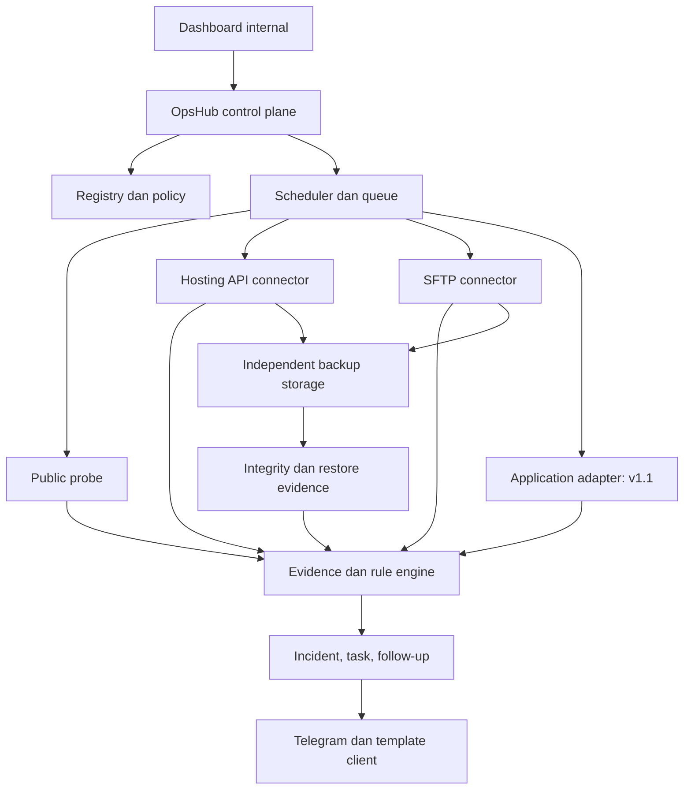
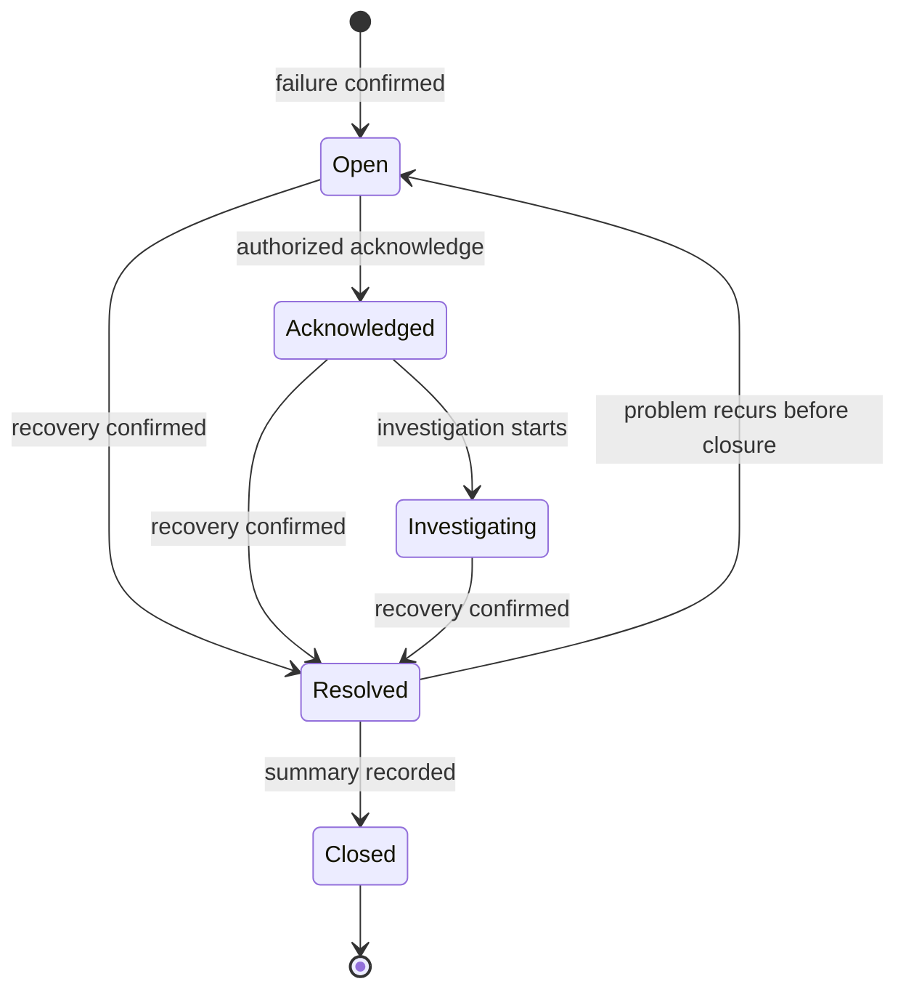

# Solveit OpsHub — Product Requirements Document

> **One control center for every client project Solveit maintains.**
>
> Dokumen ini adalah sumber acuan produk dan implementasi. Agent harus memahami keputusan, batas akses, aturan status, serta acceptance criteria di dalamnya sebelum menulis kode. Dokumen ini bukan perintah untuk langsung mengubah production client.

| Metadata | Nilai |
|---|---|
| Produk | Solveit OpsHub |
| Pemilik produk | Solveit Indonesia |
| Versi dokumen | 1.0.0 |
| Tanggal | 3 Oktober 2026 |
| Bahasa UI dan template | Bahasa Indonesia; identifier kode berbahasa Inggris |
| Zona waktu tampilan default | Asia/Jakarta |
| Target pertama | Sistem internal Solveit Indonesia |
| Target berikutnya | Evaluasi produk untuk software house, agency, freelancer multi-client, dan penyedia maintenance |
| Status | Baseline implementasi; pilihan teknis pada bagian 22 adalah rekomendasi, bukan fakta tentang repository yang sudah ada |
| Prioritas kanal komunikasi | Telegram saja pada Internal v1 |

## Daftar isi

1. [Ringkasan dan keputusan utama](#1-ringkasan-dan-keputusan-utama)
2. [Konteks masalah dan tujuan](#2-konteks-masalah-dan-tujuan)
3. [Pengguna, peran, dan permission](#3-pengguna-peran-dan-permission)
4. [Lingkup dan tahapan rilis](#4-lingkup-dan-tahapan-rilis)
5. [Konsep sistem dan batas shared hosting](#5-konsep-sistem-dan-batas-shared-hosting)
6. [Model status, freshness, dan health](#6-model-status-freshness-dan-health)
7. [Alur end-to-end](#7-alur-end-to-end)
8. [Registry client, proyek, dan aset](#8-registry-client-proyek-dan-aset)
9. [Connector dan discovery kemampuan](#9-connector-dan-discovery-kemampuan)
10. [Monitoring dan incident](#10-monitoring-dan-incident)
11. [Renewal, reminder, dan tindak lanjut client](#11-renewal-reminder-dan-tindak-lanjut-client)
12. [Integrasi Telegram](#12-integrasi-telegram)
13. [Template pesan client](#13-template-pesan-client)
14. [Backup, verifikasi, dan restore](#14-backup-verifikasi-dan-restore)
15. [Audit dan maintenance](#15-audit-dan-maintenance)
16. [Controlled operations dan approval](#16-controlled-operations-dan-approval)
17. [Policy, scheduler, dan job reliability](#17-policy-scheduler-dan-job-reliability)
18. [Dashboard, halaman, dan UX](#18-dashboard-halaman-dan-ux)
19. [Model data konseptual](#19-model-data-konseptual)
20. [Kontrak API dan event](#20-kontrak-api-dan-event)
21. [Keamanan dan tata kelola data](#21-keamanan-dan-tata-kelola-data)
22. [Arsitektur implementasi](#22-arsitektur-implementasi)
23. [Nonfunctional requirements](#23-nonfunctional-requirements)
24. [Skenario uji dan traceability](#24-skenario-uji-dan-traceability)
25. [Milestone implementasi](#25-milestone-implementasi)
26. [Ukuran keberhasilan dan evaluasi produk](#26-ukuran-keberhasilan-dan-evaluasi-produk)
27. [Risiko, asumsi, dan keputusan deployment](#27-risiko-asumsi-dan-keputusan-deployment)
28. [Instruksi eksekusi untuk coding agent](#28-instruksi-eksekusi-untuk-coding-agent)
29. [Definition of done](#29-definition-of-done)
30. [Referensi dan glosarium](#30-referensi-dan-glosarium)

## 1. Ringkasan dan keputusan utama

Solveit OpsHub adalah pusat operasi internal untuk mengelola kondisi dan siklus pemeliharaan seluruh proyek client Solveit Indonesia. Sistem menghubungkan identitas client dan proyek dengan domain, hosting, environment, repository, akses connector, monitoring, backup, renewal, incident, audit, serta pekerjaan maintenance.

Nilai utamanya adalah menjawab **proyek mana membutuhkan perhatian, apa buktinya, siapa penanggung jawabnya, tindakan apa yang diperlukan, dan apakah tindakan itu sudah berhasil**. Data dan pekerjaan tersebut tidak boleh terpisah menjadi daftar credential atau dashboard uptime saja.

OpsHub bertindak sebagai **control plane/orchestrator**. Probe eksternal, API hosting, SFTP, dan adapter aplikasi menjalankan pekerjaan sesuai kemampuan yang tersedia. Sebagian besar proyek Solveit berada di shared hosting; kemampuan setiap proyek harus diuji dan dicatat, bukan diasumsikan seragam.

### 1.1 Keputusan produk yang mengikat

| ID | Keputusan |
|---|---|
| DEC-01 | Internal-first. Tidak ada public signup, subscription billing, marketplace, atau portal client pada Internal v1. |
| DEC-02 | Telegram adalah satu-satunya integrasi notification eksternal pada Internal v1. Dashboard tetap menyimpan seluruh notifikasi dan status pengiriman. |
| DEC-03 | Telegram mengirim alert internal dan menyediakan **template chat client yang sudah terisi konteks**. Template dapat disalin tim untuk dikirim kepada client. |
| DEC-04 | Pengiriman langsung otomatis ke client tidak diaktifkan pada Internal v1. Client tidak diwajibkan memiliki Telegram. Tim meninjau pesan dan mencatat pengiriman manual; ini merupakan default rancangan untuk kebutuhan template siap kirim. |
| DEC-05 | WhatsApp, email notification, Slack, Discord, push, dan integrasi komunikasi lain hanya roadmap. Mencatat kanal pengiriman manual bukan integrasi API kanal tersebut. |
| DEC-06 | Semua hasil eksternal memiliki sumber, waktu observasi, freshness, dan status ketersediaan. Data hilang atau stale tidak boleh dipresentasikan sebagai sehat. |
| DEC-07 | Unsupported adalah batas kemampuan, bukan hasil pemeriksaan gagal. Kegagalan connector bukan otomatis berarti website down. |
| DEC-08 | Backup dianggap terlindungi setelah artifact tersimpan di storage independen dan lolos verifikasi integritas. Restore test merupakan tingkat verifikasi tambahan. |
| DEC-09 | Update dependency/deployment custom, migration, restore production, perubahan DNS, dan penghapusan artifact tidak boleh dijalankan otomatis tanpa kontrol yang didefinisikan. |
| DEC-10 | Internal v1 mengotomasi observasi, reminder, template, dan backup yang didukung. Maintenance custom dikelola sebagai task/runbook; eksekusi update custom melalui connector hadir pada v1.1. |
| DEC-11 | Secret sebenarnya berada di secrets manager; record bisnis menyimpan referensi. Token dan password tidak dikirim ke Telegram, log, browser, atau export biasa. |
| DEC-12 | OpsHub production memiliki runtime, worker, dan storage sendiri; tidak bergantung pada salah satu shared hosting client. |
| DEC-13 | Tidak ada arbitrary remote shell, autonomous AI agent di production, atau auto-update seluruh proyek sekaligus. |
| DEC-14 | Scope internal tetap menggunakan organization scope untuk menjaga jalur menuju SaaS; menjalankan banyak tenant publik membutuhkan review dan release terpisah. |

### 1.2 Definisi kata normatif

- **WAJIB/MUST**: syarat penerimaan yang harus dipenuhi pada release tempat requirement berada.
- **SEBAIKNYA/SHOULD**: rekomendasi yang dapat diganti dengan keputusan tertulis dan bukti.
- **BOLEH/MAY**: opsi, bukan kewajiban scope.
- **Internal v1**: paket release lengkap milestone M0–M5. Demo milestone sebelumnya bukan release lengkap.
- **v1.1**: perluasan setelah loop Internal v1 terbukti; tidak boleh diklaim selesai hanya dengan placeholder UI.

## 2. Konteks masalah dan tujuan

### 2.1 Kondisi awal

Solveit Indonesia adalah software house dengan tim sekitar 3–4 orang dan proyek yang tersebar pada berbagai provider. Mayoritas menggunakan shared hosting. Portofolio dapat mencakup Laravel/PHP, frontend statis/React, WordPress, atau aplikasi custom. Daftar provider, jumlah proyek, credential, dan jenis aplikasi sebenarnya harus diinventarisasi saat implementasi/pilot; contoh dalam dokumen bukan data client nyata.

Masalah yang ingin diselesaikan:

1. Tim harus mencari ulang hosting, domain, repository, PIC, dan akses ketika ada gangguan.
2. Website, SSL, koneksi aplikasi, dan backup tidak diawasi secara konsisten.
3. Domain, hosting, dan kontrak dapat mendekati jatuh tempo tanpa tindak lanjut yang jelas.
4. Backup tersedia tetapi cakupan, lokasi independen, integritas, dan kemampuan restore belum tentu diketahui.
5. Maintenance tidak memiliki policy, histori bukti, atau accountability yang seragam.
6. Alert teknis belum diterjemahkan menjadi tindakan internal atau pesan yang mudah dipahami client.

### 2.2 Tujuan dan hasil yang diharapkan

| ID | Tujuan | Hasil yang bisa diamati |
|---|---|---|
| GOAL-01 | Satu sumber informasi operasional | Proyek aktif memiliki client, PIC, environment production, URL/aset relevan, dan status coverage. |
| GOAL-02 | Gangguan terdeteksi tanpa pemeriksaan manual harian | Incident otomatis berisi bukti check, status, dan notification delivery. |
| GOAL-03 | Renewal ditindaklanjuti sebelum deadline | Reminder menghasilkan follow-up dengan template client, PIC, next follow-up, dan bukti penyelesaian. |
| GOAL-04 | Backup dapat dipercaya secara bertahap | Artifact independen, manifest, checksum, coverage, dan restore evidence dapat diperiksa. |
| GOAL-05 | Pekerjaan maintenance dapat ditelusuri | Temuan → task → tindakan → verifikasi → audit trail terhubung. |
| GOAL-06 | Founder melihat prioritas harian | Dashboard menampilkan kebutuhan perhatian berdasarkan severity, deadline, dan ownership. |
| GOAL-07 | Menjadi landasan calon produk Solveit | Ada data penggunaan, beban support, biaya operasi, dan hasil pilot sebelum evaluasi SaaS. |

### 2.3 Hal yang bukan janji produk

OpsHub tidak menjamin semua hosting memberi akses API; tidak membaca metric OS shared server tanpa izin; tidak memastikan website bebas kerentanan melalui health check; tidak menjamin snapshot file konsisten dengan database; tidak menganggap pembayaran invoice berarti layanan sudah diperpanjang; dan tidak menjanjikan seluruh data live tanpa interval.

## 3. Pengguna, peran, dan permission

### 3.1 Persona

| Persona | Kebutuhan utama |
|---|---|
| Founder/Owner | Melihat risiko lintas client, pekerjaan overdue, coverage backup, dan kesiapan renewal. |
| Operator/Developer | Menghubungkan proyek, memeriksa gangguan, menjalankan backup yang disetujui, dan menyelesaikan task. |
| Operations/Finance | Menangani renewal, komunikasi client, kontrak, dan bukti pembayaran tanpa membuka credential teknis. |
| Viewer/Auditor | Membaca status dan histori yang diizinkan tanpa melakukan tindakan. |

### 3.2 Role baseline

Nama role aplikasi: `OWNER`, `OPERATOR`, `OPERATIONS`, `VIEWER`. Permission harus diperiksa server-side, bukan sekadar menyembunyikan tombol.

| Kemampuan | OWNER | OPERATOR | OPERATIONS | VIEWER |
|---|---:|---:|---:|---:|
| Kelola user, role, policy global, Telegram destination | Ya | Tidak | Tidak | Tidak |
| Baca proyek | Semua dalam organisasi | Ditugaskan | Ditugaskan | Ditugaskan |
| Kelola registry proyek/aset | Ya | Ditugaskan | Metadata administratif ditugaskan | Tidak |
| Kelola secret reference/connector | Ya | Ditugaskan dan permission eksplisit | Tidak | Tidak |
| Baca nilai secret asli | Tidak melalui UI v1 | Tidak melalui UI v1 | Tidak | Tidak |
| Jalankan monitoring/audit aman | Ya | Ditugaskan | Tidak | Tidak |
| Trigger backup yang sudah dikonfigurasi | Ya | Ditugaskan | Tidak | Tidak |
| Akses/download backup | Permission eksplisit + step-up | Permission eksplisit + step-up | Tidak | Tidak |
| Kelola renewal dan follow-up client | Ya | Ditugaskan | Ditugaskan | Tidak |
| Acknowledge/assign incident | Ya | Ditugaskan | Incident administratif ditugaskan | Tidak |
| Request risky action | Ya | Ditugaskan | Tidak | Tidak |
| Approve risky action | Ya, mengikuti pemisahan tugas | Permission approver terpisah | Tidak | Tidak |
| Baca audit trail | Semua | Proyek ditugaskan, field terbatas | Area administratif ditugaskan | Scope diberikan |
| Export operasional tanpa secret | Ya | Scope ditugaskan | Scope administratif | Tidak secara default |

Permission tambahan seperti `backup.download`, `operation.approve`, dan `connector.manage` tidak otomatis diberikan pada seluruh operator. Record yang melibatkan satu hosting account bersama harus menghormati scope account dan seluruh proyek yang terdampak.

### 3.3 Identity Telegram

Telegram user dihubungkan ke user OpsHub melalui proses binding terverifikasi. `username`, display name, keanggotaan grup, dan kemampuan melihat pesan bukan bukti otorisasi. Setiap callback mengecek user aktif, organisasi, akses proyek, permission tindakan, serta state terbaru. User yang dinonaktifkan kehilangan akses callback segera.

## 4. Lingkup dan tahapan rilis

### 4.1 Lingkup fitur

| Modul | Internal v1 | v1.1 | Future product |
|---|---|---|---|
| Registry client/proyek/aset/environment/PIC | Lengkap | Perbaikan onboarding | Import massal dan template industri |
| Auth internal, RBAC, audit trail | Lengkap | Hardening | Tenant publik, enterprise identity |
| HTTP/TLS/DNS monitoring | Lengkap, satu lokasi probe awal | Lokasi probe tambahan | Distribusi global |
| Connector cPanel | Read + backup capability yang teruji | Provider coverage tambahan | Library connector lebih luas |
| SFTP | Pull file/backup artifact, read-only | Restore file terkontrol bila teruji | Optimasi incremental |
| Agent aplikasi ringan | Kontrak dan status unsupported tersedia | Adapter Laravel read-only + heartbeat | Adapter lain sesuai demand |
| Backup files/full account + integrity | Implementasi pada path yang didukung | DB/app adapter tambahan | Optimasi skala dan policy lanjutan |
| Restore | Runbook + restore drill isolated/manual dengan evidence | Eksekusi terkontrol untuk target yang didukung | Orkestrasi lebih luas |
| Audit | Pemeriksaan pasif + checklist manual | Repository lockfile/dependency advisory integration | Audit lebih luas berbasis kebutuhan |
| Maintenance | Task, jadwal, runbook, verifikasi manual | Controlled deployment/update | Automasi terpilih setelah bukti aman |
| Renewal + template client + follow-up | Lengkap | Penyempurnaan workflow | Portal client dan pengiriman terotorisasi |
| Telegram | Alert, digest, template, callback terbatas | Penyempurnaan | Tetap tersedia |
| Kanal selain Telegram | Tidak | Tidak wajib | WhatsApp/email/Slack/Discord/push sesuai prioritas |
| Billing SaaS, public signup | Tidak | Tidak | Release terpisah setelah validasi |
| AI insight | Tidak | Rule-based recommendation | AI opsional; tidak menjadi otoritas eksekusi |

**P0** berarti wajib agar loop registry → monitor → notify → client follow-up berjalan; **P1** berarti wajib untuk Internal v1 lengkap, terutama connector/backup/audit; **P2** berarti v1.1; **P3** berarti future. P1 bukan opsional ketika release diberi label Internal v1.

### 4.2 Out of scope Internal v1

- Pembayaran otomatis, invoice generator, penjualan hosting, provisioning reseller/WHM, dan perpanjangan otomatis.
- Login otomatis/scraping UI control panel sebagai pengganti connector resmi.
- FTP plaintext, remote root access, OS patching shared server, dan penyimpanan password plaintext.
- Advanced APM/log streaming, distributed tracing, malware removal, penetration testing, atau port scanning masif.
- Dashboard public status, native mobile app, portal client, dan account switching lintas SaaS tenant.
- One-click restore full cPanel account sebagai user biasa; kemampuan ini memerlukan akses/provider yang sesuai [S4].
- Auto-update Laravel/React/PHP production, arbitrary command, auto-restart/auto-rollback universal.
- Integrasi API WhatsApp atau email, walaupun operator boleh mencatat bahwa pesan dikirim manual lewat media tersebut.

## 5. Konsep sistem dan batas shared hosting

### 5.1 Susunan logis



Diagram menjelaskan hubungan modul, bukan pilihan microservices. Implementasi awal disarankan modular monolith dengan worker terpisah.

### 5.2 Capability matrix

| Fungsi | Public probe | cPanel account API | SFTP read | App adapter v1.1 | Manual |
|---|---|---|---|---|---|
| HTTP status/response time | Ya | Bukan sumber utama | Tidak | Boleh menambah konteks | Bukan pengganti probe |
| TLS certificate expiry | Ya untuk endpoint TLS | Opsional | Tidak | Tidak wajib | Override dengan evidence |
| DNS observation | Ya | Account zone jika tersedia | Tidak | Tidak | Catat expected value |
| Domain expiry/renewal | Tidak selalu dapat ditentukan | Umumnya bukan registrar | Tidak | Tidak | Sumber utama v1: bukti registrar/invoice |
| Hosting expiry | Tidak | Belum tentu tersedia | Tidak | Tidak | Sumber utama v1 |
| Disk quota account | Tidak | Conditional | Tidak menghasilkan quota account andal | Quota folder bukan metric server | Boleh dengan label manual |
| CPU/RAM seluruh shared server | Tidak | Tidak diasumsikan | Tidak | Tidak | N/A bila tidak didukung |
| DB connectivity | Tidak dari homepage | Tidak membuktikan app sehat | Tidak | Ya bila izin adapter tersedia | Checklist |
| File backup | Tidak | Conditional full-account | Ya, scope folder | Conditional | Upload evidence/artifact |
| DB backup | Tidak | Bisa tercakup full backup | Tidak dari file biasa | Conditional dump | Export terkontrol |
| Restore full account | Tidak | Tidak diasumsikan | Tidak | Tidak | Koordinasi provider/WHM |
| Dependency audit | Tidak | Tidak diasumsikan | Lockfile read opsional v1.1 | Conditional | Review checklist v1 |
| Deployment/update custom | Tidak | Tidak diasumsikan | Read-only v1 | V1.1 allowlisted adapter | Runbook terotorisasi |

cPanel token dan fitur backup dapat dinonaktifkan provider [S3, S4]. SFTP hanya menyediakan file; menyalin file data database hidup bukan strategi backup database aplikasi. Jenis panel `hPanel`, Plesk, atau panel custom tidak boleh diperlakukan sebagai cPanel tanpa adapter yang benar.

### 5.3 Capability profile per resource

Setiap hosting account/environment memiliki daftar capability, misalnya:

```json
{
  "resource_id": "ha_demo_01",
  "capabilities": {
    "account_disk_read": "supported",
    "full_backup_trigger": "supported",
    "backup_artifact_pull": "supported",
    "full_account_restore": "unsupported",
    "application_health": "not_configured",
    "deployment_execute": "unsupported"
  },
  "last_tested_at": "2026-10-03T14:00:00Z"
}
```

Nilai capability: `supported`, `unsupported`, `permission_denied`, `not_configured`, `unknown`. `supported` harus berasal dari capability test aman/evidence atau konfigurasi terverifikasi; tidak boleh dari nama panel saja. Pengujian discovery tidak boleh memicu backup atau tindakan write diam-diam.

## 6. Model status, freshness, dan health

### 6.1 Pisahkan dimensi

| Dimensi | Enum | Makna |
|---|---|---|
| Project lifecycle | `draft`, `onboarding`, `active`, `paused`, `archived` | Tahap pengelolaan proyek |
| Monitor state | `unknown`, `up`, `suspect`, `down`, `recovering`, `paused` | Kondisi hasil probe |
| Observation freshness | `fresh`, `stale`, `never_observed` | Usia data, terpisah dari nilai |
| Check outcome | `pass`, `warn`, `fail`, `unknown`, `not_applicable`, `unsupported` | Hasil check tertentu |
| Health summary | `healthy`, `warning`, `critical`, `unknown` | Ringkasan risiko operasional |
| Coverage | `complete`, `partial`, `unconfigured` | Kelengkapan check policy yang berlaku |
| Incident lifecycle | `open`, `acknowledged`, `investigating`, `resolved`, `closed` | Penanganan masalah |
| Severity | `info`, `warning`, `critical` | Urgensi; tidak identik dengan lifecycle |
| Maintenance context | window + reason + start/end | Label terpisah, tidak menyembunyikan hasil observasi |

Sebuah proyek dapat memiliki website `up`, health `warning`, coverage `partial`, dan backup `unsupported`. Ini bukan kontradiksi.

### 6.2 Freshness dan metadata observasi

Setiap observation menyimpan `observed_at` dari sumber jika ada, `received_at`, `source_type`, `source_id`, `evidence_ref`, `value`, `unit`, `quality`, serta `fresh_until`. Waktu agent tidak dipercaya jika clock skew melewati toleransi. Waktu OpsHub digunakan untuk reliability scheduler.

Default freshness: interval 60 detik → stale setelah 180 detik; interval 5 menit → 15 menit; interval 12 jam → 25 jam; sinkronisasi harian → 26 jam. Formula cepat adalah `max(3 × interval, 180 detik)` untuk interval ≤ 5 menit; interval lain menggunakan batas policy eksplisit. Nilai masih dapat ditampilkan sebagai last known value dengan badge stale.

### 6.3 Health aggregation deterministik

Urutan evaluasi:

1. Jika ada finding aktif critical pada aset yang berlaku atau incident critical belum resolved → `critical`.
2. Jika ada finding warning, task maintenance wajib overdue, renewal due/unknown wajib diverifikasi, backup overdue, atau required check stale/unsupported/tidak dikonfigurasi → `warning` bila masih ada observasi fresh relevan.
3. Jika tidak ada observasi fresh untuk core uptime/environment production yang wajib dipantau → `unknown`, kecuali sudah memenuhi aturan critical di langkah 1.
4. `healthy` hanya ketika seluruh required check yang berlaku fresh dan memenuhi policy, tanpa finding aktif warning/critical. Tidak ada scan tidak berarti tidak ada kerentanan.

Coverage dihitung dari required capability yang applicable. `not_applicable` hanya dengan alasan yang dicatat; `unsupported` tidak boleh dikeluarkan diam-diam dari denominator. Counter dashboard Healthy/Warning/Critical/Unknown saling eksklusif; Maintenance Due/Client Action Due adalah counter pekerjaan dan bisa overlap.

### 6.4 Uptime dan waktu gangguan

Uptime observed = successful eligible checks / total eligible checks × 100. Hanya check yang benar-benar dijalankan dihitung. Unknown/missed check dan maintenance exclusion dilaporkan terpisah; tidak dimasukkan sebagai sukses. Bila tidak ada eligible check, hasil `N/A`, bukan 100%.

Incident menyimpan `first_failed_at`, `confirmed_down_at`, `last_failed_at`, `first_recovery_sample_at`, dan `confirmed_recovered_at`. Durasi estimasi downtime dihitung dari first failed sample ke first recovery sample setelah recovery terkonfirmasi. Tampilkan bahwa angka ini estimasi berbasis interval probe. Tidak boleh mengklaim SLA multi-region dari satu lokasi.

## 7. Alur end-to-end

### 7.1 Onboarding proyek

1. Operator membuat/memilih client dan contact PIC.
2. Membuat proyek: nama, kode, tipe aplikasi, internal owner, dan contract responsibility.
3. Menambahkan production/staging environment, URL, domain, hosting account, repository link, dan service renewals.
4. Menyatakan batas kewenangan Solveit untuk observe/backup/maintain dan expiry authorization jika ada.
5. Memilih policy; sistem menampilkan required checks dan capability gap.
6. Menghubungkan connector secara opsional, membuat secret di secrets manager, lalu test read-only.
7. Mengonfigurasi monitoring, jalur backup, jam maintenance, dan destination Telegram.
8. Preview ringkasan coverage dan biaya/beban job estimasi, lalu aktivasi.
9. Sistem menjalankan initial checks dan mengirim ringkasan onboarding internal. Tidak langsung memicu tindakan write selain backup yang diaktifkan secara eksplisit.

Proyek tanpa hosting credential tetap dapat aktif dengan external monitoring, renewal manual, dan coverage partial. Required field yang belum ada harus terlihat sebagai action item.

### 7.2 Gangguan website

Probe gagal → suspect → konfirmasi berulang → satu incident → alert Telegram → operator acknowledge → investigasi/task → pemulihan terkonfirmasi → recovery alert → resolusi teknis → closure dengan ringkasan.

Acknowledgement menghentikan escalation unacknowledged, bukan menyatakan website pulih. Resolusi monitor-driven terjadi dari evidence recovery. Close manual tidak boleh menonaktifkan alert masalah yang masih berlangsung.

### 7.3 Renewal membutuhkan tindakan client

Service jatuh tempo terverifikasi → threshold reminder → satu follow-up untuk renewal cycle → pesan internal Telegram + template client → operator review/copy → pengiriman manual → catat contact/evidence → menunggu client → eskalasi atau follow-up → provider/registrar membuktikan expiry baru → verifikasi → selesai.

Invoice paid atau client berkata “sudah bayar” hanya milestone pembayaran. Renewal belum resolved sampai expiry baru/service status terverifikasi.

### 7.4 Backup

Jadwal → preflight → resource lock → request/dump/pull sesuai connector → artifact independen → manifest dan integrity check → event hasil → backup history → overdue/failure incident bila perlu → restore drill sesuai jadwal.

### 7.5 Maintenance

Audit/checklist menemukan masalah → finding → task dengan PIC/deadline → runbook/change plan → otorisasi bila perlu → tindakan manual v1/adapter v1.1 → verification → task selesai → audit trail. Task tidak selesai hanya karena command exit code 0.

## 8. Registry client, proyek, dan aset

### 8.1 Requirements

| ID | Prioritas | Requirement dan kriteria penerimaan |
|---|---|---|
| REG-01 | P0 | CRUD client/contact. Nama client wajib; contact purpose, preferred manual channel, dan PIC dapat dicatat. Contact tidak otomatis menjadi user sistem. |
| REG-02 | P0 | CRUD project dengan client, unique project code dalam organisasi, stack tags, internal PIC, lifecycle, criticality, dan notes. Satu client dapat memiliki banyak proyek. |
| REG-03 | P0 | Environment terpisah: `production`, `staging`, `development`, atau custom label. Monitoring/backup/authorization tidak dibagi diam-diam antar environment. |
| REG-04 | P0 | Asset registry mencakup URL, domain, hosting account, provider, repository reference, database metadata, storage destination reference, dan service subscription. Secret tidak berada di field notes. |
| REG-05 | P0 | Asset dapat shared oleh beberapa proyek. Satu domain/hosting account yang digunakan bersama memiliki satu canonical record dan relasi usage. |
| REG-06 | P0 | Setiap aset memiliki owner, responsibility (`solveit`, `client`, `provider`, `shared`), source/evidence, verified_at, dan notes batas akses. |
| REG-07 | P1 | Hosting account mencatat provider, panel type, hostname, account identifier, quota bila diketahui, akses tersedia, dan path roots per environment. API endpoint terpisah dari public URL. |
| REG-08 | P0 | Service renewal mencatat billing party, paying party, action owner, expiry semantics, reminder policy, source, dan evidence. Unknown date tetap null dan membuat task verifikasi. |
| REG-09 | P1 | Scope pengelolaan/authorization dicatat per proyek atau account: jenis tindakan diizinkan, evidence, masa berlaku, dan authorizer. Tindakan write diblokir bila scope tidak mengizinkan. |
| REG-10 | P0 | Archive/paused menghentikan jadwal masa depan setelah job berjalan direkonsiliasi. Histori tidak dihapus; shared resource yang masih dipakai proyek aktif tetap dijadwalkan sekali. |
| REG-11 | P1 | Search/filter client, stack, provider, status, PIC, coverage, renewal due. Paginated, tanpa secret pada response. |
| REG-12 | P1 | Export CSV registry dan action list dengan scope RBAC, audit export, redaction, dan mitigasi formula injection. Import CSV massal future. |

### 8.2 Aturan resource bersama

Full backup cPanel adalah backup account, bukan otomatis backup satu aplikasi. Jika account menyimpan tiga proyek, backup run terikat account dan mencatat seluruh project coverage. Akses download diberikan hanya kepada user dengan izin seluruh cakupan account atau owner yang berwenang. Telegram untuk operator scoped menampilkan ringkasan proyek yang boleh dilihat, tanpa mengungkap proyek lain.

Domain renewal dimiliki domain/service canonical, bukan masing-masing project. Incident resource bisa memiliki banyak affected projects; reminder tidak dikirim tiga kali karena tiga project memakai domain sama.

## 9. Connector dan discovery kemampuan

### 9.1 Requirements

| ID | Prioritas | Requirement dan kriteria penerimaan |
|---|---|---|
| CON-01 | P1 | Adapter interface seragam untuk validate config, safe discovery, read observations, backup support, dan reconcile run. Fitur unsupported mengembalikan typed result. |
| CON-02 | P1 | cPanel menggunakan API resmi pada account milik/diotorisasi Solveit. Token reference hanya dipakai worker; verifikasi TLS wajib [S3]. |
| CON-03 | P1 | SFTP read-only menggunakan host-key verification dan allowed remote roots. Listing/download tidak mengikuti symlink keluar scope. Kredensial write tidak diperlukan pada v1. |
| CON-04 | P0 | Public probe tidak membutuhkan credential hosting. Secret health endpoint hanya lewat auth header backend; tidak ditampilkan di URL. |
| CON-05 | P1 | Connection lifecycle: `not_configured`, `connected`, `degraded`, `auth_failed`, `disabled`. Capability status tersimpan terpisah. |
| CON-06 | P1 | Test connection read-only menampilkan timestamp, capabilities, serta alasan gagal yang sudah disanitasi. Tidak menyimpan token dalam error. |
| CON-07 | P1 | 401/403 → auth/permission issue, pause job write, alert internal. Retry tidak berulang tanpa batas. Uptime tetap berjalan. |
| CON-08 | P1 | Provider unsupported memakai fallback external monitoring + manual tasks. UI tidak menawarkan action yang tidak ada. |
| CON-09 | P2 | Adapter Laravel read-only melaporkan heartbeat scheduler, app/runtime version, DB check, dan deployment revision sesuai izin. Tidak menerima arbitrary command. |
| CON-10 | P2 | Repository integration membaca commit/dependency lockfile/advisory via akses read-only. Repo data tidak membuktikan versi yang sudah terdeploy. |
| CON-11 | P1 | Secret rotation atomik: test referensi baru → switch → audit → revoke lama melalui operator/provider. Jika test gagal, referensi aktif tidak berubah. |

### 9.2 Kontrak normalized result

```json
{
  "status": "unsupported",
  "capability": "account_disk_read",
  "reason_code": "PROVIDER_FEATURE_DISABLED",
  "message": "Provider belum mengaktifkan fungsi ini.",
  "observed_at": "2026-10-03T14:00:00Z",
  "evidence_ref": "ev_demo_01",
  "retryable": false
}
```

Error reason minimum: `AUTH_FAILED`, `PERMISSION_DENIED`, `UNSUPPORTED_CAPABILITY`, `RATE_LIMITED`, `NETWORK_TIMEOUT`, `TLS_INVALID`, `HOST_KEY_MISMATCH`, `QUOTA_INSUFFICIENT`, `SOURCE_BUSY`, `ARTIFACT_INCOMPLETE`, `INTEGRITY_FAILED`, `AUTHORIZATION_EXPIRED`. Tidak ada `success=true` pada unsupported.

## 10. Monitoring dan incident

### 10.1 Jenis check Internal v1

| Check | Default interval | Bukti | Batas |
|---|---|---|---|
| HTTP availability | 60 detik | status code, latency, redirect summary, timeout reason | Satu lokasi probe awal; bukan global uptime |
| Expected content | Bersamaan HTTP, bila diaktifkan | Match/nonmatch string yang ditetapkan | Body dibatasi; tidak menyimpan halaman lengkap secara default |
| TLS validity/expiry | 12 jam | hostname match, chain validity, expiry timestamp | Expiry sertifikat bukan expiry domain |
| DNS resolution | 6 jam | Record yang diizinkan, expected value bila configured | DNS berubah tidak selalu incident; policy menentukan |
| Protected app health URL | 5 menit, opsional | Payload schema yang dikonfigurasi | Tidak mengasumsikan schema semua aplikasi sama |
| cPanel account disk | 15 menit jika supported | Bytes used/quota atau unknown quota | Account scope; bukan metric seluruh server |
| Backup age | Evaluasi tiap 15 menit | Last verified backup per required scope | Backup provider tanpa evidence tidak dianggap verified |
| Connector validity | Bersamaan scheduled reads | Auth/permission/circuit status | Tidak menjalankan write untuk test |
| Worker/scheduler freshness OpsHub | 1 menit | Heartbeat + queue lag | Missing observation terpisah dari target down |

### 10.2 Requirements

| ID | Prioritas | Requirement dan kriteria penerimaan |
|---|---|---|
| MON-01 | P0 | HTTP method GET default; allowed expected status default 200–299. Redirect maksimal 5 dan setiap hop divalidasi; timeout default 10 detik; response body maksimal 1 MiB. Policy dapat menyesuaikan dalam batas platform. |
| MON-02 | P0 | Satu monitor tidak overlap run. Simpan scheduled_at, started_at, completed_at, dan normalized outcome. Missing run membuat freshness issue, bukan HTTP fail palsu. |
| MON-03 | P0 | Default down setelah 3 failed eligible samples berturut-turut; satu failure → suspect. Recovery setelah 2 successful samples berturut-turut. Nilai dapat diubah policy dengan audit. |
| MON-04 | P0 | Wrong expected content pada HTTP 200 boleh dianggap fail hanya jika expected content dikonfigurasi. Error page HTTP 200 tidak otomatis berarti aplikasi sehat. |
| MON-05 | P0 | TLS warning default ≤30 hari, critical ≤7 hari atau certificate invalid/expired. Nilai threshold berasal policy, bukan hardcoded pada template. |
| MON-06 | P1 | Disk warning ≥80%, critical ≥90%, hanya jika quota denominator diketahui. Quota unknown menampilkan bytes dan status quota unknown, bukan 0%. Recovery threshold warning <75%, critical <85%. |
| MON-07 | P0 | Incident dedup oleh organization + resource + rule + environment + active episode. Repeat failure menambah evidence, bukan incident baru setiap menit. |
| MON-08 | P0 | Incident detail memiliki impacted projects, severity, reason, timeline, assignee, acknowledge, evidence, task, dan client follow-up jika applicable. |
| MON-09 | P0 | Recovery mengubah incident ke resolved; close membutuhkan ringkasan tindakan/cause bila diketahui. Unknown cause boleh ditulis secara jujur. |
| MON-10 | P0 | Maintenance window suppress notification sesuai rule, tetap menyimpan checks/downtime. Setelah window selesai, problem yang masih ada dievaluasi dan diberi alert. |
| MON-11 | P1 | Correlation resource shared menggabungkan affected projects. Sistem tidak menyatakan provider outage tanpa evidence; hanya 'beberapa proyek pada account/provider ini terdampak'. |
| MON-12 | P0 | Timeline tidak menyimpan body aplikasi, data user client, atau raw sensitive headers. Evidence menggunakan ringkasan terstruktur yang cukup untuk diagnosis. |
| MON-13 | P0 | Flapping: ≥3 down/recovery episode dalam 30 menit menghasilkan warning stabilitas dan coalescing. Status terbaru tetap terlihat; escalation tidak membanjiri grup. |
| MON-14 | P1 | OpsHub memiliki halaman kesehatan scheduler, worker, queue, storage, notification, dan secrets manager. Independent watchdog di luar proses utama diperlukan saat pilot production. |

### 10.3 Incident state transition



Kegagalan setelah closed membuat episode baru dengan link ke incident sebelumnya. Kegagalan sebelum closure membuka ulang episode yang sama, mempertahankan histori recovery. Closing tidak dapat dilakukan saat rule masih failing; false positive memerlukan reason dan perubahan rule terotorisasi, bukan menghapus evidence.

### 10.4 Tindakan pertama berdasarkan masalah

| Kondisi | Action owner awal | Tindakan sistem |
|---|---|---|
| Website down | Operator | Incident + alert; template client opsional setelah dampak terverifikasi |
| Disk hampir penuh | Operator | Task analisis; template upgrade hanya bila client perlu keputusan |
| Domain/hosting renewal due | Responsibility registry | Follow-up administratif + template client jika client action owner |
| Backup gagal | Operator | Reconcile/retry terkontrol + incident; bukan langsung meminta client |
| Connector credential expired | Operator/Owner | Task rotasi akses; template request access bila client pemegang akun |
| SSL invalid | Operator | Investigasi renewal/certificate chain; client action hanya jika akses/biaya perlu mereka |

## 11. Renewal, reminder, dan tindak lanjut client

### 11.1 Definisi tanggal dan sumber

`expires_at` menyimpan instant jika provider memberikannya. Jika hanya tersedia tanggal, simpan `expiry_date`, `date_precision=date`, dan timezone sumber; gunakan akhir hari timezone itu untuk evaluasi reminder dengan label 'tanggal, jam belum diketahui'. `renew_by` adalah batas tindakan lebih awal yang dapat dipilih operator berdasarkan lead time; tidak menggantikan expiry asli.

Tanggal dari invoice bisa menjadi **billing due date**, bukan tanggal domain berakhir. Field `billing_due_at` dipisahkan. Domain expiry di RDAP/WHOIS dapat unavailable atau berbeda konteks auto-renew registry; Internal v1 mengutamakan data registrar/provider yang diverifikasi manual. Integrasi registrar/RDAP terotomasi adalah future, bukan prerequisite.

### 11.2 Requirements

| ID | Prioritas | Requirement dan kriteria penerimaan |
|---|---|---|
| REN-01 | P0 | Service renewal untuk domain, hosting, maintenance contract, license, atau credential expiry. Menyimpan responsible party dan evidence sumber. |
| REN-02 | P0 | Default reminder H-60/30/14/7/3/1 dan hari expiry; critical untuk ≤7 hari, warning ≤30 hari, info 31–60 hari. Lead time dapat override; istilah H berdasarkan calendar date timezone service. |
| REN-03 | P0 | Jika record pertama kali diinput pada H-5, hanya highest currently applicable threshold yang dikirim segera. Threshold terlewat dicatat skipped; tidak mengirim seluruh reminder historis. |
| REN-04 | P0 | Dedup key service_id + renewal_cycle_id + threshold + destination. Perubahan data tidak membuat ulang seluruh reminder pada cycle yang sama. |
| REN-05 | P0 | Template client otomatis tersedia bila action owner client/shared dan contact/PIC diketahui. Jika owner Solveit, reminder berupa task internal; template tetap dapat dibuat manual bila relevan. |
| REN-06 | P0 | Satu renewal cycle memiliki satu primary follow-up dengan histori contact attempts. Reminder H-14/H-7 memperbarui urgency pada follow-up yang sama. |
| REN-07 | P0 | Tanggal unknown → task verifikasi, template meminta informasi tanggal. Tidak mengarang expiry, biaya, deadline, suspension, atau grace period. |
| REN-08 | P0 | Mark contacted mencatat actor, contact, sent_at, manual channel, draft version, dan optional evidence. Copy template saja tidak mengubah status contacted. |
| REN-09 | P0 | Follow-up dapat memiliki assignee, response summary, next_followup_at, blocker, dan commitment client. Waiting client tidak menghentikan critical reminder internal. |
| REN-10 | P0 | 'Sudah diperpanjang' memerlukan expiry baru + evidence + verified_by/time. Perubahan membentuk cycle baru dan membuat pending reminder cycle lama cancelled. |
| REN-11 | P1 | Satu domain/hosting shared membuat satu reminder resource, dengan daftar impacted projects yang sesuai RBAC. |
| REN-12 | P0 | Pause/snooze mempunyai reason, expiry, dan actor. Snooze critical terbatas default maksimal 24 jam; overdue tetap muncul di dashboard. |
| REN-13 | P0 | Status pembayaran (`unknown`, `awaiting`, `reported_paid`, `verified_paid`, `not_required`) terpisah dari status renewal dan technical verification. |

### 11.3 Follow-up lifecycle

Pada verifikasi renewal, expiry baru harus melewati expiry cycle lama dan berada di masa depan, dengan precision/timezone serta evidence sumber yang jelas. `renew_by` untuk cycle baru harus dihitung ulang atau dimasukkan ulang; tidak menyalin deadline lama. Koreksi tanggal yang ternyata salah memakai operasi koreksi metadata dengan reason/evidence, bukan dianggap perpanjangan berhasil. Pembayaran dan approval evidence tidak boleh mengganti evidence masa aktif provider.

Enum: `open`, `contacted`, `waiting_client`, `client_confirmed`, `in_progress`, `resolved`, `cancelled`.

- `open`: tindakan client diperlukan; assignee belum/mulai menghubungi.
- `contacted`: operator mencatat pesan benar-benar dikirim. Set `next_followup_at` atau lanjut waiting.
- `waiting_client`: menunggu jawaban/akses/pembayaran/keputusan; wajib deadline tindak lanjut.
- `client_confirmed`: jawaban client dicatat; tindakan/verifikasi belum selesai.
- `in_progress`: Solveit/provider/client sedang menjalankan tindakan.
- `resolved`: outcome diverifikasi dengan evidence. Renewal harus memenuhi REN-10.
- `cancelled`: tidak lagi diperlukan dengan reason, misalnya layanan dihentikan berdasarkan keputusan client.

`overdue` adalah derived flag dari deadline, bukan lifecycle baru. Reopen diperbolehkan oleh user berizin dengan reason. Tabel contact attempts append-only untuk histori, correction dicatat sebagai revisi/evidence tambahan.

### 11.4 Escalation default

Info masuk digest; warning dikirim pada threshold dan saat next follow-up overdue; critical dikirim segera dan menjadi bagian critical unresolved digest. Default escalation unacknowledged critical setelah 15 menit dan satu pengingat lagi setelah 60 menit ke destination owner yang configured. Tidak ada infinite alert setiap menit. Bila critical sudah acknowledged tetapi action overdue, reminder terikat pekerjaan, bukan alert unacknowledged.

## 12. Integrasi Telegram

### 12.1 Tujuan

Telegram menghubungkan **deteksi masalah → perhatian tim → tindakan → komunikasi client → pencatatan hasil**. Bot bukan sekadar saluran pesan dan bukan endpoint untuk menerima perintah shell.

Ada tiga tipe pesan:

1. **Operational alert**: incident, backup, connector, overdue task, dan renewal.
2. **Action package**: konteks ringkas, action owner, deadline, tombol menuju follow-up, serta template client jika dibutuhkan.
3. **Digest**: ringkasan pagi dan daftar pekerjaan belum selesai dengan frekuensi terbatas.

### 12.2 Requirements

| ID | Prioritas | Requirement dan kriteria penerimaan |
|---|---|---|
| TG-01 | P0 | Owner mengatur bot token secret reference, destination allowlist, scope proyek/resource, timezone, digest schedule, dan severity routing. Test message eksplisit. |
| TG-02 | P0 | Destination berupa private chat atau grup internal. Group yang menerima semua proyek hanya beranggotakan orang yang memang boleh melihat semuanya. Bot tidak dapat menegakkan RBAC terhadap pembacaan pesan oleh anggota grup. |
| TG-03 | P0 | Pengiriman queued melalui transactional outbox. Incident/renewal tidak hilang bila Telegram sedang gagal. Dashboard tetap menampilkan pending/failed. |
| TG-04 | P0 | Setiap alert berisi event ID, project/resource, severity, waktu WIB, evidence ringkas, action owner, tindakan berikutnya, dan authenticated dashboard link. Tidak ada secret atau signed download backup di pesan. |
| TG-05 | P0 | Client action alert berisi template ready-to-copy secara terpisah dari pesan internal. Jika field wajib hilang, tampilkan blocked draft dan tombol lengkapi data. |
| TG-06 | P0 | Callback v1 terbatas pada Acknowledge, Ambil tugas, dan Minta template terbaru. Mark contacted/renewed/approve/restore/deploy dilakukan lewat dashboard authenticated. |
| TG-07 | P0 | Telegram user binding menggunakan one-time token dari session OpsHub authenticated, TTL 10 menit, private chat, dan konfirmasi akhir di dashboard. Tidak binding berdasarkan username. |
| TG-08 | P0 | Webhook memverifikasi secret header; dedup update_id per bot, simpan secara durable sebelum success response, lalu proses async. Invalid signature/token tidak melakukan mutation [S1]. |
| TG-09 | P0 | Callback payload berisi opaque reference pendek; server menyimpan action scope/expiry. Cek current state dan permission pada saat klik; replay aman dan tidak menggandakan assignment. |
| TG-10 | P0 | Delivery status tidak disebut read receipt. `sent` berarti Bot API menerima pesan dan message ID tersimpan, bukan penerima telah membaca [S1]. |
| TG-11 | P0 | Rate limit dan retry mempertimbangkan 429/retry_after. Critical mendapat prioritas; burst lintas proyek diringkas agar channel tidak banjir [S2]. |
| TG-12 | P0 | Template client dikirim sebagai pesan plaintext yang dapat disalin, terpisah dari header internal. Dashboard menyediakan tombol Copy template lengkap. Tidak bergantung pada fitur clipboard button Telegram. |
| TG-13 | P1 | Bot removal/block, invalid token, atau webhook backlog menjadi notification integration finding. Retry permanen dihentikan dan Owner melihat action item. |
| TG-14 | P0 | Commands: `/start` untuk binding/help, `/help`, `/today`, `/incidents`, dan `/template <followup_ref>`. Hasil detail dikirim ke private chat user bound, bukan ke grup yang scope-nya tidak tepat. |
| TG-15 | P0 | Quiet hours default 22:00–07:00 WIB menunda warning/info ke digest. Critical dan recovery dari critical yang sudah terkirim tetap segera. Template mengikuti severity parent. |
| TG-16 | P0 | Bot token disanitasi juga dari URL path pada logging HTTP/proxy/APM. Telemetry hanya menyimpan method/destination reference/result, bukan request URL penuh. |

### 12.3 Setup Telegram

1. Owner membuat bot melalui mekanisme Telegram yang resmi dan menyimpan token dalam secrets manager [S2].
2. OpsHub menguji identity bot dan mencatat bot identifier, bukan token pada database bisnis.
3. Owner menambahkan bot ke destination internal atau user memulai private chat sesuai setup Telegram.
4. Owner menambahkan destination yang diizinkan, memeriksa anggota/scope, lalu test delivery eksplisit.
5. Webhook HTTPS dikonfigurasi untuk production. Local development boleh long polling; satu bot/environment hanya menggunakan satu receiver aktif [S1].
6. User membentuk binding pribadi melalui proses TG-07.
7. Owner memilih route default, digest 08:00 WIB, quiet hours, dan escalation destination.

Gunakan bot terpisah untuk development/staging/production agar uji tidak menimpa webhook atau mengirim alert palsu production.

### 12.4 Delivery lifecycle dan retries

Enum delivery: `pending`, `sending`, `sent`, `retrying`, `failed`, `unknown`, `cancelled`, `superseded`.

- 429: jadwal retry mengikuti `retry_after` bila ada, ditambah jitter.
- 5xx/network error sebelum ada bukti pengiriman: retry exponential backoff default 10/30/90/300 detik, maksimal 5 attempts dalam 15 menit.
- Timeout setelah request mungkin diterima Telegram: status `unknown`; tidak mengklaim exactly-once. Retry terbatas dengan event reference yang sama dapat menghasilkan duplicate terlihat; dashboard menampilkan ketidakpastian.
- 400 malformed: gagal terminal, perbaiki payload; fallback plaintext boleh satu kali jika error formatting.
- 401 invalid token atau 403 forbidden: gagal terminal/disable destination atau connector; owner action item.
- Dedup internal menggunakan outbox event + destination + notification kind + threshold/revision. Ini mengurangi duplikasi internal, tidak memberi jaminan exactly-once pada jaringan eksternal.

Current state dibaca kembali sebelum dispatch. Warning sudah resolved dapat menjadi superseded; jika alert down belum terkirim dan recovery sudah terjadi, kirim ringkasan incident yang telah pulih alih-alih urutan down palsu lalu recovery. Jika down sudah sent, recovery adalah pesan baru yang wajib terkirim.

### 12.5 Payload dan format

Gunakan `sendMessage` biasa; pesan maksimal 4096 karakter setelah entity parsing, callback_data maksimal 64 byte [S1]. Target aplikasi internal maksimal 3500 karakter per message untuk menyediakan margin. Long template dipecah berdasarkan paragraf dengan penomoran bagian atau dibuka di dashboard; jangan memotong URL/placeholder menjadi pesan tidak valid. Escape seluruh teks eksternal jika memakai HTML/Markdown; template client default plaintext. Nonaktifkan link preview pada tautan dashboard.

Group limiter awal konservatif: maksimal 15 pesan/menit/destination; private chat maksimal 1 pesan/detik; bot-level 20 pesan/detik. Nilai operasional dapat direvisi mengikuti API dan hasil uji; alert storm menggabungkan banyak incident dalam satu ringkasan tanpa kehilangan incident individu di dashboard. Jangan aktifkan paid broadcast secara otomatis.

### 12.6 Contoh operational alert

```text
🔴 CRITICAL — Website tidak dapat diakses
Event: EVT-DEMO-001
Project: Website Client ABC
Environment: Production
URL: https://client.example
Temuan: 3 pemeriksaan gagal berturut-turut; HTTP 503.
Gagal pertama: 03 Oktober 2026, 20.13 WIB
Terkonfirmasi: 03 Oktober 2026, 20.15 WIB
PIC: Operator Solveit
Tindakan: periksa aplikasi dan hosting, lalu catat hasil investigasi.
```

Tombol: `Buka incident`, `Acknowledge`, `Ambil tugas`. Ketiga tombol tidak menjalankan perubahan production.

### 12.7 Contoh client action package

```text
🟠 TINDAKAN CLIENT — Perpanjangan hosting
Event: EVT-DEMO-002
Client: Client ABC
Project: Website Client ABC
Layanan: Hosting produksi
Berakhir: 20 Oktober 2026, jam belum dikonfirmasi
Sumber: panel provider; diverifikasi 03 Oktober 2026
Pemilik tindakan: Client
PIC Solveit: Hafizh
Status follow-up: Belum dihubungi
Tindakan: review template, hubungi PIC client, lalu catat pengiriman.
Template siap kirim tersedia pada pesan berikutnya.
```

Tombol: `Buka follow-up`, `Ambil tugas`, `Template terbaru`. Pesan berikutnya **hanya teks untuk client**, tanpa event internal, hosting credential, atau tombol internal. Bukan instruksi agar user meneruskan operational alert mentah.

### 12.8 Digest

Digest 08:00 WIB: Critical unresolved → client follow-up overdue → renewal 7 hari → backup overdue/fail → maintenance due → capability/data verification gaps. Tampilkan total dan maksimal 10 item prioritas + link filtered dashboard. Jangan mencetak seluruh daftar setiap pagi jika terdapat ratusan proyek.

## 13. Template pesan client

### 13.1 Prinsip dan lifecycle draft

Template harus singkat, sopan, mudah dipahami, relevan terhadap tindakan client, serta tidak mengklaim root cause yang belum diketahui. Isi default bahasa Indonesia dengan identitas Solveit Indonesia.

Template deterministic, bukan wajib LLM. Owner dapat mengubah wording dan publish versi baru. Setiap draft menyimpan `template_key`, `template_version`, `source_entity_version`, `variables_snapshot`, `rendered_body`, `draft_status`, `generated_at`, serta `last_edited_by` bila disunting.

Draft status: `ready`, `blocked_missing_data`, `stale`, `superseded`. User preview dapat berisi placeholder untuk melengkapi data; tombol Copy ready-to-send hanya aktif jika mandatory field lengkap. Body yang valid tidak boleh mengandung `{{...}}`, `undefined`, `null`, atau kalimat kosong.

Jika expiry/provider/contact berubah, draft lama menjadi stale. Request template dari Telegram menghasilkan versi berdasarkan data terbaru; record contact attempt lama tetap menyimpan pesan yang benar-benar dikirim. Operator boleh copy untuk dikirim secara manual lewat media yang digunakan client; pencatatan media itu tidak membutuhkan atau membuat integrasi API tambahan.

Availability template tidak memaksa user terhubung ke Telegram: draft juga dapat dibuat dan disalin di dashboard. Telegram mempermudah akses saat menerima alert; workflow tetap bisa diselesaikan jika Telegram sedang gagal. Follow-up tetap membutuhkan contact target yang tercatat, walaupun salutation menggunakan fallback `Bapak/Ibu`.

### 13.2 Variables dan validasi

| Variable | Sumber | Aturan |
|---|---|---|
| `contact_salutation` | Contact registry | Wajib; fallback sopan `Bapak/Ibu` jika nama tidak tersedia |
| `client_name` | Client | Wajib, plain text |
| `project_name` | Project(s) | Wajib; shared asset memakai nama layanan + impacted project relevan |
| `service_name` | Service | Wajib untuk renewal |
| `domain_name` | Domain | Wajib pada template domain |
| `provider_name` | Provider | Opsional; jika tidak tersedia, hapus kalimat terkait |
| `expiry_display` | Verified expiry | Wajib template renewal confirmed; unknown memakai template khusus |
| `action_deadline_display` | renew_by/follow-up deadline | Boleh kosong dengan kalimat deadline dihilangkan; tidak diisi tanggal fiktif |
| `impact_summary` | Rule yang ditinjau | Bersifat kemungkinan sampai dampak nyata terverifikasi |
| `requested_action` | Follow-up | Wajib, bahasa nonteknis |
| `invoice_reference` / `amount_display` | Verified billing metadata | Opsional; tidak dikirim ke broad Telegram group default |
| `approval_summary` | Change plan yang ditinjau | Wajib untuk request approval |
| `safe_access_instruction` | Approved secure access flow | Jangan meminta password/OTP melalui chat |
| `sender_name` | User/current assignee | Opsional |

### 13.3 Template TPL-01 — Hosting akan berakhir

Trigger: confirmed hosting expiry memasuki reminder threshold dan action owner client/shared. Mandatory: client, project/service, expiry. Optional deadline clause dibuat oleh renderer, bukan placeholder tersisa.

```text
Halo {{contact_salutation}}, kami dari Solveit Indonesia ingin mengingatkan bahwa layanan {{service_name}} untuk {{project_name}} tercatat akan berakhir pada {{expiry_display}}.

Mohon konfirmasi rencana perpanjangannya agar layanan website tetap dapat berjalan. Jika layanan tidak diperpanjang, akses website dapat terdampak sesuai ketentuan provider.

Jika membutuhkan bantuan, kami siap mendampingi proses perpanjangan. Terima kasih.
```

### 13.4 Template TPL-02 — Domain akan berakhir

```text
Halo {{contact_salutation}}, kami dari Solveit Indonesia ingin mengingatkan bahwa domain {{domain_name}} untuk {{project_name}} tercatat akan berakhir pada {{expiry_display}}.

Mohon konfirmasi rencana perpanjangannya. Domain yang tidak diperpanjang dapat menyebabkan website atau layanan email pada domain tersebut tidak dapat diakses, sesuai ketentuan registrar.

Kami siap membantu jika ada pertanyaan mengenai prosesnya. Terima kasih.
```

### 13.5 Template TPL-03 — Follow-up belum ada respons

Trigger: contact attempt tercatat dan next follow-up lewat. Jangan memakai kalimat 'sebelumnya' jika belum ada contact evidence.

```text
Halo {{contact_salutation}}, izin menindaklanjuti pesan kami sebelumnya mengenai {{service_name}} untuk {{project_name}}, yang tercatat akan berakhir pada {{expiry_display}}.

Apakah sudah ada keputusan atau kendala dalam proses perpanjangannya? Mohon informasinya agar kami dapat membantu menyiapkan langkah berikutnya.

Terima kasih, Solveit Indonesia.
```

### 13.6 Template TPL-04 — Tanggal renewal belum diketahui

```text
Halo {{contact_salutation}}, kami sedang memperbarui catatan pemeliharaan {{project_name}}.

Mohon bantuannya untuk mengonfirmasi tanggal berakhir layanan {{service_name}} melalui informasi pada panel provider atau bukti layanan terbaru. Informasi ini diperlukan agar kami dapat mengingatkan perpanjangan tepat waktu.

Tidak perlu mengirimkan password atau kode OTP melalui chat. Terima kasih, Solveit Indonesia.
```

### 13.7 Template TPL-05 — Masa layanan sudah lewat berdasarkan catatan

Gunakan jika expiry terverifikasi telah lewat, tanpa menyatakan website pasti mati.

```text
Halo {{contact_salutation}}, berdasarkan catatan layanan yang kami verifikasi, masa aktif {{service_name}} untuk {{project_name}} telah melewati {{expiry_display}}.

Mohon konfirmasi apakah perpanjangan sudah dilakukan. Jika sudah, mohon kirimkan informasi masa aktif terbaru agar kami dapat memverifikasinya. Jika belum, kami siap membantu mengecek langkah yang tersedia melalui provider.

Terima kasih, Solveit Indonesia.
```

### 13.8 Template TPL-06 — Request akses yang aman

Mandatory tambahan: tindakan yang memerlukan akses dan approved secure access instruction.

```text
Halo {{contact_salutation}}, untuk melanjutkan {{requested_action}} pada {{project_name}}, kami memerlukan akses yang sesuai ke layanan terkait.

Mohon berikan akses melalui {{safe_access_instruction}}. Jangan mengirimkan password utama atau kode OTP melalui chat.

Kami akan menggunakan akses tersebut sesuai kebutuhan pemeliharaan dan mencatat tindakannya. Terima kasih, Solveit Indonesia.
```

### 13.9 Template TPL-07 — Upgrade kapasitas membutuhkan keputusan client

Hanya dibuat setelah operator meninjau finding dan rekomendasi; disk threshold sendiri tidak boleh otomatis menjual upgrade.

```text
Halo {{contact_salutation}}, hasil pemeriksaan kami menunjukkan bahwa {{impact_summary}} pada layanan {{service_name}} untuk {{project_name}}.

Kami merekomendasikan {{requested_action}} agar layanan tetap berjalan dengan baik. Mohon konfirmasi apakah langkah tersebut dapat dilanjutkan. Rincian pilihan dan biaya, jika ada, akan kami konfirmasikan terlebih dahulu.

Terima kasih, Solveit Indonesia.
```

### 13.10 Template TPL-08 — Persetujuan maintenance

```text
Halo {{contact_salutation}}, kami berencana melakukan pemeliharaan pada {{project_name}} dengan cakupan {{approval_summary}}.

Mohon konfirmasi persetujuan dan waktu yang sesuai sebelum kami melanjutkan. Jika diperlukan penghentian layanan sementara, perkiraan dampak dan durasinya akan kami jelaskan pada rencana pekerjaan.

Terima kasih, Solveit Indonesia.
```

Persetujuan client via chat adalah evidence otorisasi bisnis yang dicatat operator. Itu tidak otomatis menggantikan approval teknis internal atau mengizinkan bot menjalankan deployment.

### 13.11 Template TPL-09 — Gangguan terverifikasi

```text
Halo {{contact_salutation}}, kami mendeteksi kendala akses pada {{project_name}} dan tim Solveit Indonesia sedang melakukan pemeriksaan.

Kami akan menyampaikan perkembangan setelah hasil pemeriksaan tersedia. Apabila ada tindakan yang memerlukan bantuan dari pihak {{client_name}}, kami akan menghubungi kembali dengan penjelasan yang jelas.

Terima kasih atas pengertiannya.
```

Root cause, estimasi pulih, kebocoran data, atau kesalahan provider tidak ditambahkan tanpa verifikasi. Template ini tersedia bagi operator tetapi tidak otomatis dikirim ke client.

### 13.12 Template TPL-10 — Renewal sudah terverifikasi selesai

Trigger hanya setelah REN-10.

```text
Halo {{contact_salutation}}, perpanjangan {{service_name}} untuk {{project_name}} telah kami verifikasi. Masa aktif terbaru tercatat sampai {{expiry_display}}.

Catatan pemeliharaan dan jadwal pengingat telah kami perbarui. Terima kasih atas kerja samanya.

Solveit Indonesia.
```

### 13.13 Requirements template

| ID | Prioritas | Requirement dan kriteria penerimaan |
|---|---|---|
| TPL-11 | P0 | Template TPL-01 sampai TPL-10 tersedia sebagai seed versioned, dengan field wajib, trigger, dan conditional clauses. Tidak ada data client nyata di seed. |
| TPL-12 | P0 | Owner preview/publish template; syntax invalid atau unknown variable ditolak. Perubahan template tidak mengganti histori pesan yang telah dikirim. |
| TPL-13 | P0 | Sanitasi whitespace dan data eksternal; conditional field kosong menghapus kalimat opsional secara utuh. Preview berbeda jelas dari ready draft. |
| TPL-14 | P0 | Event client action menghasilkan draft + linked follow-up secara atomik; retries tidak menghasilkan follow-up/draft identik berulang. |
| TPL-15 | P0 | Operator meninjau/copy pesan; UI memberi status 'Disalin' tanpa menyatakan 'Terkirim'. Mark contacted terpisah dan memiliki audit. |
| TPL-16 | P0 | Template current/ready tersedia dari alert Telegram atau callback; blocked draft menampilkan alasan dan link untuk melengkapi data, bukan pesan mentah ke client. |
| TPL-17 | P0 | Tidak ada secret, internal URL, vulnerability detail sensitif, atau signed backup URL pada rendered client body. Verified billing clauses hanya di scope private/dashboard berizin. |

## 14. Backup, verifikasi, dan restore

### 14.1 Tujuan dan cakupan

Backup harus membantu pemulihan, bukan hanya menghasilkan file. Setiap policy menentukan scope files/database/full account, exclusions, target RPO, schedule, retention, destination, authorization, dan metode verifikasi.

Internal v1 wajib mengimplementasikan dua jalur:

1. **cPanel full-account backup + retrieval independen**, pada account yang telah teruji mendukung API backup dan path pengambilan artifact.
2. **SFTP file backup**, untuk root yang diizinkan. Database tidak otomatis tercakup; bila DB diperlukan dan belum ada jalur dump, protection coverage partial dan warning tetap ada.

Fallback manual: operator mengunggah artifact melalui jalur aman/quarantine atau mencatat evidence provider backup. Provider evidence tidak diberi label OpsHub integrity verified sampai artifact tersedia dan diverifikasi. Jalur SQL dump melalui adapter Laravel/SSH restricted adalah v1.1; tidak membuka remote database ke internet demi memenuhi scope.

### 14.2 Status run dan verification

Run state: `queued`, `preflight`, `running`, `awaiting_source`, `transferring`, `verifying`, `succeeded`, `partial`, `failed`, `cancelled`, `unknown`.

Verification levels:

| Level | Makna | Bisa diklaim |
|---|---|---|
| `none` | Belum ada artifact teruji | Tidak ada verified backup |
| `transport_verified` | Object independen utuh sesuai manifest/checksum, dapat didekripsi/read kembali | Integritas transfer/storage terverifikasi |
| `content_verified` | Archive/manifest/komponen yang diminta diperiksa, missing file terdeteksi | Cakupan isi sesuai pemeriksaan, bukan jaminan aplikasi pulih |
| `restore_verified` | Artifact yang sama direstore ke target isolated dan check runbook lolos | Restore test berhasil pada target dan tanggal tersebut |

`last_successful_verified_backup_at` dihitung per required scope dari run `succeeded` dan minimal `transport_verified`. Untuk policy yang mewajibkan DB, file-only success tidak memperbarui timestamp verified backup DB. Dashboard menampilkan protection gap dan umur masing-masing komponen.

### 14.3 Requirements

| ID | Prioritas | Requirement dan kriteria penerimaan |
|---|---|---|
| BAK-01 | P1 | Backup policy mencatat resource scope, included/excluded paths, schedule, independent destination reference, retention, target RPO, dan verification requirements. |
| BAK-02 | P1 | Preflight memeriksa authorization, capability, source quota jika diketahui, estimate size, storage quota, dan resource lock. Insufficient quota tidak memicu backup yang berisiko memenuhi disk client. |
| BAK-03 | P1 | cPanel trigger menggunakan API resmi yang teruji [S5]. API accepted bukan completed; monitor async completion/artifact stability dengan deadline. |
| BAK-04 | P1 | Source artifact diretrieve ke storage independen yang tidak berada di account produksi yang sama. Backup tersisa di home directory hanya staging artifact. |
| BAK-05 | P1 | SFTP mempertahankan relative path, size, modified time, file count, exclusions, dan unreadable/missing file report. Tidak mengikuti path traversal atau symlink keluar root. |
| BAK-06 | P1 | Semua required file gagal/missing atau changed-during-transfer yang tidak terselesaikan menghasilkan partial/failed, bukan succeeded diam-diam. Excluded file sesuai policy bukan failure. |
| BAK-07 | P1 | Transfer streaming/chunked dengan limit bandwidth/concurrency configurable. Artifact besar tidak dimuat seluruhnya ke memory web process. |
| BAK-08 | P1 | Encryption at rest dan in transit; manifest + cryptographic checksum; encrypted payload perlu authentication/integrity, bukan checksum saja. Evidence tidak memuat isi secret/file. |
| BAK-09 | P1 | Semua artifact memiliki resource/environment, run_id, coverage manifest, source timestamps, object version/key reference, bytes, checksum, encryption key reference, dan verification record. |
| BAK-10 | P1 | Daily 7, weekly 4, monthly 3 default retention untuk Internal v1. Bucket tier mengacu artifact yang sama bila overlap; tidak menggandakan storage tanpa kebutuhan. |
| BAK-11 | P1 | Retention adalah operasi otomatis berdasarkan policy yang sebelumnya disetujui Owner. Jangan hapus last known good artifact tiap required scope, artifact pending restore, legal hold, atau unverified transfer. Dry-run/report tersedia. |
| BAK-12 | P1 | Backup failure/overdue menghasilkan incident internal dan task. Last success lama tetap tampil dengan timestamp, tidak diganti menjadi 'backup aman' oleh retry yang accepted. |
| BAK-13 | P1 | Backup per hosting account/resource tidak overlap. Tiga proyek pada satu account tidak memicu tiga full backup bersamaan. |
| BAK-14 | P1 | Cleanup remote hanya untuk temporary artifact yang dibuat OpsHub dengan ID ownership terverifikasi, setelah transfer verified. Tidak menghapus file/archive milik provider/operator lain. |
| BAK-15 | P1 | Restore drill isolated/manual memiliki runbook, artifact reference, operator, target, check results, dan evidence. Production target tidak boleh dipilih sebagai drill. |
| BAK-16 | P1 | Full cPanel restore diarahkan ke runbook/provider jika user tidak punya kemampuan restore [S4]. Tidak membuat tombol universal yang mengklaim dapat restore otomatis. |
| BAK-17 | P1 | Backup dashboard membedakan source backup success, independent storage status, integrity status, dan last restore test. |
| BAK-18 | P1 | Backup download berizin menggunakan link pendek dari dashboard setelah step-up, default TTL 5 menit; audit akses, scope account, dan expiry. Tidak dikirim Telegram. |
| BAK-19 | P1 | Retry remote operation yang timeout melakukan reconcile dahulu. Jika status source unknown, jangan otomatis membuat backup kedua sampai job/source dipastikan tidak aktif. |
| BAK-20 | P2 | Database dump adapter memakai fasilitas yang diizinkan, snapshot/transaction consistency sesuai engine, bounded resource usage, dan private transfer. Tidak mengambil raw database files via SFTP. |

### 14.4 Consistency dan batas provider

Website dinamis dapat mengubah file ketika SFTP berjalan. Run menyimpan consistency mode `best_effort`, `application_quiesced`, atau `provider_snapshot`. Backup best_effort tidak diklaim transactional. File yang berubah saat transfer dicek ulang/retry bounded; bila tidak stabil, partial dengan warning.

Full cPanel backup dapat mencakup email dan data account lain; scope dan persetujuan pengambilan harus diketahui. Token/API accepted tidak membuktikan archive lengkap. Test completion menggunakan mekanisme listing/status yang benar-benar didukung versi/provider, lalu verifikasi artifact. Jangan mengarang endpoint status provider.

Pemulihan schema/database tidak selalu dapat dibalik dengan file rollback. Internal v1 hanya mencatat/runbook restore production; eksekusi overwrite production tidak tersedia. Internal v1.1 memerlukan adapter teruji, approval, pre-change backup, restore plan, dan isolated rehearsal.

### 14.5 Policy awal

Standard shared hosting: backup setiap hari 02:00 WIB, overdue jika required scope tidak mempunyai verified backup dalam 30 jam. Tidak menjalankan semua account tepat pukul 02:00; scheduler memberi jitter default 0–30 menit sesuai kapasitas.

Business critical future policy: target RPO 6 jam bila kemampuan host/storage/beban memungkinkan. Policy tidak boleh disebut terpenuhi sebelum coverage dan frekuensi teruji. RTO dicatat sebagai target dan measured restore time; tidak menjamin RTO tanpa drill.

## 15. Audit dan maintenance

### 15.1 Audit scope

Internal v1: passive HTTP/TLS/DNS checks, coverage/renewal/backup freshness, connector health, dan checklist internal manual yang versioned. Tidak ada active exploit testing. Header keamanan dapat diperiksa sebagai indikator konfigurasi; missing header bukan bukti eksploitasi.

V1.1: repository dependency lockfile/advisory, runtime support status dari source lifecycle yang diverifikasi, adapter health aplikasi, scheduler heartbeat, deployment version. Latest version tersedia tidak otomatis berarti security vulnerability; severity berasal advisory yang relevan dan evidence harus menunjukkan versi sumber.

### 15.2 Requirements

| ID | Prioritas | Requirement dan kriteria penerimaan |
|---|---|---|
| AUD-01 | P1 | Audit template versioned berisi check key, category, method, applicability, expected result, severity rule, dan evidence required. |
| AUD-02 | P1 | Scheduled/on-demand audit menghasilkan run snapshot. Unsupported/not applicable/unknown tercatat; tidak diubah pass. |
| AUD-03 | P1 | Checklist manual menyimpan actor, timestamp, result, evidence, dan notes. Manual 'pass' tidak ditampilkan sebagai automated verification. |
| AUD-04 | P1 | Finding terikat resource, environment, rule, evidence, severity, owner, dan remediation. Dedup rule aktif; run berikutnya memperbarui last_seen. |
| AUD-05 | P1 | Suppression/accepted risk memerlukan reason, owner, expiry, dan approver sesuai scope. Dashboard tetap menunjukkan accepted risk count. |
| AUD-06 | P1 | Report operasional per proyek menunjukkan health, check coverage, unknowns, backup verification, renewal, maintenance due, dan actions. Export Markdown/CSV; PDF report future. |
| AUD-07 | P1 | Jadwal maintenance membuat task recurring tanpa menggandakan task aktif untuk periode yang sama. Completion membutuhkan verification notes/evidence. |
| AUD-08 | P2 | Dependency finding memakai source advisory + affected version + deployed/repo distinction. Repo lockfile tidak otomatis dianggap deployment production. |
| AUD-09 | P2 | Application adapter tidak mengekspor .env, customer records, raw error traces, query result, atau payload business. |

### 15.3 Maintenance task

Task state: `todo`, `in_progress`, `blocked`, `awaiting_approval`, `verification`, `done`, `cancelled`. Required: title, kind, resource/project scope, environment, assignee, priority, due_at bila ada, source finding/incident/follow-up, runbook, serta verification requirement.

`blocked` memerlukan reason dan next action; `done` memerlukan verification summary. Maintenance due muncul berdasarkan policy even tanpa gangguan website. Perubahan task priority/status/assignee tercatat di audit trail.

Contoh task v1: verifikasi tanggal renewal, koordinasi provider restore, review storage, test restore di sandbox, review dependency manual, evaluasi client approval, dan catat hasil deployment yang dijalankan lewat workflow tim existing. OpsHub v1 tidak harus menggantikan CI/CD existing.

## 16. Controlled operations dan approval

### 16.1 Kelas operasi

| Kelas | Contoh | Internal v1 | Kontrol |
|---|---|---|---|
| Observe | HTTP/TLS, metadata, safe read | Otomatis | Authorization observe, egress control, rate limit |
| Bounded data operation | Backup yang configured, integrity check | Otomatis sesuai policy | Scope, quota, lock, limits, retention protections |
| Administrative | Assign task, acknowledge, catat contacted | User berizin; sebagian callback | RBAC, audit, state validation |
| Change production | Deploy, update package, migration, DNS write | Runbook manual; connector execution v1.1 | Change plan, approval, backup, verification |
| Recovery/destructive | Restore overwrite, delete arbitrary files | Tidak dieksekusi v1 | Approval terpisah, scope eksplisit, rehearsal |

Backup juga bisa membebani quota dan I/O. Label bounded tidak berarti tanpa risiko; BAK-02 dan limit selalu berlaku.

### 16.2 Requirements controlled execution v1.1

| ID | Prioritas | Requirement dan kriteria penerimaan |
|---|---|---|
| OPS-01 | P2 | Operation request memiliki type allowlisted, target/environment, expected current version, immutable parameters hash, change plan, impact, verification plan, dan rollback/forward recovery plan. |
| OPS-02 | P2 | Approval terikat request hash/version dan TTL default 24 jam. Parameter/target berubah, authorization expired, atau precondition berubah → approval invalid. |
| OPS-03 | P2 | Default requester ≠ approver. Approver permission eksplisit; Owner tidak otomatis dapat self-approve. Emergency override Owner memerlukan step-up, alasan, audit khusus, dan tetap preflight/backup/verification. |
| OPS-04 | P2 | Backup precondition sesuai scope diverifikasi sebelum perubahan. Restore plan tidak diasumsikan mampu rollback irreversible migration. |
| OPS-05 | P2 | Satu production change per environment/resource dalam satu waktu, canary satu proyek dahulu, concurrency rendah. Batch tidak execute semua client sekaligus. |
| OPS-06 | P2 | Job mengecek permission, authorization, approval validity, kill switch, resource lock, dan preconditions ulang tepat sebelum remote write. |
| OPS-07 | P2 | Verify memakai health/business smoke check configured; rollback otomatis hanya bila adapter dan rollback path terbukti aman. Jika tidak, status failed-needs-intervention dan alert. |
| OPS-08 | P2 | Telegram hanya mengarahkan ke approval dashboard authenticated. Tidak approve dari tombol Telegram v1/v1.1 default. |
| OPS-09 | P2 | Tidak ada string shell bebas dari browser/chat. Adapter mempunyai operasi bernama dan parameter typed allowlist. |
| OPS-10 | P1 | Kill switch write operations tersedia sejak v1 untuk backup trigger/retention. Monitoring aman tetap berjalan. Job aktif direkonsiliasi, bukan dihentikan paksa dengan klaim remote action pasti batal. |

### 16.3 State controlled operation

`draft → awaiting_approval → approved → queued → preflight → running → verifying → succeeded/failed/unknown`.

Alternatif terminal: `rejected`, `expired`, `cancelled`. `unknown` digunakan jika remote action mungkin terjadi tetapi hasil tidak dapat dipastikan. Reconcile lebih dahulu sebelum retry. Callback/payment/client confirmation tidak dapat melewati state ini.

## 17. Policy, scheduler, dan job reliability

### 17.1 Policy templates

| Policy setting | Standard Website v1 | Business Critical v1.1/future |
|---|---|---|
| HTTP | 60 detik, 3 fail, 2 recovery | 30 detik jika kapasitas memungkinkan |
| Protected health | 5 menit jika ada endpoint | 1 menit jika supported |
| TLS | 12 jam; warning 30 hari, critical 7 | 6 jam |
| DNS | 6 jam | 1 jam bila relevan |
| Disk | 15 menit bila supported | 5 menit bila supported |
| Backup | Daily 02:00 + jitter; target RPO 24 jam | 6 jam setelah feasibility test |
| Backup overdue | Required verified scope >30 jam | >8 jam jika target 6 jam aktif |
| Integrity | Setiap backup | Setiap backup |
| Restore drill | 90 hari, target isolated, evidence | 30 hari setelah target tersedia |
| Audit | Mingguan, default Minggu 03:00 WIB | Harian untuk check relevan |
| Maintenance review | Bulanan | Sesuai contract/criticality |
| Telegram digest | 08:00 WIB | 08:00 WIB |
| Renewal | H-60/30/14/7/3/1/0 | Lead time dapat lebih awal |

Policy tidak menambahkan kemampuan connector. Jika assigned policy meminta DB backup tetapi environment tidak mendukungnya, UI menunjukkan policy unmet; tidak silently downgrade ke file-only.

### 17.2 Requirements

| ID | Prioritas | Requirement dan kriteria penerimaan |
|---|---|---|
| POL-01 | P0 | Policy versioned; assignment menyimpan versi. Perubahan draft tidak memengaruhi project aktif. |
| POL-02 | P1 | Publish/rollout policy menampilkan affected resources, capability gaps, perubahan interval/biaya estimasi, dan explicit activation oleh Owner. |
| POL-03 | P0 | Per-project override terbatas, terdokumentasi, dan terlihat dalam effective policy. Tidak ada interval 0/negative atau schedule invalid. |
| POL-04 | P1 | Global minimum interval, concurrency, allowed ports, transfer size, dan storage limits menjadi safety envelope yang tidak bisa dilanggar override biasa. |
| JOB-01 | P0 | Scheduler menghasilkan job unique per resource+kind+scheduled slot+policy version, dengan idempotency dan dedup constraint. |
| JOB-02 | P0 | Durable queue, worker leases/heartbeats, bounded attempts/backoff, dan dead-letter inspection. Worker crash tidak menghapus job/history. |
| JOB-03 | P1 | Resource lock shared melindungi account-level backup dan environment write. Lock TTL diperbarui; kehilangan lock sebelum remote action → abort/reconcile, bukan lanjut bebas. |
| JOB-04 | P0 | Outbox ditulis atomik dengan business event. Worker dispatch terpisah, tidak mengirim Telegram di transaction utama atau HTTP request user. |
| JOB-05 | P1 | Circuit breaker per connector/provider menghentikan retries auth_failed/rate-limit berkepanjangan. Public probes yang independen tetap berjalan. |
| JOB-06 | P0 | Scheduler backlog tidak membanjiri source dengan semua interval terlewat. Coalesce ke check terbaru; missed slot dicatat untuk coverage. |
| JOB-07 | P1 | Job priority: critical alerts/recovery, uptime, renewal, routine audits, backups berat sesuai budget. Backup memiliki pool sendiri agar tidak menghambat alert. |
| JOB-08 | P1 | Kill switch global/per connector dan pause schedule diaudit. Cancellation request tidak diklaim remote cancelled jika belum terkonfirmasi. |
| JOB-09 | P0 | Event ordering memakai resource/entity version. Event lama tidak menimpa observasi atau follow-up yang lebih baru. |

### 17.3 Aturan timezone

Database menyimpan instant UTC. Policy/calendar schedule memiliki IANA timezone. UI menampilkan Asia/Jakarta default, label WIB pada pesan. Time math tidak menggunakan string display atau timezone OS. Threshold tanggal renewal memakai timezone service; boundary tests mencakup 23:59/00:00 dan perbedaan UTC/WIB.

## 18. Dashboard, halaman, dan UX

### 18.1 Navigasi

Menu: Overview, Clients, Projects, Assets, Incidents, Client Follow-ups, Backups, Audits, Maintenance, Activity, Settings. Tidak perlu halaman raksasa yang mencampur semua detail teknis.

### 18.2 Halaman dan komponen

| Halaman | Konten wajib |
|---|---|
| Overview | Total active projects; Healthy/Warning/Critical/Unknown; maintenance due; client action due; ranked attention list; integration/worker health banner |
| Clients | Client/contact registry; proyek terkait; follow-up aktif; responsibility renewal |
| Projects | Filter/search; health + coverage + freshness; PIC; nearest action; links |
| Project detail | Summary + Assets/Connections + Monitoring + Backups + Renewals/Follow-ups + Audit/Maintenance + Activity |
| Assets | Canonical resource, shared usages, provider/account relations, responsibility, evidence |
| Incidents | Severity/status/owner; timeline dan evidence; acknowledge/assign; recovery dan closure |
| Follow-ups | Deadline, contacted state, next follow-up, client PIC, template preview/copy, contact history, verification |
| Backups | Per scope last verified, independent location status, manifest, integrity, restore test, partial gaps, run history |
| Audit detail | Template version, pass/warn/fail/unsupported counts, manual vs automated evidence, findings/task |
| Maintenance | List/kanban status, due dates, verification gate, runbook, blocker |
| Activity | Filter actor/action/resource/time, sanitized before/after, correlation ID |
| Settings | Users/permissions, policy, Telegram, template versions, connector profiles, storage reference, limits, kill switch |

### 18.3 Requirements UX

| ID | Prioritas | Requirement dan kriteria penerimaan |
|---|---|---|
| UX-01 | P0 | Status tidak hanya warna: label teks + ikon. Unknown/unsupported/stale berbeda dari failed. |
| UX-02 | P0 | Setiap metric card menampilkan last checked/synced dan source. UI polling 15 detik untuk snapshot dashboard; backend collection interval tetap terpisah. |
| UX-03 | P0 | Loading, empty, error, missing permissions, stale, dan unavailable states jelas. Tidak ada dummy green status pada production. |
| UX-04 | P0 | Attention sorted severity → overdue/deadline → criticality → oldest unresolved; user filter tetap tersedia. |
| UX-05 | P0 | Client follow-up menonjolkan next action, bukan hanya histori. Tombol Copy/Mark contacted/Verify resolution jelas berbeda. |
| UX-06 | P1 | Table responsive dengan key summary tetap terbaca pada mobile browser. Desktop menjadi primary workflow; tidak memerlukan native app. |
| UX-07 | P0 | Long action masuk queue dan mengembalikan run reference/progress. Browser tidak menunggu full backup selesai. |
| UX-08 | P1 | Search debounce, pagination server-side, summary query terindeks, lazy-load history. Jangan render seluruh checks minute-level di browser. |
| UX-09 | P0 | Dangerous actions tidak muncul enabled jika capability/authorization kurang. Explain reason dan cara memperbaiki konfigurasi. Backend tetap memeriksa. |
| UX-10 | P1 | Keyboard navigation, form labels, visible focus, contrast, dan error message actionable. |

### 18.4 Contoh summary proyek

```text
Website Client ABC · Production
Health: Warning · Coverage: Partial
Website: Online — diperiksa 22 detik lalu
TLS: Valid — 45 hari tersisa; diperiksa 2 jam lalu
Disk account: 82% — sinkron 8 menit lalu
File backup: Verified — 7 jam lalu
Database backup: Belum tersedia — policy belum terpenuhi
Hosting renewal: 17 hari lagi — diverifikasi 03 Oktober 2026
Next action: Hafizh menghubungi PIC client mengenai perpanjangan
```

Ini contoh data demonstrasi. Requirement yang belum dikonfigurasi ditampilkan secara jujur.

## 19. Model data konseptual

### 19.1 Entity map

Tabel berikut menjelaskan kebutuhan persistence, bukan SQL migration final. Agent menyusun schema actual setelah membaca repository dan framework yang digunakan.

| Entity | Field/relasi utama | Invariant |
|---|---|---|
| Organization | id, name, timezone, settings | V1 satu organisasi aktif; scope tetap wajib |
| User / Membership | identity, organization, role, status, MFA | Disabled menolak session/callback baru; akses scope server-side |
| ProjectAccess | membership, project, extra permissions | Unique membership+project |
| Client | organization, name, status, notes | Tidak menyimpan secret |
| Contact | client, name, purpose, preferred manual channel, verified_at | PII minimal; bukan otomatis user |
| Project | client, code, name, lifecycle, criticality, PIC | Code unique dalam organization |
| Environment | project, kind, display_name | Secrets/monitor/write scope terpisah |
| Asset | organization, kind, canonical identity, responsibility | Canonical untuk domain/account bersama |
| AssetUsage | asset, project, environment, purpose | Resource shared tidak menduplikasi schedule |
| HostingAccount | asset, provider, panel, endpoint, roots, quota | Account-level scope dan authorization |
| ServiceSubscription | asset, billing_due, expiry/date precision, paying/action owner | Unknown date null; billing dan expiry berbeda |
| RenewalCycle | service, cycle_key, previous/new expiry, lifecycle, evidence | Satu active cycle/service; histori tak ditimpa |
| ManagementAuthorization | resource/project, allowed action classes, evidence, valid_until | Write memerlukan authorization aktif |
| SecretReference | external locator, type, version, owner/resource scope | Tidak mengandung secret value |
| Connector | kind, resource, config sanitized, secret_ref, state | Endpoint/scopes validated |
| CapabilityResult | connector/resource, capability, state, reason, tested_at | Supported memerlukan evidence |
| Policy / PolicyVersion | normalized configuration, published_at | Published immutable |
| PolicyAssignment | resource/project, policy_version, overrides | Effective configuration dapat direkonstruksi |
| Monitor | resource/environment, type, interval, rule config | Tidak overlap; policy provenance tersimpan |
| Observation | monitor, value/result, observed/received_at, freshness, evidence | Append-only; late event tidak menimpa current |
| Incident | resource/rule/episode, affected usages, severity/state, owner, timestamps | Satu active episode/resource+rule |
| IncidentEvent | incident, actor/event, evidence, version | Timeline durable |
| ClientFollowUp | service/incident/task, contact, assignee, state, deadlines | Satu primary follow-up per renewal cycle |
| ContactAttempt | followup, draft_snapshot, actor, sent_at, manual channel, evidence | Copy ≠ sent; historical body retained |
| MessageTemplate / Version | key, locale, allowed vars, body, published version | Wording publication immutable |
| ClientMessageDraft | template version, source version, variables snapshot, body, status | Mandatory variables complete untuk ready |
| BackupPolicy | resource scope, source, destination, schedule, retention | Required file/DB scopes eksplisit |
| BackupRun | policy version, states, source/transfer times, lock/correlation | API accepted ≠ completed |
| BackupArtifact | run, object reference, checksum, encryption ref, manifest | Artifact independent; coverage scoped |
| BackupVerification | artifact, level, evidence, verified_at | Level tidak melebihi evidence |
| RestoreDrill | artifact, isolated target, runbook, results, evidence | Bukan production overwrite |
| AuditTemplate / Version | check definitions | Versioned |
| AuditRun / AuditCheckResult | scope/version, method, outcome, evidence | Manual/automated distinguished |
| Finding | rule/resource, severity, state, seen times, remediation | Dedup active finding |
| MaintenanceTask | scope, source, status, assignee, due, runbook, verification | Done perlu verification evidence |
| OperationRequest / Approval | v1.1 request/hash, actor, TTL, decision | Approval invalid pada parameter change |
| JobRun | scheduled slot, attempts, lease, states, error, correlation | Idempotency dan reconciliation |
| OutboxEvent | entity version, payload reference, dispatch status | Atomik dengan state change |
| TelegramDestination | bot reference, chat ID, type, allowed scope | Tidak menyimpan token value |
| TelegramUserBinding | user, telegram_user_id, verified_at, revoked_at | Unique active binding dalam bot/org scope |
| TelegramUpdateReceipt | bot, update_id, received_at, processing state | Unique bot+update_id |
| NotificationDelivery | event, destination, attempt/result, message ID | Sent bukan read; unknown didukung |
| AuditEvent | organization, actor, action, resource, time, before/after sanitized | App tidak dapat update/delete biasa |
| Evidence | kind, secure ref/content digest, scope, source, verified_by | Tidak mengekspos file sensitif secara publik |

### 19.2 Constraint, consistency, dan retention

- Organization ownership pada seluruh record bisnis; child scope diturunkan dan divalidasi, tidak menerima organization ID browser sebagai otoritas.
- Unique keys untuk project code, active cycle, active incident fingerprint, job slot, outbox delivery, dan Telegram update. Concurrency test wajib.
- Foreign-key integrity atau mekanisme setara; archive bukan cascade delete histori.
- Optimistic concurrency `version` untuk renewal/follow-up/config; stale update mendapat 409 dan tidak menimpa data baru.
- Index operasional: scope+status, resource+time, assignee+due, event+destination, monitor+observed_at, service+active cycle. Query plan divalidasi pada volume pilot.
- Notification/outbox payload menyimpan reference/snapshot minimal; bukan salinan seluruh secret/config.
- Baseline retention: raw HTTP observation 30 hari; aggregate daily uptime 12 bulan; full routine job details 90 hari; notification delivery 90 hari; incident/follow-up/audit records 24 bulan. Evidence mengikuti sensitivity dan kebijakan Owner; backup mengikuti BAK-10. Cleanup punya report dan hold controls.
- Aggregate disusun sebelum raw retention cleanup. Audit retention berbeda dari application log. Perubahan retention tidak langsung menghapus histori tanpa preview.
- Telegram numeric identifiers disimpan dalam tipe yang menjaga nilai utuh, termasuk chat ID negatif; jangan cast ke integer 32-bit.

## 20. Kontrak API dan event

### 20.1 Prinsip

API versi `/api/v1`, session authentication untuk dashboard same-origin; CSRF protection untuk mutation. Jika agent memilih framework dengan server actions/Inertia, domain contract tetap sama dan API publik hanya dibuat bila diperlukan. Webhook Telegram terpisah dari session API dan memakai verifikasi sendiri.

Server menghasilkan ID/run reference; semua akses scoped. Browser tidak mengirim secret asli untuk pembacaan; flow secret onboarding khusus owner/operator berizin tidak memantulkan secret di response. GET aplikasi tidak memicu perubahan atau backup. API remote provider yang memakai GET untuk trigger tetap dibungkus action POST internal, dengan kontrol operasi.

### 20.2 Endpoint domain minimum

| Method/path | Fungsi | Guard |
|---|---|---|
| GET `/overview` | Summary dan attention queue | Scoped authenticated read |
| GET/POST `/clients` | List/create | RBAC |
| GET/PATCH `/clients/{id}` | Read/update | Scope + version |
| GET/POST `/projects` | List/create | RBAC |
| GET/PATCH `/projects/{id}` | Read/update | Scope + version |
| POST `/projects/{id}/activate` | Activate validated configuration | Coverage preview + actor |
| POST `/projects/{id}/pause` / `/archive` | Lifecycle change | Reason + shared resource handling |
| GET/POST `/assets` | Canonical asset read/create | RBAC |
| POST `/connectors/{id}/test` | Safe test/discovery queued | connector.manage; rate limited |
| POST `/connectors/{id}/rotate-reference` | Test/switch secret ref | Step-up, no token response |
| GET `/monitors/{id}/observations` | Paginated evidence | Scope; redaction |
| POST `/monitors/{id}/check-now` | Enqueue safe check | Cooldown + lock |
| GET `/incidents` / `/incidents/{id}` | Incident list/detail | Scope |
| POST `/incidents/{id}/acknowledge` | Acknowledge | Permission + idempotency |
| POST `/incidents/{id}/assign` | Set owner | Assignment scope |
| POST `/incidents/{id}/close` | Closure with summary | Resolved condition |
| GET/POST `/services` | Renewal registry | Administrative permission |
| GET `/follow-ups` / `/follow-ups/{id}` | Action list/detail | Scope |
| POST `/follow-ups/{id}/drafts` | Generate current template | Permission + source version |
| POST `/follow-ups/{id}/contact-attempts` | Record manually sent message | Actual sent_at/contact/body version |
| PATCH `/follow-ups/{id}` | Status/deadline/response | Transition validation + version |
| POST `/services/{id}/verify-renewal` | Confirm new expiry/evidence | Administrative permission + version |
| POST `/backup-policies/{id}/runs` | Trigger configured backup | backup.run + authorization + idempotency |
| GET `/backup-runs/{id}` | Progress/results | Account scope |
| POST `/backup-artifacts/{id}/download-link` | Short download capability | backup.download + step-up + audit |
| POST `/restore-drills` | Record/prepare isolated drill | Target/permission guard |
| POST `/audits/runs` | Scheduled/manual audit | Scope |
| GET/POST `/maintenance-tasks` | Task list/create | RBAC |
| PATCH `/maintenance-tasks/{id}` | Task transition | Verification gate |
| GET `/activity` | Sanitized audit view | Audit scope |
| POST `/telegram/bind-intents` | One-time user binding intent | Current authenticated user |
| POST `/telegram/bind-intents/{id}/confirm` | Complete binding | Same authenticated user, TTL |
| POST `/telegram/destinations/{id}/test` | Explicit delivery test | Owner |
| POST `/webhooks/telegram/{bot_ref}` | Receive Telegram updates | Header secret + size/rate limits |

Path table bersifat domain contract; agent boleh mengadaptasi route naming ke repository dengan mapping tertulis. Route v1.1 operation execution tidak aktif di Internal v1.

### 20.3 Response/error contract

```json
{
  "data": {"run_id": "run_demo_01", "state": "queued"},
  "meta": {"request_id": "req_demo_01", "accepted_at": "2026-10-03T14:00:00Z"}
}
```

Async action mengembalikan 202. Error typed:

```json
{
  "error": {
    "code": "UNSUPPORTED_CAPABILITY",
    "message": "Backup database belum tersedia untuk environment ini.",
    "details": {"capability": "database_backup"}
  },
  "meta": {"request_id": "req_demo_02"}
}
```

400 invalid syntax; 401 unauthenticated; 403 forbidden; 404 tidak ada/tidak dapat diakses sesuai policy anti-enumeration; 409 stale version/resource busy; 422 invalid input/transition/capability; 429 throttled; 503 dependency unavailable. Respons tidak berisi provider token, connection string, stack trace, atau raw request headers.

Untuk mutation job, client mengirim `Idempotency-Key`; server menyimpan organization+actor+action+key dan request hash. Key sama + payload berbeda → 409. Key same payload → response existing. TTL baseline 24 jam; job-slot dedup permanen sesuai retention reference.

### 20.4 Event catalog

`project.activated`, `connector.failed`, `monitor.down_confirmed`, `monitor.recovered`, `observation.stale`, `renewal.threshold_reached`, `renewal.verified`, `followup.overdue`, `followup.contact_recorded`, `client_template.ready`, `client_template.blocked`, `backup.started`, `backup.verified`, `backup.failed`, `backup.overdue`, `audit.completed`, `finding.created`, `maintenance.overdue`, `notification.failed`, `policy.activated`, `write_operations.paused`.

Envelope minimum: `event_id`, `event_type`, `organization_id`, `aggregate_type`, `aggregate_id`, `aggregate_version`, `occurred_at`, `correlation_id`, `causation_id`, dan sanitized payload/reference. Subscriber idempotent; event source version lama tidak membatalkan renewal cycle baru.

## 21. Keamanan dan tata kelola data

### 21.1 Security requirements

| ID | Prioritas | Requirement dan kriteria penerimaan |
|---|---|---|
| SEC-01 | P0 | Auth internal tanpa public signup; password hashing standar framework, rate limits, session revoke, secure cookies, HTTPS. Owner wajib MFA production. |
| SEC-02 | P0 | Server-side RBAC dan resource scope pada query, API, download, job, callback. Semua data access punya organization scope. |
| SEC-03 | P1 | Production secrets melalui secrets manager dengan least privilege, audit, rotation, dan external key custody [S7]. Database bisnis hanya reference; secret retrieval terjadi di worker yang perlu. |
| SEC-04 | P0 | Redact authorization headers, bot token in path, API tokens, DB URLs, cookies, signed artifact URLs, dan sensitive bodies dari logs/telemetry/errors. |
| SEC-05 | P0 | SSRF guard untuk probe/connector/download: validate scheme, hostname, port, resolved IP, redirects, dan actual connect target; block metadata/link-local/loopback/private/reserved ranges default, termasuk IPv6 [S6]. |
| SEC-06 | P1 | Private connector target jika diperlukan memakai explicit Owner-approved network allowlist pada worker pool terisolasi; bukan menonaktifkan SSRF global. |
| SEC-07 | P1 | Remote TLS certificate dan SFTP host key diverifikasi; mismatch gagal dan memerlukan review. Tidak ada default skip verification. |
| SEC-08 | P1 | Backup storage private, encryption enabled, service credential scoped, object version/retention protections bila tersedia. Source account compromise tidak boleh memberi akses delete ke independent storage. |
| SEC-09 | P0 | Webhook validation + update dedup + callback permission. Forged/replayed/unbound requests tidak melakukan bisnis mutation. |
| SEC-10 | P1 | Upload evidence/artifact memakai size/type validation, quarantine bila diperlukan, private access. Archive extraction isolated, bounded, anti zip/tar traversal/bomb; tidak mengeksekusi file upload. |
| SEC-11 | P0 | User-controlled text escaped pada dashboard/Telegram. CSV export mitigasi spreadsheet formula injection. Template tidak mengeksekusi kode atau expression arbitrary. |
| SEC-12 | P1 | Audit trail append-only melalui aplikasi; audit viewer tidak dapat edit/delete. Privileged DB admin threat ditangani dengan backup/export berkala, hash chain/integrity evidence jika diimplementasikan. Jangan mengklaim tamper-proof hanya karena UI readonly. |
| SEC-13 | P1 | Download backup, connector mutation, policy rollout, dan security setting meminta recent step-up authentication default 10 menit. |
| SEC-14 | P1 | Data minimization: tidak menarik business/customer data aplikasi untuk monitoring. Full backup memerlukan authorization scope karena dapat memuat PII dan secret. |
| SEC-15 | P1 | Recovery key/secrets manager recovery tersedia pada prosedur terpisah yang diuji. Backup terenkripsi tanpa key recovery tidak dianggap recovery-ready. |
| SEC-16 | P0 | Development menggunakan mock/sandbox; real connector write dan Telegram destination production tidak aktif secara default. Tidak commit .env/token/SSH key. |
| SEC-17 | P1 | Admin bootstrap tidak hardcode password. Initial owner setup one-time, rotate/revoke setup credential, dan dokumentasi deployment. |

### 21.2 Threat model baseline

Risiko utama: attacker memasukkan URL yang mencapai metadata/internal network; token Telegram muncul di log; user klik callback proyek di luar scope; account shared membocorkan backup client lain; job retry menjalankan remote action dua kali; restore mengekstrak archive berbahaya; kompromi satu connector memberi akses seluruh portofolio; retention menghapus satu-satunya good backup.

Kontrol harus diuji terhadap skenario tersebut. Secret scope per account/project, worker isolation, allowlisted operations, resource locking, dan independent storage mengurangi blast radius; tidak ada klaim risiko nol.

### 21.3 Audit event minimum

Actor human/system/provider; action; object type/ID; organization; occurred_at; request/correlation ID; permission context; sanitized before/after; reason; outcome. Required events: login/logout/revoke, user permission change, connector create/rotate/disable, policy activation, job manual trigger, backup download/delete proposal, follow-up contact/status, renewal verification, callback acknowledge/assign, incident close, kill switch, dan future approval/execution.

## 22. Arsitektur implementasi

### 22.1 Baseline rekomendasi greenfield

Jika repository baru, gunakan **modular monolith** dengan boundary domain dan asynchronous workers. Rekomendasi praktis sesuai kemampuan tim Solveit: Laravel versi yang masih didukung saat implementasi, React + TypeScript melalui Inertia atau frontend same-origin, PostgreSQL, Redis untuk queue/cache/locks, private S3-compatible storage, dan secrets manager. Versi package/PHP/runtime harus diverifikasi saat coding; dokumen tidak mengunci nomor versi yang belum diuji.

Pilihan ini adalah default untuk mempercepat implementasi, bukan keharusan memigrasi existing repository. Jika repository sudah memakai stack lain yang layak, agent harus menilai gap dan mempertahankannya kecuali ada alasan teknis terukur. Jangan memperkenalkan microservices, Kubernetes, atau event streaming cluster hanya untuk memenuhi diagram.

### 22.2 Module boundaries

`IdentityAccess`, `ClientProjectRegistry`, `AssetConnections`, `PolicyScheduling`, `MonitoringIncidents`, `RenewalFollowUps`, `ClientMessaging`, `TelegramNotifications`, `BackupRecovery`, `AuditMaintenance`, `ActivityEvidence`, `ControlledOperations` (v1.1).

Business rules berada di domain/application services, connector detail di adapter. Controller/UI tidak memanggil API hosting langsung. Notification renderer tidak menentukan status renewal. Template engine tidak mengambil secret. Storage adapter tidak mempunyai hak arbitrary production write.

### 22.3 Runtime layout

| Komponen | Tanggung jawab |
|---|---|
| Web/API process | Auth, registry, dashboard, configuration, webhook ingestion; tidak menjalankan backup panjang |
| Scheduler process | Membentuk scheduled jobs sesuai policy dan dedup |
| Probe worker pool | HTTP/TLS/DNS dan collector ringan |
| Notification worker pool | Outbox, Telegram delivery, digest |
| Backup worker pool | Connector backup, transfer, integrity; isolasi resource dan quota |
| Relational database | Metadata, history, state transitions, audit, outbox |
| Queue/cache/lock store | Job delivery, resource coordination, cache terbatas |
| Independent object storage | Artifact/evidence privat dan encryption |
| Secrets manager | Runtime secret retrieval/rotation/recovery |
| Independent watchdog | Mendeteksi OpsHub down/worker silent; Telegram alert dengan credential terpisah dan scope minimal |

Komponen boleh berjalan pada satu VPS awal dengan proses/container terpisah, tetapi backup artifact dan recovery copy OpsHub harus independen dari disk VPS utama. Watchdog harus berada di failure domain berbeda dari proses/host yang diawasi agar tidak ikut mati.

### 22.4 Config baseline

Nonsecret config contoh: `APP_TIMEZONE=Asia/Jakarta`, `PUBLIC_BASE_URL`, `MONITOR_DEFAULT_INTERVAL_SECONDS=60`, `HTTP_TIMEOUT_SECONDS=10`, `MAX_RESPONSE_BODY_BYTES=1048576`, `BACKUP_MAX_CONCURRENT_PER_ACCOUNT=1`, `DIGEST_LOCAL_TIME=08:00`, `LIVE_CONNECTORS_ENABLED=false` untuk development.

Secret config tidak ditulis pada PRD/seed. Secret references dipasang lewat provisioning environment/secrets manager. Default service port allowlist: public web 80/443, cPanel connector 2083, SFTP 22; custom port butuh Owner-approved target-specific config. Validasi IP/hostname tetap berlaku.

### 22.5 Adapter testability

Setiap connector mempunyai fake adapter deterministic dengan scenario supported/denied/timeout/partial/async complete. Fake hanya development/test dan label demo jelas. Production tidak fallback diam-diam ke fake. Contract tests memverifikasi normalized states sehingga provider error tidak ditafsirkan berbeda antar modul.

### 22.6 Disaster recovery OpsHub

Backup database OpsHub, metadata storage, policy/template versions, dan recovery secrets/key custody menjadi operasi sistem sendiri. Target awal database backup harian + sebelum upgrade schema; quarterly recovery drill isolated. Restore OpsHub tidak boleh otomatis menjalankan semua queued remote write yang tersimpan: recovery mode membuat write paused, reconcile outstanding jobs, kemudian Owner membuka kembali sesuai evidence.

## 23. Nonfunctional requirements

Semua angka berikut adalah **target desain/pilot**, bukan benchmark yang telah dicapai atau SLA kontraktual.

| ID | Area | Target dan cara verifikasi |
|---|---|---|
| NFR-01 | Capacity | Internal v1: 100 proyek, 200 HTTP monitors interval 60 detik, 10 user bersamaan. Load test synthetic sesuai pola tersebut; volume raw observations harus dihitung sebelum deploy. |
| NFR-02 | Dashboard | p95 API overview/list ≤1 detik pada dataset pilot yang terindeks dan server baseline terdokumentasi; initial usable page ≤3 detik pada koneksi normal test. |
| NFR-03 | Detection | Dengan interval 60 detik/3 fail, target konfirmasi down ≤190 detik sejak target mulai gagal pada worst scheduling phase di lingkungan sehat. Queue/probe delay dicatat terpisah. |
| NFR-04 | Telegram | Critical event committed → first send attempt p95 ≤10 detik; successful API acceptance target p95 ≤30 detik jika Telegram/queue sehat dan rate limit tidak menunda. Bukan jaminan push perangkat/read. |
| NFR-05 | Collection freshness | ≥99% eligible lightweight checks start within 10 detik dari schedule pada load pilot. Missed/delayed slots dilaporkan, bukan dihapus dari data coverage. |
| NFR-06 | Reliability | Crash worker/outbox retry tidak menghilangkan committed incident/follow-up. Unknown remote outcome dapat direconcile tanpa duplicate action. |
| NFR-07 | Isolation | Backup berat tidak membuat queue critical alert berhenti. Concurrency awal total backup 2 dan per account 1, configurable setelah uji. |
| NFR-08 | Transfer memory | Backup file besar streaming; memory ceiling ditetapkan per worker dan diuji pada file fixture >1 GiB tanpa buffer seluruh file. |
| NFR-09 | Security | Tidak ada secret pada log/error/UI/export/Telegram fixture tests; SSRF dan cross-scope negative tests pass. |
| NFR-10 | Availability | Target internal app 99,5% monthly setelah pilot; maintenance/missing telemetry dijelaskan. Independent watchdog + DR diperlukan; bukan SLA client otomatis. |
| NFR-11 | Accessibility | Labels, keyboard access, focus, status textual, dan contrast diperiksa pada main workflow. |
| NFR-12 | Observability | Metrics: job lag/fail, scheduler heartbeat, probe outcome, connector failures, backup bytes/quota, Telegram delivery, outbox backlog. Logs memakai correlation ID dan redaction. |
| NFR-13 | Retention/cost | Storage/raw check growth dan backup egress/cost diukur; policy limits terlihat; quota warning sebelum storage penuh. |
| NFR-14 | Compatibility | Desktop browser modern sebagai primary; mobile browser untuk melihat incident/template dan acknowledge. Tidak memerlukan Telegram Mini App. |

NFR-01 menghasilkan sekitar 288.000 HTTP observations/hari untuk 200 monitors. Gunakan compact structured records, retention/aggregation, dan pengukuran storage. Angka kapasitas tidak boleh dicapai dengan membuang failure evidence atau menandai missed check sukses.

## 24. Skenario uji dan traceability

Gunakan test yang membuktikan aturan bisnis dan failure behavior, bukan sekadar snapshot UI yang meniru implementasi. Clock/scheduler, adapter, queue, dan Telegram transport harus bisa dikontrol pada automated tests. Live tests hanya sandbox atau target yang diotorisasi; production client bukan fixture.

### 24.1 Acceptance scenarios

| Test | Given / When / Then | Requirement terkait |
|---|---|---|
| TC-01 | Given proyek shared hosting tanpa credential; when aktif dengan URL dan policy; then external monitoring berjalan, backup capability gap tampil, tidak ada fake internal metric. | REG-02–04, CON-04/08, MON-01, UX-01/03 |
| TC-02 | Given satu client banyak project/environment; when edit staging; then production URL/policy/secret tidak ikut berubah; unauthorized user mendapat denial. | REG-01–03, SEC-02 |
| TC-03 | Given 2–3 proyek berbagi domain/account; when jadwal renewal/full backup; then satu canonical reminder/run, impacted projects tersimpan, scope download account dijaga. | REG-05, REN-11, BAK-13/18 |
| TC-04 | Given tiga HTTP failure pada clock terkontrol; when sample ketiga selesai; then satu down incident dan outbox alert, timestamp first fail berbeda dari confirmed. | MON-02/03/07, JOB-04, NFR-03 |
| TC-05 | Given down active; when dua success samples; then recovery resolved, recovery notification hanya sesuai histori down delivery, closure perlu summary. | MON-09, TG-03/10, section 12.4 |
| TC-06 | Given HTTP 200 error page; when expected content configured tidak match; then failed evidence. Jika tidak configured, UI tidak mengklaim app-level check lolos. | MON-04, section 6 |
| TC-07 | Given scheduler berhenti; when freshness melewati batas; then required metrics stale/unknown, bukan website down palsu; watchdog memberi alert dari failure domain terpisah. | MON-14, JOB-06, section 6.2 |
| TC-08 | Given TLS expiry 30/7 hari atau invalid; when eval policy; then warning/critical sesuai threshold. Given quota disk null; then tidak ada percentage palsu. | MON-05/06 |
| TC-09 | Given maintenance window; when target down; then evidence tetap dicatat dan alert suppressed sesuai policy. Problem tetap down setelah window → alert dievaluasi lagi. | MON-10 |
| TC-10 | Given rapid down/recovery; when 3 episode/30 menit; then flapping warning/coalescing dan dashboard menyimpan seluruh episode. | MON-13, TG-11 |
| TC-11 | Given service baru pada H-5; when scheduler pertama; then threshold applicable terkirim sekali, H-60/30/14 historis tidak dibanjirkan. Repeat job idempotent. | REN-02–04, JOB-01 |
| TC-12 | Given expiry date-only dan WIB/UTC boundary; when melewati date threshold; then display precision benar dan reminder tidak bergeser satu hari karena timezone server. | REN-01/02, section 11.1/17.3 |
| TC-13 | Given expiry unknown; when draft diminta; then TPL-04 valid atau blocked bila service data kurang; tidak ada expiry/biaya/suspension fiktif. | REN-07, TPL-13/16 |
| TC-14 | Given client action renewal; when threshold event; then satu follow-up, ready client draft, alert internal + separate plaintext template, PIC dan deadline/link tersedia. | REN-05/06, TG-04/05/12, TPL-14 |
| TC-15 | Given operator menyalin template; when Copy; then hanya clipboard feedback. Contacted berubah hanya setelah actor mencatat benar-benar dikirim ke contact. | REN-08, TPL-15 |
| TC-16 | Given client menyatakan sudah bayar; when marked reported_paid/client_confirmed; then renewal masih unresolved. New expiry valid + evidence → verified, old reminders cancelled, new cycle dibuat. | REN-09/10/13 |
| TC-17 | Given follow-up waiting_client overdue; when threshold critical; then internal reminder tetap berjalan, bukan tertutup oleh waiting status; snooze mempunyai reason/expiry. | REN-09/12, section 11.4 |
| TC-18 | Given template source berubah; when callback template lama ditekan; then current draft atau stale notice, historical contact body tetap utuh. Unknown variables/invalid syntax ditolak publish. | TPL-12–16, JOB-09 |
| TC-19 | Given teks client berisi markup/long Unicode/null optional; when render; then escaping benar, optional clause hilang, tidak ada unresolved variables, oversized message terbagi aman. | TPL-13/17, TG-12, SEC-11 |
| TC-20 | Given unauthorized/unbound/disabled Telegram user; when callback action; then denial tanpa bisnis mutation. Authorized callback replay → tidak menggandakan assign/ack. | TG-06–09, SEC-02/09 |
| TC-21 | Given binding token stolen/expired/reused atau group chat; when binding attempted; then ditolak/tidak finalized tanpa dashboard confirmation user yang benar. | TG-07, SEC-01/09 |
| TC-22 | Given forged webhook/malformed payload; when receive; then reject. Same valid update_id dua kali → proses sekali setelah durable receipt. | TG-08/09 |
| TC-23 | Given Telegram 429/5xx/403/network timeout; when delivery; then retries bounded, retry_after honored, permanent failure/unknown terlihat, event business tidak hilang. | TG-03/10/11/13, section 12.4 |
| TC-24 | Given 100 incident events dalam 1 menit; when dispatch; then rate cap respected, critical prioritized/coalesced, individual incidents tersimpan. Quiet-hour warning ditunda; critical tetap mencoba segera. | TG-11/15, NFR-04 |
| TC-25 | Given alert belum sent lalu incident pulih; when worker resume; then obsolete alert superseded/ringkasan recovered, bukan memberi status down saat sudah up tanpa konteks. | section 12.4, JOB-09 |
| TC-26 | Given provider disables token/backup atau 401/403; when test/read; then typed permission issue, write paused, uptime tetap berjalan, unsupported ≠ successful. | CON-01/02/05–08 |
| TC-27 | Given SFTP host key mismatch/symlink traversal; when read; then fail tanpa auto trust atau download keluar root. | CON-03, SEC-07 |
| TC-28 | Given source quota hampir penuh atau storage insufficient; when backup preflight; then backup write diblokir dan actionable failure, bukan memicu disk exhaustion. | BAK-02, NFR-13 |
| TC-29 | Given cPanel API accepted tetapi artifact belum completed; when reconcile; then awaiting_source, bukan succeeded. Artifact hanya lokal source → belum independent verified. | BAK-03/04/17/19 |
| TC-30 | Given SFTP files backup aplikasi dengan database required; when transfer semua files lolos; then file scope verified tetapi DB gap warning tetap; project tidak healthy palsu. | BAK-01/05/06/09, section 6.3 |
| TC-31 | Given checksum/decryption fail atau missing required file; when verification; then failed/partial, last known good timestamp tetap, incident internal tercatat. | BAK-06/08/09/12 |
| TC-32 | Given backup run worker crash/lock expiry; when retry; then reconcile source terlebih dahulu, tidak dua remote backup bersamaan, lease/attempt trail tersimpan. | BAK-13/19, JOB-02/03 |
| TC-33 | Given retention cleanup dan last known good/legal hold/restore pending; when apply approved policy; then protected artifact tidak terhapus, ownership remote cleanup dibuktikan. | BAK-10/11/14 |
| TC-34 | Given isolated restore drill; when artifact dipulihkan dan checks pass; then restore_verified hanya artifact/target/time tersebut. Full account tanpa capability → runbook provider, bukan universal restore. | BAK-15/16, SEC-10/15 |
| TC-35 | Given unauthorized artifact access/download link expired; when request/read; then deny. Valid scope+step-up → short-lived access dan audit; tidak muncul pada Telegram. | BAK-18, SEC-02/08/13 |
| TC-36 | Given audit unsupported/manual check; when report; then manual label/unsupported tetap, accepted risk berexpiry, finding dedup dan task verification enforced. | AUD-01–07 |
| TC-37 | Given policy draft diubah; when save; then proyek aktif tidak berubah. Published rollout preview → activation version baru + coverage gaps. | POL-01–04 |
| TC-38 | Given registry/follow-up stale version; when edit atau service renewed bersamaan; then 409, tidak overwrite newer state/dua active cycles. | REN-10, section 19.2/20.3 |
| TC-39 | Given SSRF URL/redirect/DNS rebinding/IPv6 metadata; when probe/connector; then connection blocked; legitimate approved public target works. | SEC-05/06, MON-01 |
| TC-40 | Given secret-bearing errors/token URL/CSV formula input; when log/export/Telegram render; then secret redacted dan formula inert. | REG-12, TG-16, SEC-04/11 |
| TC-41 | Given write kill switch active; when backup/retention/future change starts; then write ditolak/paused, read monitoring tetap, job unknown direconcile. | OPS-10, JOB-08 |
| TC-42 | Given UI errors/stale/empty/mobile; when main workflows dibuka; then labels/focus/freshness tersedia, tidak ada success palsu atau mock production. | UX-01–10 |
| TC-43 | Given OpsHub DB recovery; when workers restart; then queued remote writes paused until reconcile, policy/template/evidence references intact. | section 22.6, SEC-15 |
| TC-44 | Given load target dan backup besar; when run load/transfer test; then measured p95, scheduler lag, alert latency, memory, dan storage growth dilaporkan terhadap target. | NFR-01–08/12/13 |
| TC-45 | V1.1: given changed parameters/expired approval/self-approve; when execute; then denied. Canary/backup/verification/rollback paths obey immutable plan dan authorization. | OPS-01–09 |
| TC-46 | V1.1: given repo version berbeda deployment dan advisory unavailable; when audit; then source distinction/unknown jelas, tidak auto-upgrade; app adapter tidak membocorkan data business. | CON-09/10, AUD-08/09, BAK-20 |

### 24.2 Coverage gate per release

- P0 milestones: seluruh scenario P0 yang relevan harus pass; test P1 yang belum diimplementasikan ditandai `not_implemented`, bukan pass/skip tersembunyi.
- Internal v1: TC-01 sampai TC-44 harus mempunyai bukti automated/integration/manual yang sesuai. Security/business invariants utama memerlukan automated negative tests.
- TC-45/46 adalah gate v1.1, tidak menghalangi v1 selama feature memang out of scope dan UI/API tidak mengklaim tersedia.
- Capability live validation dilakukan minimal pada satu **sandbox account untuk setiap jalur connector yang diklaim didukung**, serta satu sandbox path denied/unsupported. Bila belum ada sandbox, fake contract tests dapat selesai tetapi live integration status tetap `unverified`; jangan mempromosikan connector production-ready.
- Test evidence berisi commit/build, environment, fixture description, command/tool, expected/actual, timestamp, dan sanitized result. Tidak perlu screenshot untuk setiap unit test; screenshot cukup untuk workflow UI penting.

### 24.3 Matriks tujuan ke fitur

| Tujuan | Fitur utama | Bukti minimal |
|---|---|---|
| GOAL-01 | REG/CON/POL | TC-01/02/03/26/37 |
| GOAL-02 | MON/TG/JOB | TC-04–10/20–25/44 |
| GOAL-03 | REN/TPL/TG | TC-11–19/38 |
| GOAL-04 | BAK/SEC | TC-27–35/43 |
| GOAL-05 | AUD/maintenance/activity | TC-36/40/41 dan task evidence |
| GOAL-06 | UX/health/attention queue | TC-07/14/30/42 |
| GOAL-07 | Pilot telemetry/cost | Bagian 26 dan readiness review |

## 25. Milestone implementasi

Milestone berurutan berdasarkan dependency. Jangan membuat estimasi minggu pasti sebelum agent membaca repository, mengetahui jumlah developer, dan mengevaluasi akses sandbox. Setiap milestone menghasilkan slice yang benar-benar bekerja.

| Milestone | Deliverable | Exit gate |
|---|---|---|
| M0 — Foundation | Repository assessment, stack decision, auth/RBAC, organization scope, safe config, domain schema baseline, audit/outbox/queue, fake adapters | Auth/scope/security fundamentals; CI/checks sesuai stack; tidak ada credential hardcode |
| M1 — Registry dan observation | Clients/projects/assets/environment, policy assignment, public probe HTTP/TLS/DNS, health/freshness, incidents, overview | TC-01–10 dan policy/data tests; external loop tanpa hosting credential berfungsi |
| M2 — Telegram dan client actions | Bot setup/binding, scoped destinations, outbox/retries/digest, renewal cycles, follow-up, 10 template, copy/contact/verify workflow | TC-11–25/38; satu simulasi renewal lengkap; hanya Telegram API communication |
| M3 — Connectors dan backup | cPanel capability discovery, SFTP read, source backup/pull, independent storage, integrity, retention, scoped access, restore runbook/drill evidence | TC-26–35/39–41; live sandbox-supported paths validated; unsupported jujur |
| M4 — Audit dan maintenance | Audit templates/checklists, findings, task lifecycle, operational reports, policy rollout, activity views, self-health/watchdog/DR | TC-36/37/40–43; no unsupported pass; write kill switch efektif |
| M5 — Internal pilot dan hardening | Real project onboarding bertahap, performance/resource tuning, runbooks, measured operational metrics, readiness review | TC-01–44 evidence complete; pilot gates bagian 26; release Internal v1 |
| M6 — v1.1 optional | App/repo adapters, DB dump paths, controlled deployment/update/restore supported, approval/canary | TC-45/46 + inherited regressions; approval/backup/verification demonstrated |
| M7 — Product discovery | Agency interviews/pilot, pricing/unit cost hypothesis, onboarding support demand, tenant hardening plan | External user demand dan security/support feasibility; belum public SaaS by default |

### 25.1 Implementasi vertikal pertama

Setelah M0, agent sebaiknya membuktikan satu demo end-to-end:

1. Client fiktif → proyek Laravel/shared hosting fiktif → production public URL sandbox.
2. URL sehat → gagal 3 samples → incident/outbox → fake Telegram transport menerima alert.
3. Hosting expiry masuk H-14 → follow-up → TPL-01 ready → operator copy → contacted → waiting.
4. Client confirmed payment → masih unresolved → expiry baru verified → resolved/cycle baru.
5. Website pulih 2 samples → recovery → closure.

Demo ini membuktikan business loop sebelum banyak connector dikembangkan. Live Telegram sandbox diaktifkan setelah Owner memasang konfigurasi dan test delivery yang diminta pada implementasi, bukan saat sekadar membaca PRD ini.

### 25.2 Deliverable engineering saat agent mengimplementasikan

Agent dapat membuat `TECHNICAL_DESIGN.md`, `IMPLEMENTATION_PLAN.md`, `TEST_PLAN.md`, `RUNBOOK.md`, `.env.example` tanpa secret, dan laporan status requirement. Dokumen tambahan harus konsisten dengan PRD dan hanya dibuat bila membantu implementasi; permintaan saat ini adalah PRD ini, bukan bahwa file engineering tersebut sudah tersedia.

## 26. Ukuran keberhasilan dan evaluasi produk

### 26.1 Baseline dan target pilot internal

Catat baseline sebelum pilot: jumlah proyek aktif, provider/panel, jumlah renewal per bulan, waktu mencari akses, jumlah check manual, frekuensi incident, backup/restore coverage, dan beban koordinasi. Jangan mengarang baseline.

Target awal yang dievaluasi setelah minimal 30 hari penggunaan operasional:

| Metric | Target awal | Catatan |
|---|---|---|
| Inventory coverage | 100% proyek aktif memiliki client/PIC/environment/aset relevan | Ketiadaan akses dicatat, bukan dipaksakan |
| External monitor coverage | 100% production URL yang diotorisasi reachable dari probe mempunyai monitor | Exceptions dengan reason |
| Renewal registry | 100% layanan aktif diketahui expiry atau memiliki task verifikasi | Unknown bukan sukses verifikasi |
| Client action follow-through | ≥90% warning renewal yang perlu client ditindaklanjuti dalam 2 hari kerja | Ukur contact recorded, bukan copy |
| Critical attention | ≥90% critical internal acknowledged dalam 15 menit pada jam coverage yang disepakati | Tim kecil tidak otomatis 24/7 on-call |
| Verified independent backup | ≥95% supported required scopes memenuhi backup age policy | Supported denominator + unsupported total dilaporkan terpisah |
| Restore drill | Minimal satu drill per jalur backup supported sebelum klaim recovery-ready | Repeat sesuai policy |
| Duplicate notifications | <1% delivery duplikasi internal yang tidak diharapkan | Ambiguous network retries dilaporkan terpisah |
| Routine admin time | Penurunan dibanding baseline manual | Ukur diary/time logs, bukan klaim estimasi |
| Alert usefulness | Weekly review false positives/no-action alerts menurun | Jangan membaik dengan mematikan required checks |

### 26.2 Release readiness pilot

Pilot dimulai dari 2–3 proyek dengan izin dan risiko rendah, lalu diperluas. Wajib memuat satu target public monitoring-only dan satu backup-capable account; backup unsupported scenario juga diuji. Jika portofolio belum memenuhi ini, sandbox menutupi kebutuhan uji dan limitation tetap dicatat.

Gate Internal v1: minimal satu siklus renewal simulasi lengkap, satu incident/recovery nyata atau sandbox terkontrol, independent backup/integrity, restore drill, permission review, callback abuse tests, outbox failure recovery, kill switch, serta measured queue/performance report.

### 26.3 Jalur menjadi produk

Positioning kandidat: **Project Operations for Software Houses and Agencies**, dengan portfolio campuran dan shared-hosting-friendly onboarding. Ini hipotesis, bukan bukti bahwa kategori tersebut kosong atau tidak ada kompetitor.

Sebelum public SaaS, validasi melalui calon pengguna eksternal: kesulitan operasional mereka, stack/provider, kebutuhan akses, willingness to pay, cost per managed project, support connector, storage/egress, serta keberatan memberi akses. Pilihan differentiated workflow adalah maintenance policy + coverage transparan + client action packages + operational history, bukan banyak feature list saja.

Roadmap public product memerlukan tenant isolation/security review, account billing, onboarding self-service, data lifecycle/export/delete, legal/privacy terms yang sesuai, abuse controls egress, fair-use backup, dan support process. Jangan membuka public signup pada internal deployment sebagai jalan pintas.

## 27. Risiko, asumsi, dan keputusan deployment

### 27.1 Asumsi yang digunakan agar PRD executable

| ID | Asumsi/default | Jika berbeda |
|---|---|---|
| ASM-01 | Tim inti 3–4 orang; aplikasi internal berbahasa Indonesia | Sesuaikan role/UX setelah inventory; core behavior tetap |
| ASM-02 | Mayoritas hosting shared; cPanel dan SFTP hanya bila tersedia | Tidak memaksakan connector; inventory provider menentukan roadmap |
| ASM-03 | Telegram awal untuk tim internal; client message disalin/dikirim manual | Direct client Telegram membutuhkan keputusan produk dan setup terpisah, tidak aktif by default |
| ASM-04 | Metadata renewal manual terverifikasi merupakan sumber awal | Registrar/provider API diprioritaskan setelah sumber/izin nyata diketahui |
| ASM-05 | OpsHub mendapat VPS/runtime worker + independent private storage | Jika tidak tersedia, deployment production menunggu provisioning; development mock tetap berjalan |
| ASM-06 | Management authorization client dapat didokumentasikan | Jangan menyalakan backup/change tanpa scope yang memadai |
| ASM-07 | Tidak ada existing OpsHub repository yang diberikan bersama PRD | Agent membaca kondisi actual sebelum memilih scaffolding |
| ASM-08 | Internal v1 tidak menyediakan automated custom update production | Maintenance task/manual runbook tetap ada; connector change masuk v1.1 |

### 27.2 Risiko dan mitigasi

| Risiko | Dampak | Mitigasi produk/engineering |
|---|---|---|
| API panel disabled | Internal collection/backup terbatas | Capability detection, fallback, coverage gap |
| SFTP/no DB dump | Data recovery tidak lengkap | Scope file/DB terpisah, partial protection, manual/provider strategy |
| Full backup menghabiskan quota | Website client terganggu | Preflight, estimate, limits, cleanup own artifacts, provider consultation |
| Client belum memberi akses | Maintenance/renewal terhambat | Safe access template, follow-up owner/deadline |
| Telegram gagal/down | Tim tidak mendapat push | Durable outbox, dashboard failure banner, independent watchdog; channel alternative future |
| Semua alert menuju satu grup | Fatigue/PII exposure | Scope destination, digest/coalescing, minimal data, group membership review |
| OpsHub/secret compromise | Blast radius banyak proyek | Scoped secrets/worker, no reveal, permission review, revoke/rotate procedure |
| Backup good tetapi key hilang | Tidak dapat restore | Key recovery drill dan independent custody |
| Wrong shared-resource scope | Leak backup client lain | Account-level access gate, affected project mapping |
| Wrong renewal date/payment assumption | Layanan expired meski status dianggap selesai | Source precision, verified expiry, separate payment state |
| Feature scope terlalu luas | Tim tidak selesai/maintain | Milestone vertical slices; v1.1/future jelas |
| Provider berubah API | Connector error | Contract tests, reason codes, capability retest, adapter isolation |
| Retry duplicate remote action | Quota/production change berulang | Idempotency + reconciliation + resource locks |
| Public product terlalu cepat | Support/security cost tidak terkendali | Internal evidence dan external pilot sebelum SaaS |

### 27.3 Informasi yang harus diisi sebelum live deployment

Agent dapat membuat implementasi/mock tanpa menunggu seluruh informasi ini, tetapi tidak boleh mengarang atau mengaktifkan akses production berdasarkan contoh.

- Inventory provider/panel/account/stack/URL proyek aktual dan shared usages.
- Live target authorization, action scopes, PIC client/internal, dan coverage hours tim.
- Runtime/VPS/domain OpsHub, HTTPS, worker deployment, database, secrets manager, dan storage independent.
- Bot token reference, bot identity, destination chat ID/scope, user binding, serta allowed group membership.
- Source renewal evidence/date precision, paying party, dan lead time actual.
- Source paths dan include/exclude backup, artifact transfer path, data size, quota, encryption/recovery custody, serta restore target sandbox.
- Existing repository/AGENTS instructions, CI runner, package versions supported, deployment restrictions.

Default perilaku bila kosong: field unknown, capability not configured, feature live disabled, task verifikasi, dan mock tests yang berlabel jelas. Kekurangan credential tidak boleh membuat agent menyatakan integrated/production-ready.

## 28. Instruksi eksekusi untuk coding agent

Bagian ini ditujukan untuk Codex CLI/Desktop Apps, Claude Code CLI/Desktop Apps, atau coding agent lain yang menerima dokumen ini.

### 28.1 Langkah awal wajib

1. Baca seluruh PRD, terutama DEC-01–14, bagian 4–6, 11–14, 21, dan release gates.
2. Inspeksi repository, git status, instructions/AGENTS, existing architecture, dependencies, dan test setup. Jangan menimpa perubahan user atau membuat ulang project yang sudah ada.
3. Petakan requirement ke `implemented`, `partial`, `not_implemented`, `unsupported_on_target`, atau `live_unverified`. Status ini menjelaskan implementasi dan deployment secara terpisah.
4. Tentukan milestone aktif berdasarkan state actual dan instruksi user. Jika hanya PRD diberikan sebagai instruksi implementasi tanpa scope lain, mulai M0 lalu lanjut slice berurutan yang bisa diselesaikan; jangan menyatakan seluruh v1 selesai jika hanya scaffold.
5. Catat pilihan teknis, asumsi deployment, dan missing live configuration. Selesaikan development/tests yang independen dari informasi tersebut.
6. Gunakan source dokumentasi resmi untuk API/library/runtime actual. Jangan memakai URL contoh yang salah, fitur deprecated tanpa alasan, atau kemampuan provider yang belum diuji.

### 28.2 Prinsip implementasi

- Build workflow end-to-end, bukan mock dashboard yang seluruhnya hijau.
- Model canonical resource dan shared hosting account dahulu sebelum membuat job backup/renewal.
- Implement business transitions, RBAC, audit, queue/outbox, dan typed failures sebelum live connector write.
- Tidak memanggil hosting API dari frontend dan tidak mengambil secret ke browser untuk memudahkan implementasi.
- Jangan menambahkan WhatsApp/email notification API atau platform komunikasi lain pada scope awal.
- Jangan membuat client template sekadar string static tanpa context, validation, version, follow-up, dan recorded contact outcome.
- Implement interval/freshness sebagai konfigurasi policy; UI refresh bukan bukti collection real-time.
- Worker dan mutation endpoints harus memiliki permission/state guards sendiri; UI guard bukan security boundary.
- Tidak menjalankan remote backup/update/restore/delete pada real client hanya karena file PRD dibaca. Live action membutuhkan task authorization dan config sesuai scope.
- Production-facing action yang sudah secara eksplisit diminta/diotorisasi dapat dilaksanakan mengikuti guards; tidak perlu meminta ulang keputusan rutin yang sudah ditetapkan PRD/user.
- Maintenance/update custom memakai task/manual runbook pada v1. Jangan menambahkan auto-update production untuk terlihat lebih lengkap.
- Tidak mengklaim arbitrary rollback migration, full account restore user-level, atau database backup dari SFTP files biasa.
- Jangan membuat requirement future sebagai enabled tombol kosong. Fitur belum tersedia ditampilkan jujur atau disembunyikan sesuai UX.
- Saat memperbaiki kegagalan, jangan mematikan test, menurunkan status assertion, atau mengubah unknown menjadi pass.

### 28.3 Urutan kerja default

Assess repository → requirement mapping → design/data constraints → M0 → M1 external monitoring → M2 Telegram/renewal/template/client loop → M3 supported backup path → M4 audit/tasks/reliability → M5 pilot evidence → optional M6.

Agent harus melanjutkan pekerjaan yang telah diotorisasi sampai outcome milestone terpenuhi atau ada blocker nyata. Missing token/provider access bukan alasan berhenti membangun domain/fake tests; tetap laporan live integration belum diuji.

### 28.4 Laporan akhir implementasi

Laporan agent wajib menyebut:

1. Milestone/requirement yang selesai dengan ID.
2. Perubahan behavior yang dapat diuji user.
3. Test/check yang dijalankan dan actual results.
4. Live connector yang sudah diuji vs mock/unverified/unsupported.
5. Missing production configuration dan langkah deployment/runbook.
6. Risiko tersisa, skipped scope, serta status release yang tepat.

Status akhir yang diperbolehkan: `MILESTONE_READY`, `READY_FOR_INTERNAL_PILOT`, `INTERNAL_V1_READY`, `PARTIAL_WITH_BLOCKERS`. Hanya `INTERNAL_V1_READY` jika Definition of Done v1 dan gates sesuai deployment benar-benar terpenuhi. Tidak ada klaim '100% selesai' berdasarkan UI saja.

## 29. Definition of done

### 29.1 Internal v1 lengkap

- [ ] DEC-01–14 dipatuhi; scope kanal eksternal Telegram saja.
- [ ] Semua P0 dan P1 requirements implemented; batas unsupported target tetap terlihat.
- [ ] Registry canonical client/project/environment/assets/shared account teruji.
- [ ] Core HTTP/TLS/DNS, freshness, health aggregation, incidents, recovery, dan maintenance context berjalan.
- [ ] Telegram setup/binding/scope/webhook/outbox/retry/digest dan safe callbacks berjalan.
- [ ] Client action package + 10 template versioned + copy/contact/wait/verify workflow berjalan end-to-end.
- [ ] Renewal tidak dianggap selesai hanya karena payment/client confirmation.
- [ ] cPanel/SFTP supported backup paths mempunyai live sandbox validation; artifact independen/integrity/coverage/retention terlindungi.
- [ ] Restore runbook dan minimal drill untuk jalur yang diklaim recovery-ready mempunyai evidence.
- [ ] Audit/checklist/finding/maintenance task/history/report sesuai scope v1.
- [ ] RBAC, secret handling, SSRF, host verification, scoped backup access, kill switch, dan redaction tests pass.
- [ ] Jobs/resource locks/outbox/ordering/recovery dapat direconcile; remote unknown state tidak diterjemahkan success.
- [ ] Dashboard memenuhi required empty/error/stale/unsupported states dan usability workflow.
- [ ] TC-01–44 memiliki evidence sesuai metode; limitations documented, tidak menyembunyikan failed tests.
- [ ] NFR diukur pada baseline server/dataset tercatat; target yang belum tercapai menjadi blocker atau explicit release limitation yang disetujui Owner.
- [ ] Deployment configuration, incident/backup/renewal/DR runbooks, independent watchdog, dan recovery key procedure tersedia.
- [ ] Pilot outcomes dan readiness review dicatat; user training minimal mengenai template dan verification flow dilakukan.

### 29.2 Hal yang tidak cukup untuk dianggap selesai

Scaffold database, fake green dashboard, notification test tunggal, backup trigger accepted, file archive di hosting yang sama, template berisi placeholder, pembayaran invoice, pass health check tanpa required coverage, serta seluruh tests berbasis mock ketika live integration diklaim production-ready.

## 30. Referensi dan glosarium

### 30.1 Referensi teknis

Dokumentasi berikut diperiksa pada 3 Oktober 2026 untuk batas integrasi. Requirement produk, interval default, role, milestone, kapasitas, dan SLA target adalah keputusan rancangan dalam PRD, bukan klaim dari sumber ini. Agent harus memeriksa dokumentasi versi/provider saat implementasi.

| Ref | Dokumentasi | Relevansi |
|---|---|---|
| S1 | [Telegram Bot API](https://core.telegram.org/bots/api) | HTTPS interface, webhook/getUpdates, update IDs, secret header, sendMessage, callback payload limits |
| S2 | [Telegram Bots FAQ](https://core.telegram.org/bots/faq) | Bot setup dan messaging rate limits |
| S3 | [cPanel: How to Use API Tokens](https://docs.cpanel.net/knowledge-base/security/how-to-use-cpanel-api-tokens/) dan [Manage API Tokens](https://docs.cpanel.net/cpanel/security/manage-api-tokens-in-cpanel/) | Token authentication dan fitur dapat dinonaktifkan provider |
| S4 | [cPanel: Backup for cPanel](https://docs.cpanel.net/cpanel/files/backup-for-cpanel/) | Full backup, quota risks, batas restore full account pada interface user |
| S5 | [cPanel UAPI: fullbackup_to_homedir](https://api.docs.cpanel.net/specifications/cpanel.openapi/backup/backup-fullbackup_to_homedir) | Trigger full-account backup; accepted response bukan verifikasi artifact |
| S6 | [OWASP: SSRF Prevention](https://cheatsheetseries.owasp.org/cheatsheets/Server_Side_Request_Forgery_Prevention_Cheat_Sheet.html) | Risiko target URL/IP/DNS/redirect dan network boundaries |
| S7 | [OWASP: Secrets Management](https://cheatsheetseries.owasp.org/cheatsheets/Secrets_Management_Cheat_Sheet.html) | Lifecycle secret, least privilege, auditing, dan recovery |

### 30.2 Glosarium

| Istilah | Arti dalam OpsHub |
|---|---|
| Control plane/orchestrator | Pusat konfigurasi, keputusan, scheduling, koordinasi, dan histori; bukan root access universal |
| Project | Unit pekerjaan/layanan client yang dikelola Solveit |
| Environment | Deployment context seperti production/staging |
| Asset/resource | Domain, hosting account, URL, repository, database metadata, atau service yang dipakai proyek |
| Connector | Adapter akses ke source external dengan capability spesifik |
| Capability | Kemampuan teruji pada target, bukan nama provider |
| Evidence | Data/bukti yang menjelaskan hasil check atau verifikasi tindakan |
| Freshness | Apakah usia observasi masih dalam batas policy |
| Coverage | Apakah seluruh required checks/scopes applicable tersedia dan dikonfigurasi |
| Incident | Episode masalah dengan ownership, timeline, dan resolusi |
| Follow-up | Pekerjaan komunikasi/koordinasi yang memerlukan tindakan client/internal |
| Client action package | Alert internal + context + follow-up + template chat client siap ditinjau/disalin |
| Renewal cycle | Periode layanan yang dikelola sampai expiry baru diverifikasi |
| RPO | Target maksimum data yang berpotensi hilang dalam pemulihan; bergantung backup frequency/coverage |
| RTO | Target durasi pemulihan; perlu pengukuran drill untuk membuktikannya |
| Independent backup | Artifact di storage yang tidak berada pada account produksi yang sama |
| Integrity verification | Pemeriksaan artifact dapat ditransfer/disimpan/dibaca secara utuh; bukan otomatis restore aplikasi |
| Restore drill | Uji pemulihan artifact pada target isolated dengan evidence |
| Transactional outbox | Penyimpanan event dispatch atomik bersama perubahan bisnis, dikirim worker terpisah |
| Near-real-time | Data/pesan diproses segera setelah event/polling, dengan delay jaringan/queue yang tetap mungkin |
| Live-unverified | Implementasi connector mungkin ada tetapi belum diuji pada target actual/sandbox yang sesuai |

### 30.3 Changelog

| Versi | Tanggal | Perubahan |
|---|---|---|
| 1.0.0 | 3 Oktober 2026 | Baseline lengkap Solveit OpsHub: internal-first, shared-hosting-aware, Telegram-only, client action packages/template follow-up, phased backup/audit/controlled operations, security, data/API contracts, dan release acceptance. |
